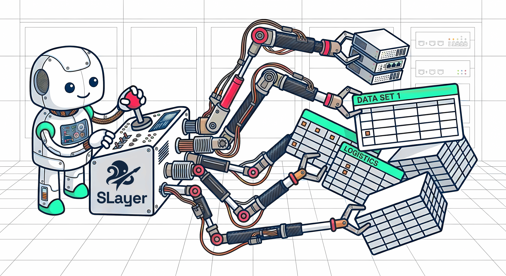

# SLayer — a semantic layer by Motley

<p align="center">
  
</p>

[](https://pypi.org/project/motley-slayer/)
[](https://pypi.org/project/motley-slayer/)
[](https://motley-slayer.readthedocs.io/)
[](LICENSE)
[](https://github.com/MotleyAI/slayer/stargazers)

> [If you find SLayer useful, a ⭐ helps others discover it!](https://github.com/MotleyAI/slayer/stargazers)

A lightweight, open-source semantic layer that lets AI agents query data without writing SQL.

---

## The problem

When AI agents write raw SQL, things break in production — hallucinated column names, incorrect joins, metrics that drift across queries. Existing semantic layers (Cube, dbt metrics) were built for dashboards: heavy infrastructure, slow model refresh cycles, and limited expressiveness for the kinds of ad-hoc analysis agents need.

### What SLayer does differently

- **Auto-ingestion with FK awareness** — Connect a database, and SLayer introspects the schema, detects foreign keys, and generates usable models with denormalized joins instantly. No manual modeling required to get started.
- **Dynamic model manipulation** — Agents create and edit models at runtime. Changes take effect immediately — no rebuild, no deploy, no restart.
- **Query-time expressions** — Compose derived metrics on the fly with the `fields` API (`"revenue:sum / *:count"`, `"cumsum(revenue:sum)"`, `"change_pct(revenue:sum)"`). Aggregation is specified at query time via colon syntax — no need to pre-define every metric.
- **First-class time operations** — Built-in `time_shift`, `change`, `change_pct`, `cumsum`, `rank`, and `last` — all composable and nestable (e.g., `"last(change(revenue:sum))"`).
- **Cross-model measures** — Query measures from joined models with dotted syntax and colon aggregation (`"customers.score:avg"`, multi-hop: `"customers.regions.name"`). Joins auto-resolved via graph walk. Transforms work on cross-model measures (`"cumsum(customers.score:avg)"`).
- **Multistage queries** — Use a query as the source for another query, or save any query as a permanent model for reuse. `ModelExtension` extends models inline with extra dimensions/joins.
- **Model filters** — Always-applied WHERE conditions on models (e.g., `"deleted_at IS NULL"`).

### Roadmap
- Unpivoting
- Smart output formatting (currency, percentages)
- Auto-propagating filters
- Asof joins
- Chart generation (eCharts)
- Claude Code plugin with query skills

---

### What's new since 0.1

- **Cross-model measures** — Query measures from joined models with dot syntax and colon aggregation (`"customers.*:count"`, `"customers.score:avg"`, multi-hop: `"customers.regions.name"`). Sub-query isolation prevents JOIN row multiplication. Transforms compose on cross-model measures (`"cumsum(customers.score:avg)"`).
- **Multistage queries** — Use a query as the source for another query, or save any query as a permanent model with `create_model_from_query`. `ModelExtension` extends models inline with extra dimensions, measures, or joins at query time.
- **Dynamic joins with diamond support** — Joins are auto-resolved at query time by walking the join graph. Path-based aliases (`customers__regions` vs `warehouses__regions`) disambiguate when the same table is reachable via multiple FK paths.
- **Model filters** — Always-applied WHERE conditions on models (e.g., `"deleted_at IS NULL"`).
- **DuckDB support** — New Tier 1 database, fully integration-tested, no Docker required.
- **Query introspection** — `dry_run` previews generated SQL without executing; `explain` shows execution plans.
- **Simpler query syntax** — Dimensions, measures, time dimensions, and order accept plain strings (`"status"` instead of `{"name": "status"}`).
- **SQL-style filters** — Operators `=`, `<>`, `IN`, `IS NULL`; multi-hop filters (`"customers.regions.name = 'US'"`); computed-column filters (`"change(revenue:sum) > 0"`).

---


## Quick Start

```bash
# Run instantly with uv (no install needed, SQLite works out of the box)
uvx --from motley-slayer slayer serve --models-dir ./my_models

# Or install as a standalone tool
uv tool install 'motley-slayer[postgres]'
slayer serve --models-dir ./my_models

# Or install with pip
pip install motley-slayer[all]           # all interfaces + all database drivers
pip install motley-slayer[postgres]      # PostgreSQL
pip install motley-slayer[mysql]         # MySQL / MariaDB
pip install motley-slayer[clickhouse]    # ClickHouse

# Start the HTTP server
slayer serve --models-dir ./my_models

# Or set up stdio MCP for an agent like Claude Code
# (the agent spawns slayer as a subprocess — you don't run this manually)
claude mcp add slayer -- slayer mcp --models-dir ./my_models
```

## What is SLayer?

SLayer is a semantic layer that sits between your database and whatever consumes the data — AI agents, internal tools, dashboards, or scripts. You define your data model once (or let SLayer auto-generate it from your schema), and consumers query using a structured API of measures, dimensions, and filters instead of writing SQL directly.

SLayer compiles these queries into the correct SQL for your database, handling joins, aggregations, time-based calculations, and dialect differences so that consumers don't have to. Models are editable at runtime — agents can add metrics, adjust definitions, and query the results immediately, with no redeploy step.

**Key features:**

* **Four interfaces, one query language** — MCP (stdio + SSE), REST API, CLI and Python SDK all expose the same capabilities. Agents, apps, and humans use the same models.
* **14 database dialects** — CI-tested against Postgres, MySQL, ClickHouse, DuckDB, and SQLite; additional support for Snowflake, BigQuery, Redshift, Trino/Presto, Databricks/Spark, MS SQL Server, and Oracle via sqlglot.
* **Composable `fields` API** — Derived metrics as formula strings (`"revenue:sum / *:count"`, `"cumsum(revenue:sum)"`, `"time_shift(revenue:sum, -1, 'year')"`). Aggregation specified at query time via colon syntax. Arbitrary nesting works — `change(cumsum(revenue:sum))` just compiles.
* **Zero-config onboarding** — Point SLayer at a database and it introspects the schema, detects foreign keys, and generates models with explicit joins. LEFT JOINs are built dynamically at query time.
* **Instant model editing** — Add or remove measures and dimensions on a running system via API, CLI, or MCP tool. No rebuild, no restart — changes are queryable immediately.
* **Embeddable** — Use it as a standalone service or import it as a Python module with no network layer.


## Interfaces

### REST API

```bash
# Query
curl -X POST http://localhost:5143/query \
  -H "Content-Type: application/json" \
  -d '{"model": "orders", "fields": [{"formula": "*:count"}], "dimensions": [{"name": "status"}]}'

# List models (returns name + description)
curl http://localhost:5143/models

# Get a single datasource (credentials masked)
curl http://localhost:5143/datasources/my_postgres

# Health check
curl http://localhost:5143/health
```

### MCP Server

SLayer supports two MCP transports:

**Stdio** — the agent spawns SLayer as a subprocess (for Claude Code, Cursor, etc.). You do not run `slayer mcp` manually; instead, register it with your agent:

```bash
# Register with Claude Code (the agent will spawn the process itself)
claude mcp add slayer -- slayer mcp --models-dir ./my_models

# If slayer is in a virtualenv, use the full path to the executable:
#   poetry env info -p   # prints e.g. /home/user/.venvs/slayer-xyz
#   claude mcp add slayer -- /home/user/.venvs/slayer-xyz/bin/slayer mcp --models-dir /path/to/my_models
```

**SSE (Server-Sent Events)** — MCP over HTTP, served alongside the REST API on `/mcp`. You run `slayer serve` yourself, then point the agent at the URL:

```bash
# 1. Start the server (REST API + MCP SSE)
slayer serve --models-dir ./my_models
# REST API at http://localhost:5143/query, /models, etc.
# MCP SSE at http://localhost:5143/mcp/sse

# 2. In a separate terminal, register the remote MCP endpoint with your agent
claude mcp add slayer-remote --transport sse --url http://localhost:5143/mcp/sse
```

Both transports expose the same tools — no duplication.

MCP tools:

| Tool | Description |
|------|-------------|
| `datasource_summary` | List all datasources and their models with schemas (dimensions, measures) |
| `inspect_model` | Detailed model info with sample data |
| `query` | Execute semantic queries |
| `create_model` | Create a new model from table/SQL |
| `create_model_from_query` | Save a query as a reusable model with auto-introspected schema |
| `edit_model` | Edit an existing model: update metadata, add measures/dimensions, remove fields — all in one call |
| `delete_model` | Delete a model |
| `create_datasource` | Configure a database connection (with connection test and auto-ingestion; set `auto_ingest=false` to skip) |
| `list_datasources` | List configured datasources |
| `describe_datasource` | Show datasource details, test connection, list schemas |
| `list_tables` | Explore tables in a database |
| `edit_datasource` | Edit an existing datasource config |
| `delete_datasource` | Remove a datasource |
| `ingest_datasource_models` | Auto-generate models from DB schema |

Typical agent workflow:
1. `create_datasource` (auto-ingests models by default) → `datasource_summary` → `inspect_model` → `query`
2. Or with `auto_ingest=false`: `create_datasource` → `describe_datasource` → `ingest_datasource_models` → `datasource_summary` → `query`

### Python Client

```python
from slayer.client.slayer_client import SlayerClient
from slayer.core.query import SlayerQuery, ColumnRef

# Remote mode (connects to running server)
client = SlayerClient(url="http://localhost:5143")

# Or local mode (no server needed)
from slayer.storage.yaml_storage import YAMLStorage
client = SlayerClient(storage=YAMLStorage(base_dir="./my_models"))

# Query data
query = SlayerQuery(
    model="orders",
    fields=[{"formula": "*:count"}, {"formula": "revenue:sum"}],
    dimensions=[ColumnRef(name="status")],
    limit=10,
)
df = client.query_df(query)
print(df)
```

### CLI Query

```bash
# Run a query directly from the terminal
slayer query '{"model": "orders", "fields": [{"formula": "*:count"}], "dimensions": [{"name": "status"}]}'

# Or from a file
slayer query @query.json --format json
```


## Models

Models are defined as YAML files. Add an optional `description` to help users and agents understand complex models:

```yaml
name: orders
sql_table: public.orders
data_source: my_postgres
description: "Core orders table with revenue metrics"

dimensions:
  - name: id
    sql: id
    type: number
    primary_key: true
  - name: status
    sql: status
    type: string
  - name: created_at
    sql: created_at
    type: time

measures:
  - name: revenue
    sql: amount
  - name: quantity
    sql: qty
```


## Fields

The `fields` parameter specifies what data columns to return. Each field has a `formula` string, an optional `name`, and an optional `label` (human-readable display name):

```json
{
  "model": "orders",
  "dimensions": [{"name": "status"}],
  "time_dimensions": [{"dimension": {"name": "created_at"}, "granularity": "month"}],
  "fields": [
    {"formula": "*:count"},
    {"formula": "revenue:sum"},
    {"formula": "revenue:sum / *:count", "name": "aov", "label": "Average Order Value"},
    {"formula": "cumsum(revenue:sum)"},
    {"formula": "change_pct(revenue:sum)"},
    {"formula": "last(revenue:sum)", "name": "latest_rev"},
    {"formula": "time_shift(revenue:sum, -1, 'year')", "name": "rev_last_year"},
    {"formula": "time_shift(revenue:sum, -2)", "name": "rev_2_periods_ago"},
    {"formula": "lag(revenue:sum, 1)", "name": "rev_prev_row"},
    {"formula": "rank(revenue:sum)"},
    {"formula": "change(cumsum(revenue:sum))", "name": "cumsum_delta"}
  ]
}
```

Formulas are parsed using Python's `ast` module (see `slayer/core/formula.py`). Available functions: `cumsum`, `time_shift`, `change`, `change_pct`, `rank`, `last`, `lag`, `lead`. `time_shift` always uses a self-join CTE — it can reach outside the current result set (no edge NULLs) and handles data gaps correctly. `lag`/`lead` use SQL window functions directly (more efficient, but produce NULLs at edges). Formulas support arbitrary nesting — e.g., `change(cumsum(revenue:sum))` or `cumsum(revenue:sum) / *:count`.

Functions that need ordering over time resolve the time dimension via: query `main_time_dimension` -> query `time_dimensions` (if exactly one) -> model `default_time_dimension` -> error.


## Filters

Filters use simple formula strings — no verbose JSON objects:

```json
{
  "model": "orders",
  "fields": [{"formula": "*:count"}, {"formula": "revenue:sum"}],
  "filters": [
    "status == 'completed'",
    "amount > 100"
  ]
}
```

**Operators**: `=`, `<>`, `>`, `>=`, `<`, `<=`, `IN`, `IS NULL`, `IS NOT NULL`

**Boolean logic**: combine with `and`, `or`, `not` in a single string:
```json
"filters": ["status = 'completed' or status = 'pending'"]
```

**Pattern matching**: `like` and `not like` operators (e.g., `"name like '%acme%'"`, `"name not like '%test%'"`). Filters on measures (e.g., `"count > 10"`) are automatically routed to HAVING.

**Computed column filters**: filters can reference field names or contain inline transform expressions. These are applied as post-filters after all transforms are computed:
```json
"filters": ["change(revenue:sum) > 0", "last(change(revenue:sum)) < 0"]
```


## Auto-Ingestion

Connect to a database and generate models automatically. SLayer introspects the schema, detects foreign key relationships, and creates models with explicit join metadata.

For example, given tables `orders → customers → regions` (via FKs), the `orders` model will automatically include:
- Joined dimensions: `customers.name`, `regions.name`, etc. (dotted syntax)
- Count-distinct measures: `customers.*:count_distinct`, `regions.*:count_distinct`
- Explicit joins — LEFT JOINs are constructed dynamically at query time

```bash
# Via CLI
slayer ingest --datasource my_postgres --schema public

# Via API
curl -X POST http://localhost:5143/ingest \
  -d '{"datasource": "my_postgres", "schema_name": "public"}'
```

Via MCP, agents can do this conversationally:
1. `create_datasource(name="mydb", type="postgres", host="localhost", database="app", username="user", password="pass")`
2. `ingest_datasource_models(datasource_name="mydb", schema_name="public")`
3. `datasource_summary()` → `inspect_model(model_name="orders")` → `query(...)`


## Configuration

Datasources are configured as individual YAML files in the `datasources/` directory:

```yaml
# datasources/my_postgres.yaml
name: my_postgres
type: postgres
host: ${DB_HOST}
port: 5432
database: ${DB_NAME}
username: ${DB_USER}
password: ${DB_PASSWORD}
```

Environment variable references (`${VAR}`) are resolved at read time. Both `username` and `user` field names are accepted.


## Storage Backends

SLayer ships with two storage backends:

- **YAMLStorage** (default) — models and datasources as YAML files on disk. Great for version control.
- **SQLiteStorage** — everything in a single SQLite file. Good for embedded use or when you don't want to manage files.

```python
from slayer.storage.yaml_storage import YAMLStorage
from slayer.storage.sqlite_storage import SQLiteStorage

# YAML files in a directory
storage = YAMLStorage(base_dir="./slayer_data")

# Single SQLite file
storage = SQLiteStorage(db_path="./slayer.db")
```

Both implement the `StorageBackend` protocol, so you can swap them freely or write your own:

```python
from slayer.storage.base import StorageBackend

class MyCustomStorage(StorageBackend):
    def save_model(self, model): ...
    def get_model(self, name): ...
    def list_models(self): ...
    def delete_model(self, name): ...
    # same for datasources
```

Pass any backend to `create_app()`, `create_mcp_server()`, or `SlayerClient(storage=...)`.


## Examples

The `examples/` directory contains runnable examples that also serve as integration tests:

| Example | Description | How to run |
|---------|-------------|------------|
| [embedded](examples/embedded/) | SQLite, no server needed | `python examples/embedded/run.py` |
| [postgres](examples/postgres/) | Docker Compose with Postgres + REST API | `cd examples/postgres && docker compose up -d` |
| [mysql](examples/mysql/) | Docker Compose with MySQL + REST API | `cd examples/mysql && docker compose up -d` |
| [clickhouse](examples/clickhouse/) | Docker Compose with ClickHouse + REST API | `cd examples/clickhouse && docker compose up -d` |

Each example includes a `verify.py` script that runs assertions against the seeded data.

All examples use a shared seed dataset (`examples/seed.py`) with a small e-commerce schema: regions, customers, products, and orders (68 orders across 12 months). The embedded example includes derived column demo queries using `fields`.


## Tutorials

The `docs/examples/` directory contains Jupyter notebooks that walk through SLayer's features step by step. All notebooks use a shared Jaffle Shop dataset (DuckDB, ~200K orders) and are self-contained.

| Notebook | Topic |
|----------|-------|
| [SQL vs DSL](docs/examples/02_sql_vs_dsl/) | How model SQL and query DSL stay cleanly separated |
| [Auto-Ingestion](docs/examples/03_auto_ingest/) | Schema introspection, FK graph discovery, automatic model generation |
| [Time Operations](docs/examples/04_time/) | `change`, `change_pct`, `time_shift`, `lag`, `lead`, `last` — composable time transforms |
| [Joins](docs/examples/05_joins/) | Dot syntax, multi-hop joins, diamond join disambiguation |
| [Joined Measures](docs/examples/05_joined_measures/) | Cross-model measures with sub-query isolation |
| [Multistage Queries](docs/examples/06_multistage_queries/) | Query chaining, queries-as-models, `ModelExtension` |


## Claude Code Skills

SLayer includes Claude Code skills in `.claude/skills/` to help Claude understand the codebase:

- **slayer-overview** — architecture, package structure, MCP tools list
- **slayer-query** — how to construct queries with fields, dimensions, filters, time dimensions
- **slayer-models** — model definitions, datasource configs, auto-ingestion, incremental editing


## Development

```bash
# Install with all extras
poetry install -E all

# Run tests
poetry run pytest

# Lint
poetry run ruff check slayer/ tests/

# Start dev server
poetry run slayer serve
```


## Why SLayer?

### SLayer is embeddable

Besides being a standalone service, SLayer is also a Python module. That's why it can also be directly imported and used in Python applications with no network communication involved.

For example, using it in a multi-tenant application could be as simple as:

```python
client = SlayerClient(storage=MyStorage(tenant_id=...))
```

No need for setting up network and auth at all.

### SLayer models can be updated on the fly

In SLayer, models are treated as a dynamic part of the process, rather than something that is preconfigured and frozen.
Models can be created or edited at any time and immediately queried.
We expose tools for interacting with the models via API, CLI and MCP.

### SLayer is flexible

Slayer is agnostic to the datasource type: it can be an SQL database, a BI tool or even a REST API.
Adapters for popular databases are included, but adding a new one just takes implementing 3 straightforward methods: a query-to-datasource-input translator and a result-to-dataframe parser. Please open a pull request if you write one!


## Known limitations

SLayer currently has no caching or pre-aggregation engine.
If you need to process lots of requests to large databases at sub-second latency, consider adding a caching layer or pre-aggregation engine.


## License

MIT — see [LICENSE](https://github.com/MotleyAI/slayer/blob/main/LICENSE).
