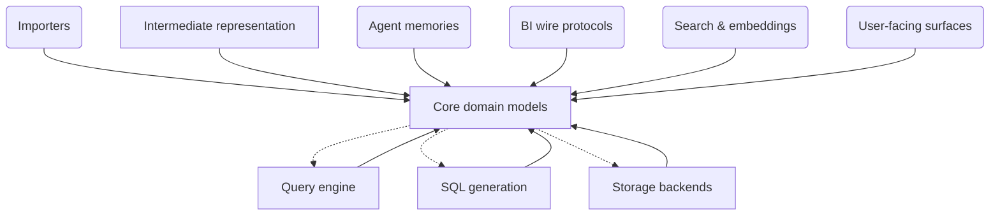

# core — domain models, keys, errors

## 1. Purpose & context

`slayer/core` holds the domain models, the `ValueKey` structural-identity
family, and the typed error/warning vocabulary. It is the bottom layer: it is
meant to import no other SLayer node; the remaining `core → engine/sql/storage`
edges are grandfathered and slated to die (system principle 2).

## 2. Building blocks

The `core_focus` view ([views.c4](views.c4)) — `core` and its incident edges:

<!-- likec4:core_focus -->

*Dashed arrows: legacy edges slated to die.*
<!-- /likec4:core_focus -->

Identity: `keys.py`; scopes:
`scope.py`; errors/warnings: `errors.py`, `warnings.py`; Pydantic domain
models alongside.

## 3. Principles

1. **A key answers one question**: a `ValueKey` identifies a value —
   "are these two expression occurrences the same?" — and carries nothing
   else; rendering state lives on slots, never on keys. [review]
2. **Local and cross-model share one key shape**: the join path is data (empty
   vs non-empty `path`); there is no separate cross-model track, and the render
   strategy is chosen downstream, never baked into identity. [review]
3. **Traversal is total by construction**: every key kind implements the
   `children()` / `map_children()` protocol so generic walkers and rewriters
   cover new kinds the day they are added; deliberately asymmetric visitors
   keep explicit dispatch with a fail-closed raise tail. [review]
4. **Errors are typed, with a stable format**: the intentional-failure
   vocabulary is `SlayerError` subclasses, distinguishable from driver/IO
   errors; the stage-5 resolution family renders via `_format_error_message` —
   a class-name-prefixed first line binding tests and greps to a stable
   prefix, plus optional input/scope/suggestion lines. [review]
5. **Warnings are structured payloads, surfaced twice**: degradations emit
   payload-carrying warnings that appear both as Python warnings and on
   `SlayerResponse.warnings` — never only a log line. [review]

## 4. Rationale

Structural identity (P1) keeps the duplicate/shared-slot bug family
unrepresentable; one key shape (P2) keeps the intermediate representation free
of parallel per-family tracks.
