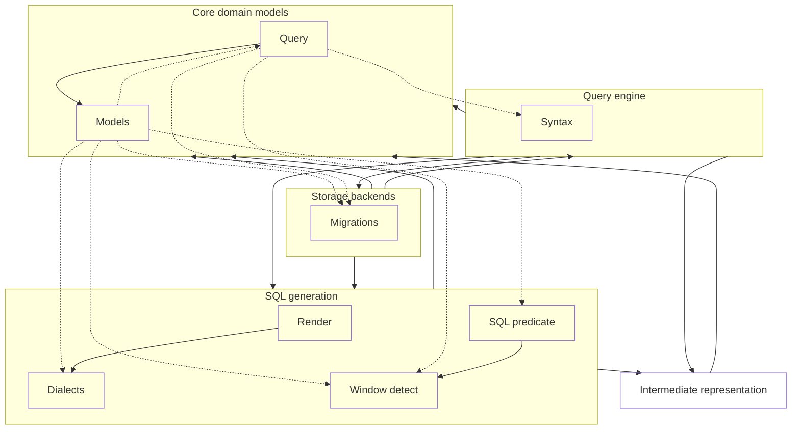

# engine — query resolution pipeline

## 1. Purpose & context

`slayer/engine` turns a `SlayerQuery` into a `PlannedQuery` for `sql` to
render: normalize → parse → bind → plan, orchestrated by the query engine.
Behaviour is specified in `openspec/specs/queries`; the algebra the pipeline
implements is `semantics.arc42.md`.

## 2. Building blocks

The `query_pipeline` view ([views.c4](views.c4)):

<!-- likec4:query_pipeline -->

*Dashed arrows: legacy edges slated to die.*
<!-- /likec4:query_pipeline -->

Stages:
`normalization.py` → `syntax.py` (parse) → `binding.py` → `planning.py` /
`stage_planner.py` (plan) → `slayer/ir/planned.py` (the typed hand-off to
`sql`), fed by `bundle_builder.py` (builds the `ir` source bundle);
`query_engine.py` orchestrates.

## 3. Principles

1. **Typed pipeline**: each stage consumes and produces typed objects
   (raw → normalized → `ParsedExpr` → `BoundExpr` → `ValueSlot` →
   `PlannedQuery`); no stage string-rewrites a previous stage's output after
   parsing. [review]
2. **Parsing is pure syntax**: no scope, storage, or saved-measure resolution
   in the parser; both aggregation spellings (colon and functional) collapse to
   one node, so everything downstream is spelling-insensitive by construction.
   [review]
3. **Resolution is pure; storage is consulted once**: everything binding needs
   is resolved eagerly into the source bundle at the top of execution, making
   the binder a deterministic function of (parsed, scope, bundle) — no
   re-resolution, no context variables. [review]
4. **Interning is the dedup mechanism**: structurally-equal keys intern to one
   slot; public names are a separate namespace (one declared name, many
   aliases); filter/order-only values materialise as hidden slots trimmed from
   the public projection. [review]
5. **Stages compose only through schemas**: every stage emits an explicit flat
   `StageSchema` downstream stages bind against; the two scope kinds
   (`ModelScope`: dots walk joins; `StageSchema`: flat names only) are distinct
   types, never a flag. [review]
6. **Phase is a property of the value**: WHERE/HAVING/post routing derives from
   the max phase of the slots a filter references, never from text analysis.
   [review]
7. **One slack pass, typed warnings**: slack-but-unambiguous query shapes are
   rewritten once at the pipeline entry; every rewrite surfaces as a structured
   warning on the response; a slack rule retires by promotion to first-class
   grammar, never by accumulating rewrites. [review]
8. **Models persist verbatim**: `save_model` stores the author's spelling
   unchanged; normalization applies to queries at execute time only. [review]

## 4. Rationale

Structural identity end to end (P1) is what keeps enrichment from degenerating
into string rewriting. Purity of binding (P3) is what keeps re-resolution
state (context variables) unrepresentable; schema-only composition (P5) is
what makes downstream stages structurally unable to reach an upstream join
graph.
