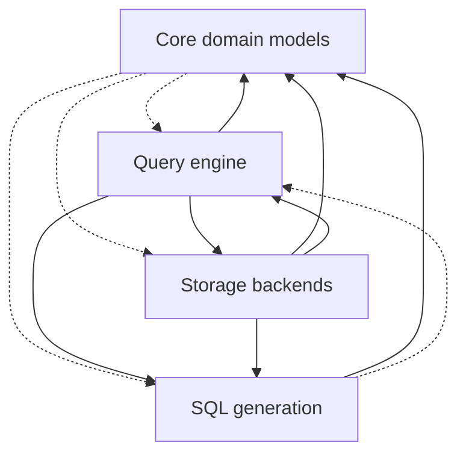

# sql — SQL generation

## 1. Purpose & context

`slayer/sql` turns a `PlannedQuery` (built by `engine`) into dialect-correct SQL
text. Children: `render` (AST assembly: value keys, order terms, joins, CTE
assembly) and `dialects` (per-dialect emission strategies). It must not know how
plans are made — the grandfathered `sql → engine` edges die with the
`slayer/ir` extraction slice.

## 2. Building blocks

The `query_pipeline` view ([views.c4](views.c4)):

<!-- likec4:query_pipeline -->

*Dashed arrows: legacy edges slated to die.*
<!-- /likec4:query_pipeline -->

Children: `render`
(value keys, aggregates, order terms, joins, node assembly) and `dialects`.

## 3. Principles

1. **AST end to end**: statements are built and composed as sqlglot AST; text
   round-trips of already-emitted SQL are forbidden (dotted aliases corrupt on
   re-parse). [review]
2. **Dialect quirks live only in `dialects/`** — one file per Tier-1 dialect,
   data-shaped Tier-2 table; everything not explicitly overridden goes through
   sqlglot transpilation. No `if dialect == …` outside `dialects/`. [review]
3. **One naming authority**: `slayer/sql/naming.py` owns every alias and
   result-key decision (dotted result keys, flat inner names, mangling,
   identifier-length fitting, CTE names). [review]
4. **One Mode-A door**: free SQL enters a scope only through
   `ScopeFrame.enter_predicate` / `enter_expression`; join discovery is a side
   effect of entering, never a separate pass. [review]
5. **One ValueKey renderer**: `render_value_key` / `render_scalar_call` /
   `render_arithmetic` are the sole render paths for typed keys. [review]
6. **CTE dependencies are declared**, never rediscovered by scanning rendered
   SQL. [review]
7. **Grain join-backs are null-safe**, built by the one builder in
   `render/joins.py`; an empty grain is an explicit CROSS JOIN, never `TRUE`.
   [review]
8. **One reserved-keyword set** (`slayer/sql/reserved_keywords.py`); extend that
   set only. [review]
9. **Fail closed**: reject with a typed error rather than emit invalid or
   silently-wrong SQL; the scope-closure validator (`SLAYER_VALIDATE_SCOPES`,
   on in the test harness) backstops emission. [review]
10. **One composition primitive**: every aggregate that needs its own rows —
    crossing a join, its own ordering, its own frame, its own grain — compiles
    as a producer (a plan-shaped CTE rooted where its rows live), attached
    back by a null-safe LEFT JOIN on its complete grain and substituted into
    expressions by structural identity, never text. [review]
11. **One flat WITH**: every statement renders through one pipeline
    (base → aggregate → combined → steps → post) with one allocator; a
    producer's internal WITH hoists to the top level — a WITH never nests
    inside a CTE definition; fusion of adjacent phases is an emission
    decision, never semantic. [review]
12. **Attach is cardinality-neutral**: attaching a producer never changes the
    host row count or any other column's value.
    [enforced: test:tests/test_dev1837_dimension_measure_matrix.py]

## 4. Rationale

The single-door / single-renderer / single-namer shape is the end state of the
DEV-1742 consolidation (6 PRs, 2026-08), which replaced five per-path renderers,
four ORDER BY resolvers, and regex-based join discovery — each a source of
silent divergence. The layering target (`engine` → `sql` → `core`) still has
grandfathered edges because `generator.py` consumes engine plan types directly;
the `slayer/ir` extraction slice moves those types into a shared IR package.
Recent structural trail in the archive: e.g.
`openspec/changes/archive/2026-09-02-dev-1838-…` (node discipline in the
generator's root SELECT).
