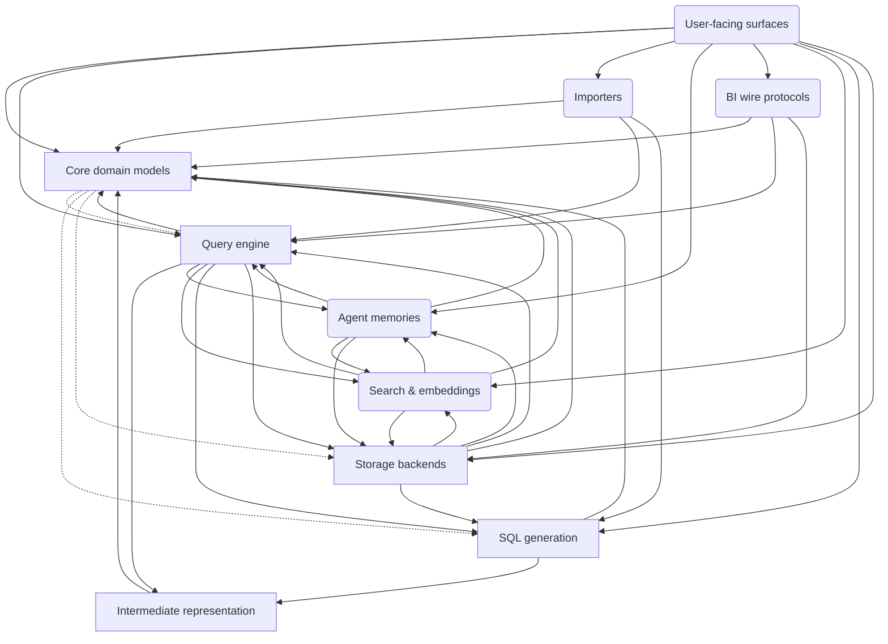

# SLayer — system architecture

## 1. Purpose & context

SLayer is a semantic layer for AI agents: agents describe measures, dimensions,
and filters; SLayer generates and executes the SQL. This file is the root of the
living-architecture layer — present-tense structure and principles, updated in
place. Behaviour lives in `openspec/specs/`; decision history lives in
`openspec/changes/archive/` and git (there is no ADR log).

## 2. Building blocks

The `landscape` view ([views.c4](views.c4), model in
[model/slayer.c4](model/slayer.c4)):

<!-- likec4:landscape -->

*Dashed arrows: legacy edges slated to die.*
<!-- /likec4:landscape -->

Ten nodes: precise `core`, `sql`, `ir`,
`engine`, `storage` around the query pipeline; virtual buckets `importers`,
`search`, `memories`, `protocols`, `surfaces` for the rest. Package claims,
the legacy-arrow baseline, and spec mapping are in [index.yaml](index.yaml).

## 3. Principles

All code, old and new, MUST obey these.

1. **Target layering**: `engine` → `sql` → `ir` → `core`. The grandfathered
   crossings (declared `#legacy` child arrows, count = the `legacy_arrows`
   baseline in index.yaml) are dying, never growing.
   [enforced: arch_check:model-truth]
2. **`core` imports no other SLayer node.** The remaining crossings are the
   grandfathered child-level `#legacy` doors (`core.query`/`core.models` →
   `engine.syntax`, `sql.*`, `storage.migrations`), slated to die.
   [enforced: arch_check:model-truth]
3. **Every top-level `slayer.*` package/module belongs to exactly one node.**
   A new top-level package must be claimed in `index.yaml` in the same change.
   [enforced: arch_check:claims-exactly-once]
4. **Model truth**: the LikeC4 relation set covers the AST-measured runtime
   import edges at every declared granularity — each module attributes to its
   finest declared child else its node, every edge is licensed by its
   most-specific arrow, and TYPE_CHECKING-guarded imports are excluded. The
   model describes the code as it IS; `#legacy` marks edges slated to die.
   [enforced: arch_check:model-truth]
5. **Ratchet**: `#legacy` arrows are only ever removed; their count equals the
   `legacy_arrows` baseline in index.yaml, so deleting one lowers the baseline
   in the same commit. The count check is a stateless backstop — review of the
   paired `.c4` + index diff owns monotonicity. Adding a legacy arrow means the
   architecture is changing: do it deliberately, with explicit user OK.
   [enforced: arch_check:baseline-ratchet]
6. **SQL is built as sqlglot AST**, never by string concatenation of fragments.
   [review]
7. **Async-first**: engine and storage methods are async; sync entry points
   bridge via `execute_sync` / `run_sync`. [review]
8. **The query algebra** lives in `semantics.arc42.md`; its observable face:
   adding a measure never changes result cardinality or other fields'
   values. [enforced: test:tests/test_dev1837_dimension_measure_matrix.py]
9. **Dotted-canonical references**: dots denote join paths in queries and model
   SQL; the legacy `__` split-alias input form is a hard error; `__` survives
   only as an internal generated-SQL join alias (`__slayer_` prefix reserved).
   [enforced: test:tests/test_dev1743_resolution.py]
10. **Two expression layers**: Mode A free SQL (`Column.sql`, model `filters`)
    vs Mode B Python-AST DSL (formulas, query fields, scalar allowlist only) —
    one canonical `SCALAR_PASSTHROUGH` set, extended never forked. [review]
11. **Versioned persistence**: models/queries/datasource configs carry
    `version`; migrations run automatically on load. [review]
12. **Pydantic v2 for all models; never dataclasses.** [review]
13. **The ValueKey union grows reluctantly**: a construct that traverses like an
    existing key kind reuses it (reserved-name scalar, reserved-leaf
    placeholder) rather than adding a union member — hand-rolled visitors are
    fail-open on new kinds. [review]
14. **Ingestion is idempotent and additive-only**: user metadata is never
    overwritten by a re-ingest (`source_kind` refresh is the one documented
    exception). [review]
15. **Row-level security fails closed**: anything a session policy cannot
    confirm is rejected, never passed through unscoped. [review]

## 4. Enforcement

The enforcement bundle — `tools/arch_check.py` (the one import law) runs in CI;
the full bundle runs at the spec-review gate and the arch-slice move gate:

```bash
poetry run python tools/arch_check.py        # also runs in CI
npx -y likec4@1.47.0 validate architecture   # pinned; run from the repo root
poetry run basedpyright                      # gate = no new errors vs baseline
```

`arch_check`'s `diagrams-fresh` goes red when a mapped doc's embedded mermaid
drifts from the model or views — the one fix is `poetry run python
tools/arch_diagrams.py`.

Every numbered principle item in an arc42 file carries at least one
square-bracketed status tag (all three kinds validated by arch_check, per
clause where clauses differ):

- an `enforced:` tag — an automatic check trips on violation; its id names an
  arch_check check (`arch_check:<check-id>`) or a test (`test:<pytest path>`,
  taken on trust). Several may accumulate; tag the strongest available
  (structural > static > generative > example matrix) and upgrade over time.
- `[review]` — true today, unenforced; a standing candidate for a fitness
  function (the DEV-1869 law harness for the semantics laws).
- a `target:` tag naming a `DEV-<number>` issue — envisioned, not yet true;
  that issue flips the tag in its own PR.

## 5. Model & diagram authoring convention

`likec4 validate` owns syntax; `tools/arch_diagrams.py` is the one parser of the
constrained convention `arch_check` enforces (`model-identity`, `model-truth`,
`diagrams-fresh`):

- every element declared as `<id> = <kind> '<title>'`, one per line; children
  nest inside the parent's `{ }` body and are addressed by dotted FQN
  (`core.query`) everywhere else;
- all relations flat at model top level, one `<src> -> <dst>` per line (dotted
  endpoints allowed), never inside element bodies, never `this`/`it`; `#legacy`
  on the same line. `from pkg import name` measures both the `pkg` and the
  `pkg.name` edge — a re-exported attribute sharing a child's name attributes to
  that child (accepted fuzz);
- `index.yaml` declares each node's on-disk `children:` (dotted paths under its
  package); the one law then measures imports at the finest declared
  granularity, so an arrow is required between any two declared children;
- `views.c4` includes support only `include *`, listed top-level ids, and the
  focus predicates `x -> *` / `* -> x`; a per-view `view_depth:` in index.yaml
  (default 3) sets how many levels each view expands — deeper elements collapse
  into their cutoff ancestor with edges rolled up, and shown children render as
  nested mermaid subgraphs;
- each mapped doc (the `diagrams:` block in [index.yaml](index.yaml)) carries a
  `<!-- likec4:<view_id> -->` … `<!-- /likec4:<view_id> -->` marker pair placed
  once by hand, and `poetry run python tools/arch_diagrams.py` fills the mermaid
  between the markers.

## 6. Rationale

The wedge is focused on the query pipeline because that is where boundary
violations accumulate (see `sql.arc42.md`); buckets stay coarse until real work
touches them.
