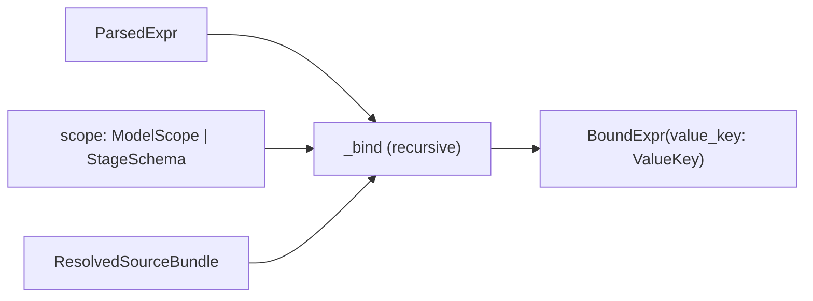

# Binding

**Module:** `slayer/engine/binding.py`

The binder takes a `ParsedExpr`, a scope (`ModelScope` or `StageSchema`), and a
`ResolvedSourceBundle`, and produces a `BoundExpr` whose leaves are resolved
`ValueKey`s. It is the stage that turns *names* into *structural identity* — and
it is a pure function of its inputs (P11).

## Output types

- `BoundExpr(value_key)` — the whole expression's structural identity. `.phase`
  is lifted from `value_key.phase`.
- `BoundFilter(value_key, phase, referenced_keys)` — adds the max phase any
  referenced slot reaches (**P8**) and the full tuple of `ValueKey`s touched
  anywhere in the tree (used by cross-model filter routing).

Public entry points: `bind_expr`, `bind_filter`, `bind_time_dimension`, plus the
`walk_value_keys` traversal helper.

## Resolving a reference

`_resolve_ref` (bare) and `_resolve_dotted` (path) are where scope semantics
live (**P5**):

**Against a `StageSchema`:** a bare name must be a column in the flat schema
(else `UnknownReferenceError`); a dotted ref raises `IllegalScopeReferenceError`
("downstream stages see a flat schema"). This is the DEV-1449 guard.

**Against a `ModelScope`:**

- A bare name resolves to a `ColumnKey(path=(), leaf=name)`, or to a
  `ColumnSqlKey` if the column is derived (`col.sql` set and not a trivial
  self-remap). If the name matches a `ModelMeasure` instead of a column, the
  binder raises with a suggestion to expand it first — measure expansion is the
  [parser stage](parsing.md)'s job, not the binder's.
- A `__`-bearing bare name is legal *only* if it exact-matches a literal column
  name (the C11 carve-out); otherwise `IllegalScopeReferenceError`.
- A dotted ref walks the join graph: `parts[:-1]` are join targets, `parts[-1]`
  is the leaf. Each hop must have a matching `ModelJoin` on the current model and
  the target must be in the bundle; revisiting a model raises a legacy-compatible
  `Circular join` error. The terminal column becomes a `ColumnKey` (or
  `ColumnSqlKey`) carrying the hop path.

### C14 — self-prefix stripping

`_resolve_dotted` strips a leading segment equal to the host model's name before
walking: `orders.status` on an `orders`-rooted query → `status`;
`orders.customers.name` → `customers.name`. This is principle **C14**,
preserving the legacy convenience of qualifying with your own model name.

## Binding aggregates

`_bind_agg` builds an `AggregateKey`. The source is a `StarKey` for `*`, a
path-carrying `StarKey` for a cross-model star (`customers.*:count`, via
`_resolve_dotted_star`), or the bound column otherwise. Positional/kwarg
arguments bind through `_bind_agg_arg` — identifier args become `ColumnKey`,
literals normalize via `normalize_scalar`. Crucially, `_resolve_column_filter_key`
looks up the resolved source column's `Column.filter` and folds it into the key
as `column_filter_key` (a `SqlExprKey`) — so an aggregate over a filtered column
has a distinct identity (P3 / the `column_filter_key` invariant from
[Typed keys](typed-keys.md)).

## Binding transforms (P9)

`_bind_transform` produces a `TransformKey` whose `input` is the bound value to
transform — a `ValueSlotRef`, not a string. Two whitelists govern it:

- `_TRANSFORM_KWARG_RULES` — per-op accepted kwargs. It is deliberately broader
  than the legacy whitelist: every transform implicitly accepts `partition_by`
  (so `change(measure, partition_by=…)` threads through to the desugared
  `time_shift`, **C6**), and the rank family / `time_shift` / `lag` / `lead` /
  `ntile` / `consecutive_periods` add their own.
- `_TRANSFORM_POSITIONAL_KWARGS` — the transforms whose documented DSL form
  accepts positional params after the value (`time_shift(x, periods,
  granularity)`, `lag(x, periods)`, `lead(x, periods)`). A name supplied both
  positionally and as a kwarg is an error.

`partition_by` values must bind to a `ColumnKey` / `ColumnSqlKey` (and become
`partition_keys`); other kwargs must fold to a scalar literal
(`_fold_to_scalar` also handles unary-minus over a numeric literal, the AST shape
of `periods=-1`). `_apply_transform_kwarg_defaults` validates required kwargs
(`ntile` needs a positive-integer `n`; `time_shift` needs `periods`) and applies
defaults (`lag`/`lead` default `periods=1`). Note the binder does **not** set
`time_key` — it lacks query context; the [stage planner](stage-planning.md)
attaches it after all binding completes.

## Binding scalar calls (P1 / C12)

`_bind_scalar` re-checks `SCALAR_FUNCTIONS` membership (defence-in-depth against
direct `ParsedExpr` construction that bypasses the parser) and builds a
`ScalarCallKey`. Arithmetic, comparison, boolean, and unary ops all become
`ArithmeticKey` with the operator string.

## Filters and phase classification (P8)

`bind_filter` binds the predicate, walks it via `walk_value_keys` to gather every
referenced `ValueKey`, takes `phase = max(referenced phases)`, and rejects raw
windows. The phase is computed entirely from the slots referenced — no text
analysis. `_reject_windowed_column_sql` raises `IllegalWindowInFilterError` if
any referenced `ColumnSqlKey` has a windowed `Column.sql` body — DEV-1369
removed predicate promotion, so filtering on a window is an error, not an
auto-hoist. (Against a `StageSchema` this check is skipped — window detection
already happened when the upstream stage was bound.)

### `alias_map` — filter/order refs by declared name (P4 / DEV-1445)

`bind_filter` accepts an optional `alias_map: Dict[str, ValueKey]` mapping a
stage's declared-measure names (user `name`, declared name, canonical alias) to
their bound `ValueKey`. A bare ref matching an alias interns onto that exact slot
*before* any column lookup. This is what lets a filter reference a renamed measure
by alias: `filters=["rev >= 100"]` for a measure declared
`{"formula": "customers.revenue:sum", "name": "rev"}` binds `rev` onto the
cross-model aggregate slot — and because the dotted/colon form interns
structurally onto the *same* `AggregateKey`, both forms share one slot. Only
*measure* aliases enter the map (never dimension / time-dimension names), because
a time dimension's declared name is its raw column and a `created_at <= '…'`
filter must resolve to the raw column, not the truncated dimension slot. See
[Stage planning](stage-planning.md) for how the map is built.

## `bind_time_dimension`

Binds a `TimeDimension` into a `BoundExpr` carrying a `TimeTruncKey`. The
underlying column resolves against scope exactly like an identifier ref and must
have a temporal `Column.type` (`DATE` / `TIMESTAMP`). It may be a base
`ColumnKey` OR a **derived** `ColumnSqlKey` (DEV-1450 follow-up #4a):
`TimeTruncKey.column` is `Union[ColumnKey, ColumnSqlKey]`, and the generator
applies the `DATE_TRUNC` over the expanded `Column.sql` everywhere it would
over a bare column.

> **Limitation.** Only `ModelScope` is accepted (a `StageSchema` raises —
> downstream stages already see the truncated column as a flat name).

## `walk_value_keys`

Yields every `ValueKey` reachable from a key (including the key itself),
recursing through `AggregateKey` source/args/kwargs, `TransformKey`
input/args/kwargs/partition_keys/time_key, `ArithmeticKey` operands,
`ScalarCallKey` args, and `BetweenKey` column/low/high. It is the typed
counterpart to the parser's `walk_parsed_refs`, used for phase computation and
cross-model filter routing.

## Design rationale

- **Why is the binder pure?** Everything it needs is in the bundle (P11). No
  storage access, no `ContextVar`, no callback re-resolution — so binding a given
  `(parsed, scope, bundle)` is deterministic and order-independent. This is the
  single biggest simplification over the legacy enrichment closures.
- **Why fold `Column.filter` into the aggregate key rather than handle it at
  render time?** Because two aggregates over the same column differ *as values*
  when their filters differ; making that part of identity means the registry
  interns correctly and the generator never has to reconcile two slots that are
  "the same column but filtered differently".
- **Why does the binder leave `time_key` unset?** Resolving the active time
  dimension needs query-level context (`main_time_dimension`,
  `default_time_dimension`, the set of TDs in the query). The binder is
  expression-local; the planner has the query, so it patches `time_key` there.
