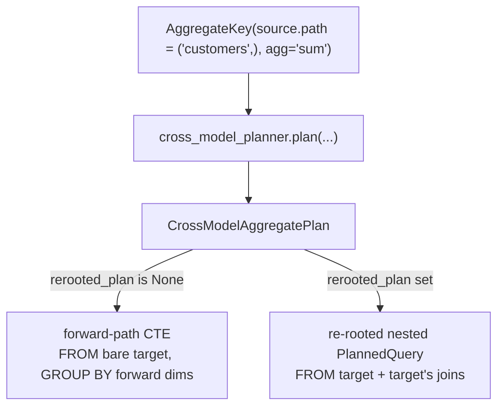
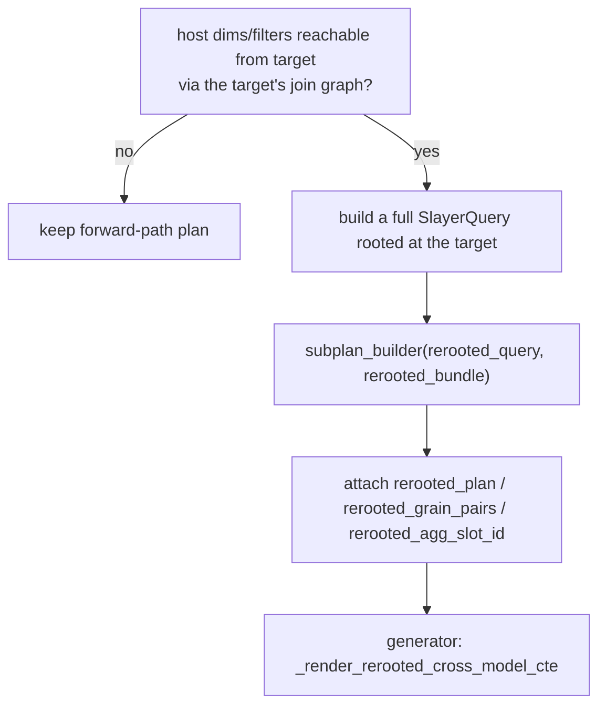
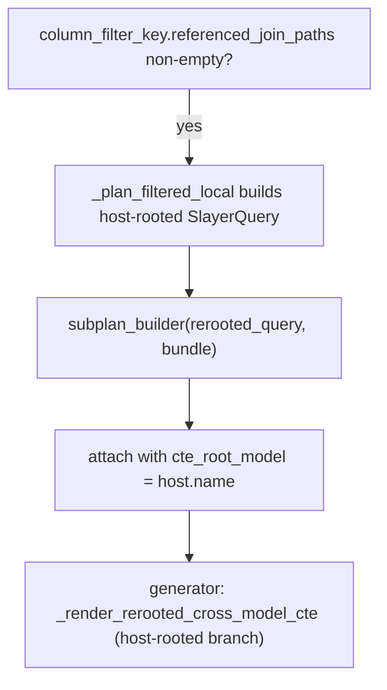

# Cross-model aggregates

**Modules:** `slayer/engine/cross_model_planner.py` (strategy +
`_maybe_reroot_cross_model_plan`),
`slayer/sql/generator.py` (`_render_with_cross_model_plans`,
`_render_rerooted_cross_model_cte`)

A cross-model aggregate is `customers.revenue:sum` on an `orders`-rooted query —
an aggregate whose source carries a non-empty join path. Principle **P3** says it
shares the `AggregateKey` shape with a local aggregate (only `source.path`
differs), and that "base CTE vs cross-model CTE" is a *render strategy* decided
downstream, not a semantic split. The identity side of P3 holds cleanly. The
**render** side turned out to need two strategies — the most significant
deviation from the plan.

## The identity is uniform; the rendering is not

The planner detects the cross-model case structurally (`agg_path` non-empty in
`plan_query`) and invokes the strategy. The strategy is a substitutable
component — **I1**: `CrossModelPlanner` is a `Protocol`,
`IsolatedCteCrossModelPlanner` is the default — so the *shape* of the result
(`CrossModelAggregatePlan` in `planned.py`) is strategy-agnostic and only the
populating planner changes.

## Strategy 1: `IsolatedCteCrossModelPlanner` (the plan's design)

This is the planned design: one CTE per `(target_model, shared_grain)`. It walks
the join chain from host to target (`_walk_chain` → `JoinRequirement`s), groups
the aggregate at the first hop's target grain, and builds `join_back_pairs` so
the host LEFT JOINs the CTE back on the first-hop columns. `_make_cte_schema`
produces the CTE's typed projection. `_aggregate_alias` derives the output
column name via `canonical_agg_name`.

### Host-filter routing (the `inherited_filter_policy` decision table)

`classify_host_filter` is a pure classifier mapping each host filter to a
`FilterRoute`:

| Filter references | Route |
| --- | --- |
| host-local row slot only | `DROP_HOST_LOCAL` (applied at host) |
| all on the joined-target path (row) | `PROPAGATE_WHERE` |
| cross-model agg-ref on the same target | `PROPAGATE_HAVING` |
| slots on a different joined branch | `DROP_UNREACHABLE` (+ warn) |
| mixed reachable + unreachable | `DROP_UNREACHABLE` (+ warn) |
| transform / POST phase | `STAY_AT_HOST_POST` |

The planner threads each route into the explicit
`where_filter_ids` / `having_filter_ids` lists on `CrossModelAggregatePlan` so
the generator never re-classifies. The target model's own `SlayerModel.filters`
ride into `target_model_filters` (always-applied WHERE), and a `Column.filter` on
the aggregated column rides on the `AggregateKey` itself as a CASE-WHEN — neither
goes through host-filter classification. `shared_grain_slots` is the set of host
dimension/time-dimension slots reachable from the target, used to LEFT JOIN the
CTE back without changing cardinality.

## Strategy 2: re-rooting (the deviation)

`IsolatedCteCrossModelPlanner` alone is insufficient. When the host query carries
dimensions that are reachable from the target through the **target's own** join
graph (the legacy `_build_rerooted_enriched` case — e.g.
`policy_amount → policy → policy_number`), the forward-path CTE
("FROM bare target, GROUP BY forward-path dims only") collapses the host
dimension to a scalar `CROSS JOIN`: every host row gets the global aggregate
instead of a per-dimension value.

`_maybe_reroot_cross_model_plan` detects this and attaches a nested re-rooted
plan. As of DEV-1450 follow-up #2 it lives in `cross_model_planner.py` and runs
**inside** `IsolatedCteCrossModelPlanner.plan` — the strategy owns the
forward-vs-re-rooted choice rather than `plan_query` patching the plan after the
fact:

It re-roots each host dimension/time-dimension/filter from the host's perspective
to the target's (`_reroot_ref`: host-local → `<host>.<name>`; on-target → bare;
through-target → strip the prefix), drops anything unreachable from the target
(matching legacy), reconstructs the local aggregate formula
(`_local_agg_formula`), builds a fresh `SlayerQuery` rooted at the target, and
compiles it via the injected `subplan_builder` callback (which `plan_query`
supplies as a `plan_query` recursion — keeping `cross_model_planner.py` free of a
`stage_planner` import). The sub-plan is rendered by
`_render_rerooted_cross_model_cte` as the `_cm_*` CTE (FROM target + the target's
joins, preserving host grain) and joined back on the re-rooted dimension via
`rerooted_grain_pairs`.

### Why this is flagged as a deviation

The plan envisioned the `inherited_filter_policy` decision table plus
`IsolatedCteCrossModelPlanner` as **the** cross-model mechanism. In practice
there are now **two** cross-model render strategies, both owned by the strategy
(`IsolatedCteCrossModelPlanner.plan` → `_maybe_reroot_cross_model_plan`), with
the re-rooting one bolted onto `CrossModelAggregatePlan` via `rerooted_plan` /
`rerooted_grain_pairs` / `rerooted_agg_slot_id`. P3's "one shape, render strategy
chosen downstream" holds for *identity* but not for *rendering* — and the
re-rooted path is, structurally, the legacy `_build_rerooted_enriched` shape
brought across to the typed plan.
This reintroduces (in a contained, typed form) the kind of "second resolution
path for a permutation" the redesign set out to eliminate. It works and is
tested, but it is the place a future reviewer should look first when reasoning
about cross-model behavior.

## Strategy 3: filtered-local isolation (DEV-1503)

A **cross-model-FILTERED local measure** is a host aggregate whose `Column.filter`
references a joined table — `loss_payment_amt:sum` where `loss_payment_amt` has
`filter="loss_payment.has_flag = 1"`. The aggregate's `source.path` is empty
(it's a local column), but its `column_filter_key.referenced_join_paths` is
non-empty, so emitting it inline in the host base SELECT would pull the
filter-target join into the host's FROM. With **two** such measures whose
filter targets are different INNER joins, the host base would intersect to
only the rows present in BOTH targets — silently corrupting both aggregates.

The trigger predicate is structural:
`agg_path` non-empty (forward cross-model) **OR**
`column_filter_key.referenced_join_paths` non-empty (filtered-local). Both
route through `IsolatedCteCrossModelPlanner.plan`; the filtered-local branch
calls `_plan_filtered_local`, which builds a **host-rooted** nested
`PlannedQuery` (same `source_model`, same dims/TDs, only the filtered measure
as the single aggregate) and attaches it via the same
`rerooted_plan` / `rerooted_grain_pairs` / `rerooted_agg_slot_id` slots the
re-rooted path uses. The plan carries `cte_root_model = host_model.name` as
the disambiguator the renderer reads; `_render_rerooted_cross_model_cte`
short-circuits the source-model swap when `cte_root_model` is set.

`subplan_builder` always passes `disable_dev1503_isolation=True` so the
recursive `plan_query` call inside the sub-plan does NOT re-trigger isolation
on the same measure.

### Filter routing for filtered-local

| Host filter phase | Route |
| --- | --- |
| ROW | propagate into the host-rooted sub-plan (so a non-dim filter like `status = 'active'` affects the isolated aggregate's rowset) |
| AGGREGATE | **outer combined-SELECT WHERE wrapper** (see below) |
| POST | stay at the existing host post-transform wrapper |

### Outer combined-SELECT WHERE wrapper

An AGGREGATE-phase host filter referencing an isolated aggregate
(`loss_payment_amt:sum > 1000`) cannot route as HAVING inside the `_cm_*` CTE:
the LEFT JOIN back to `_base` would surface host rows whose filtered
aggregate didn't meet the predicate with a NULL value instead of dropping
them. The renderer (`_render_with_cross_model_plans`) classifies each
AGGREGATE-phase filter; any that walks an `AggregateKey` matching an
isolated slot is routed to an outer WHERE on the **combined SELECT** (which
is non-aggregating — plain WHERE is legal). The renderer
(`_render_filter_for_outer_wrapper`) substitutes:

- isolated `AggregateKey` → `<cte_name>."<agg_col_alias>"` (the joined-back column),
- any other slot → `_base."<first_alias>"` (the host base's projection).

Non-isolated aggregate operands of a mixed filter (`loss_payment_amt:sum >
1000 AND total_amount:sum > 10` where `total_amount:sum` isn't a public
measure) are promoted to hidden aux slots in `base_render_order` by the
existing `_add_local_aux_slots(aggregates_only=True)` pass — `_base`
materialises them so the outer WHERE can reference them, and the combined
public projection trims them out.

## Generator side

`generate_from_planned` delegates to `_render_with_cross_model_plans` when
`cross_model_aggregate_plans` is non-empty. Each plan renders as a `_cm_*` CTE
(forward-path or re-rooted), joined back to the host base. `Column.filter` on the
aggregated column renders as `SUM(CASE WHEN <filter> THEN <col> END)`. See
[SQL generation](sql-generation.md).

## Known limitations (documented, not blocking)

- A host-local filter on a **no-dimension** cross-model-agg query is applied
  nowhere (the empty `_base` placeholder doesn't filter; host-local filters are
  excluded from the re-rooted CTE). Semantically ambiguous; rare.
- `time_shift` / `consecutive_periods` / `change` / `change_pct` over (or
  alongside) a cross-model aggregate raise `NotImplementedError` — factor the
  temporal transform into an earlier stage.
- Cross-model parametric-agg result keys diverge from legacy **by design**:
  `customers.revenue:percentile(p=0.5)` → `…revenue_percentile_p_0_5` where
  legacy dropped the kwarg suffix (`…revenue_percentile`). Legacy's drop was a
  collision bug; the new path keeps the suffix. This violates **P10** for this
  one combination and is tested structurally, not by parity. See
  [the deviations list](index.md#deviations-from-the-plan).
- `weighted_avg(weight=qty)` / `corr(other=qty)` cross-model semantics (a
  host-local weight column evaluated inside the target CTE) are not supported.

## Design rationale

- **Why a Protocol (I1)?** So the cross-model strategy is substitutable without
  touching the plan shape or the generator. The re-rooting case shows the value:
  it was added as a *second* population path for the same `CrossModelAggregatePlan`
  struct, not as a new struct.
- **Why route filters in the planner, not the generator?** So the generator
  renders each route mechanically. Classification needs the slot graph (which
  slot is on which branch); putting it in the planner keeps the generator a
  straight `WHERE`/`HAVING`/`CASE-WHEN` emitter.
- **Why re-root rather than emit a literal JOIN chain inside the CTE?** Parity
  with legacy `_build_rerooted_enriched` for the grain-preserving case; emitting
  the chain directly was the path not taken, and re-rooting reuses the whole
  planner recursively, which is less code than a bespoke chain emitter — at the
  cost of the second-strategy complexity above.
