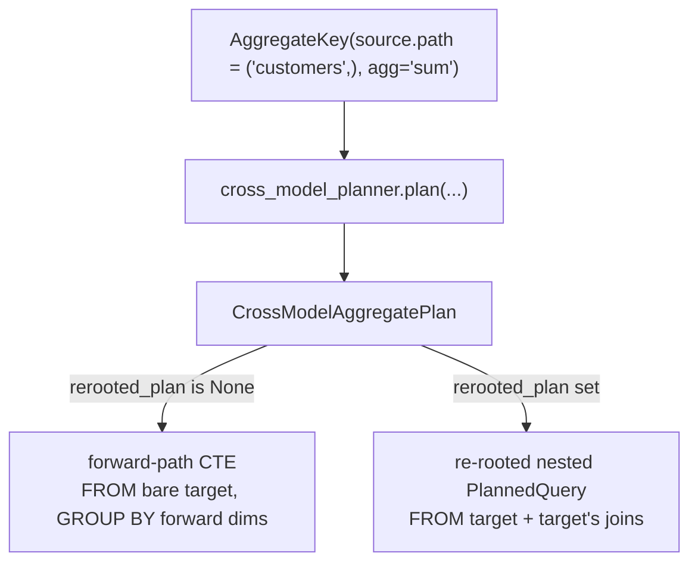
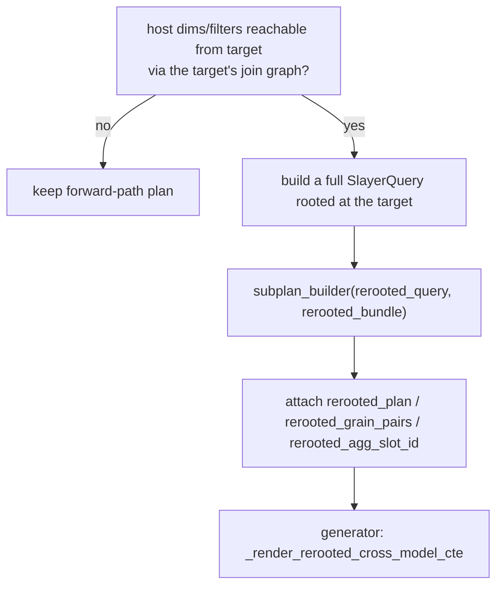
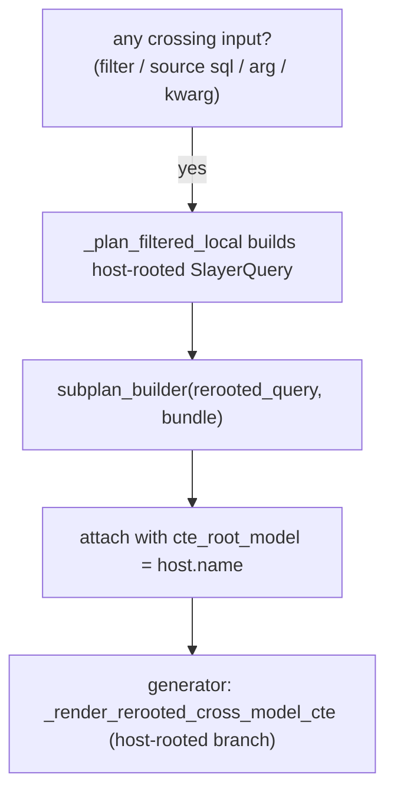

# Cross-model aggregates

**Modules:** `slayer/engine/cross_model_planner.py` (strategy +
`_maybe_reroot_cross_model_plan`),
`slayer/sql/generator.py` (`_render_with_cross_model_plans`,
`_render_rerooted_cross_model_cte`)

A cross-model aggregate is `customers.revenue:sum` on an `orders`-rooted query —
an aggregate whose source carries a non-empty join path. Principle **P3** says it
shares the `AggregateKey` shape with a local aggregate (only `source.path`
differs), and that "base CTE vs cross-model CTE" is a *render strategy* decided
downstream, not a semantic split. The identity side of P3 holds cleanly. The
**render** side turned out to need two strategies — the most significant
deviation from the plan.

## The identity is uniform; the rendering is not

```mermaid
flowchart TB
    agg["AggregateKey(source.path = ('customers',), agg='sum')"]
    agg --> cmp["cross_model_planner.plan(...)"]
    cmp --> plan["CrossModelAggregatePlan"]
    plan -->|rerooted_plan is None| fwd["forward-path CTE<br/>FROM bare target, GROUP BY forward dims"]
    plan -->|rerooted_plan set| rr["re-rooted nested PlannedQuery<br/>FROM target + target's joins"]
```

The planner detects the cross-model case structurally (`agg_path` non-empty in
`plan_query`) and invokes the strategy. The strategy is a substitutable
component — **I1**: `CrossModelPlanner` is a `Protocol`,
`IsolatedCteCrossModelPlanner` is the default — so the *shape* of the result
(`CrossModelAggregatePlan` in `planned.py`) is strategy-agnostic and only the
populating planner changes.

## Strategy 1: `IsolatedCteCrossModelPlanner` (the plan's design)

This is the planned design: one CTE per `(target_model, shared_grain)`. It walks
the join chain from host to target (`_walk_chain` → `JoinRequirement`s), groups
the aggregate at the first hop's target grain, and builds `join_back_pairs` so
the host LEFT JOINs the CTE back on the first-hop columns. `_make_cte_schema`
produces the CTE's typed projection. `_aggregate_alias` derives the output
column name via `canonical_agg_name`.

### Host-filter routing (the `inherited_filter_policy` decision table)

`classify_host_filter` is a pure classifier mapping each host filter to a
`FilterRoute`:

| Filter references | Route |
| --- | --- |
| host-local row slot only | `DROP_HOST_LOCAL` (applied at host) |
| all on the joined-target path (row) | `PROPAGATE_WHERE` |
| cross-model agg-ref on the same target | `PROPAGATE_HAVING` |
| slots on a different joined branch | `DROP_UNREACHABLE` (+ warn) |
| mixed reachable + unreachable | `DROP_UNREACHABLE` (+ warn) |
| transform / POST phase | `STAY_AT_HOST_POST` |

The planner threads each route into the explicit
`where_filter_ids` / `having_filter_ids` lists on `CrossModelAggregatePlan` so
the generator never re-classifies. The target model's own `SlayerModel.filters`
ride into `target_model_filters` (always-applied WHERE), and a `Column.filter` on
the aggregated column rides on the `AggregateKey` itself as a CASE-WHEN — neither
goes through host-filter classification. `shared_grain_slots` is the set of host
dimension/time-dimension slots reachable from the target, used to LEFT JOIN the
CTE back without changing cardinality.

### Rerooting the aggregate's embedded references (`reroot_aggregate_key`)

When the forward `_cm_*` CTE (`_render_cross_model_cte`), its HAVING route, and
the re-rooted plan render a cross-model aggregate
in its target scope, every reference embedded in the `AggregateKey` — the
`source`, positional `args` (e.g. the `first`/`last` explicit time arg), keyword
`kwargs` values (e.g. `weighted_avg(weight=…)`), and `column_filter_key` — must
be re-anchored from the query root's coordinate system to the target's. This is
one symmetric transform, `slayer.core.keys.reroot_aggregate_key(key, *,
target_path)` (DEV-1707), which prefix-strips `target_path` off each ref's join
path and keeps the residual (`('customers','regions')` under target
`('customers',)` → `('regions',)`; an exact match → local). `column_filter_key`
is owner-anchored (stamped against the model that owns the filtered column) and
therefore invariant under reroot — it is carried through unchanged. A time arg
left with a *residual* path after reroot (a hop past the target) is a
[DEV-1526](https://linear.app/motley-ai/issue/DEV-1526) Stage-4 gap: the isolated
CTE does not yet pull that deeper join, so `_resolve_explicit_time_col` raises
for the derived-column case and the scope-closure validator catches the
bare-column case.

## Strategy 2: re-rooting (the deviation)

`IsolatedCteCrossModelPlanner` alone is insufficient. When the host query carries
dimensions that are reachable from the target through the **target's own** join
graph (the legacy `_build_rerooted_enriched` case — e.g.
`policy_amount → policy → policy_number`), the forward-path CTE
("FROM bare target, GROUP BY forward-path dims only") collapses the host
dimension to a scalar `CROSS JOIN`: every host row gets the global aggregate
instead of a per-dimension value.

`_maybe_reroot_cross_model_plan` detects this and attaches a nested re-rooted
plan. As of DEV-1450 follow-up #2 it lives in `cross_model_planner.py` and runs
**inside** `IsolatedCteCrossModelPlanner.plan` — the strategy owns the
forward-vs-re-rooted choice rather than `plan_query` patching the plan after the
fact:

```mermaid
flowchart TB
    detect["host dims/filters reachable from target<br/>via the target's join graph?"]
    detect -->|no| keep["keep forward-path plan"]
    detect -->|yes| build["build a full SlayerQuery rooted at the target"]
    build --> replan["subplan_builder(rerooted_query, rerooted_bundle)"]
    replan --> attach["attach rerooted_plan / rerooted_grain_pairs / rerooted_agg_slot_id"]
    attach --> gen["generator: _render_rerooted_cross_model_cte"]
```

It re-roots each host dimension/time-dimension/filter from the host's perspective
to the target's (`reroot_value_key`: host-local → `<host>.<name>`; on-target →
bare; through-target → strip the prefix), drops anything unreachable from the
target, re-anchors the aggregate as a typed key (`reroot_aggregate_key`), builds
a fresh `SlayerQuery` rooted at the target, and
compiles it via the injected `subplan_builder` callback (which `plan_query`
supplies as a `plan_query` recursion — keeping `cross_model_planner.py` free of a
`stage_planner` import). The sub-plan is rendered by
`_render_rerooted_cross_model_cte` as the `_cm_*` CTE (FROM target + the target's
joins, preserving host grain) and joined back on the re-rooted dimension via
`rerooted_grain_pairs`.

### Why this is flagged as a deviation

The plan envisioned the `inherited_filter_policy` decision table plus
`IsolatedCteCrossModelPlanner` as **the** cross-model mechanism. In practice
there are now **two** cross-model render strategies, both owned by the strategy
(`IsolatedCteCrossModelPlanner.plan` → `_maybe_reroot_cross_model_plan`), with
the re-rooting one bolted onto `CrossModelAggregatePlan` via `rerooted_plan` /
`rerooted_grain_pairs` / `rerooted_agg_slot_id`. P3's "one shape, render strategy
chosen downstream" holds for *identity* but not for *rendering* — and the
re-rooted path is, structurally, the legacy `_build_rerooted_enriched` shape
brought across to the typed plan.
This reintroduces (in a contained, typed form) the kind of "second resolution
path for a permutation" the redesign set out to eliminate. It works and is
tested, but it is the place a future reviewer should look first when reasoning
about cross-model behavior.

## Strategy 3: host-rooted isolation — any crossing input (DEV-1503, widened by DEV-1709)

A LOCAL aggregate (empty `source.path`) isolates into a **host-rooted** CTE
when **any** of its inputs crosses a join (Law 3, DEV-1703 D1/D2):

- its `Column.filter` references a joined table — the original DEV-1503
  case (`loss_payment_amt:sum` with `filter="loss_payment.has_flag = 1"`),
  read from the bind-time `column_filter_key.referenced_join_paths`;
- its **source `Column.sql`** crosses a join (`region_pay` with
  `sql="customers.regions.payment_amount"` — dotted-canonical since DEV-1743 —
  and sibling derived chains);
- a **positional arg** crosses — including the explicit first/last time arg
  (`amount:last(customers.signup_at)` and derived variants);
- a **kwarg** crosses — a column ref (`weighted_avg(weight=customers.w)` or
  a crossing derived column), a user-supplied template-fragment string, or
  a non-overridden model-default `AggregationParam.sql` fragment.

The non-filter kinds are computed plan-time by
`slayer/engine/aggregate_input_paths.py::compute_aggregate_input_join_paths`
(the same parse → derived-expansion → root-scope-walk pipeline the filter
scan uses; an unparseable template fragment contributes nothing — parity
with the filter scan's defensive fallback). Without isolation, a crossing
input emitted inline in the host base SELECT would pull its join into the
host's FROM: two measures whose filter targets are different INNER joins
would intersect the base to rows present in BOTH targets, and any 1:N
crossing join would **multiply the host rows seen by sibling measures** —
the sibling-protection guarantee is the point of Law 3. The crossing
measure itself keeps multiply-per-match semantics inside its CTE (F1
decision — 1:N semantics unchanged, only the scope moved).

The trigger predicate is structural:
`agg_path` non-empty (forward cross-model, target-rooted) **OR** any
crossing input (host-rooted). Both route through
`IsolatedCteCrossModelPlanner.plan`; the host-rooted branch
calls `_plan_filtered_local`, which carries the EXISTING typed `aggregate_key`
unchanged (the sub-plan is rooted at the SAME host model, so there is nothing to
re-root) into a
**host-rooted** nested `PlannedQuery` (same `source_model`, same dims/TDs,
only the crossing measure as the single aggregate) and attaches it via the
same `rerooted_plan` / `rerooted_grain_pairs` / `rerooted_agg_slot_id`
slots the re-rooted path uses. The plan carries
`cte_root_model = host_model.name` as the disambiguator the renderer
reads; `_render_rerooted_cross_model_cte` short-circuits the source-model
swap when `cte_root_model` is set. Isolation is strictly
per-`AggregateKey`-slot: identical keys intern to one slot and share one
CTE; distinct keys get distinct CTEs (cross-CTE merging is DEV-1688 /
`may_inline` territory).

```mermaid
flowchart TB
    detect["any crossing input?\n(filter / source sql / arg / kwarg)"]
    detect -->|yes| build["_plan_filtered_local builds host-rooted SlayerQuery"]
    build --> replan["subplan_builder(rerooted_query, bundle)"]
    replan --> attach["attach with cte_root_model = host.name"]
    attach --> gen["generator: _render_rerooted_cross_model_cte (host-rooted branch)"]
```

`subplan_builder` always passes `disable_host_rooted_isolation=True`
(DEV-1709 rename of `disable_dev1503_isolation`) so the recursive
`plan_query` call inside the sub-plan does NOT re-trigger isolation on the
same measure — inside the CTE the crossing inputs render inline
(base-pull), which is legal there because the CTE is the aggregate's own
scope. The flag never affects target-rooted isolation.

### Composite lowering (F3)

In an AGGREGATE-phase composite (`a:sum + b:sum`, `coalesce(a:sum, 0)`),
each **crossing leaf** isolates individually (the leaves are hidden
aggregate slots that traverse the same trigger loop); local leaves stay in
`_base`; the composite expression renders only in the combined SELECT via
the leaves' projected aliases. This holds for projected composites,
filter-only composites (routed to the outer WHERE), and order-only
aggregate refs.

### first/last is a route of its own

A `first`/`last` aggregate does NOT reach the cross-model route. It needs its
own ROW ORDERING, so it isolates for that reason — which subsumes the
crossing-input trigger — and compiles to a `_rk_` CTE. See
[Ranked aggregates](ranked-aggregates.md). The one exception is a **re-rooted**
cross-model `first`/`last`, which keeps its `CrossModelAggregatePlan`: the
ranked plan belongs to its nested sub-plan.

### Filter routing for filtered-local

| Host filter phase | Route |
| --- | --- |
| ROW | propagate into the host-rooted sub-plan (so a non-dim filter like `status = 'active'` affects the isolated aggregate's rowset) |
| AGGREGATE | **outer combined-SELECT WHERE wrapper** (see below) |
| POST | stay at the existing host post-transform wrapper |

### Outer combined-SELECT WHERE wrapper

An AGGREGATE-phase host filter referencing an isolated aggregate
(`loss_payment_amt:sum > 1000`) cannot route as HAVING inside the `_cm_*` CTE:
the LEFT JOIN back to `_base` would surface host rows whose filtered
aggregate didn't meet the predicate with a NULL value instead of dropping
them. The renderer (`_render_with_cross_model_plans`) classifies each
AGGREGATE-phase filter; any that walks an `AggregateKey` matching an
isolated slot is routed to an outer WHERE on the **combined SELECT** (which
is non-aggregating — plain WHERE is legal). The renderer
(`_render_filter_for_outer_wrapper`) substitutes:

- isolated `AggregateKey` → `<cte_name>."<agg_col_alias>"` (the joined-back column),
- any other slot → `_base."<first_alias>"` (the host base's projection).

Non-isolated aggregate operands of a mixed filter (`loss_payment_amt:sum >
1000 AND total_amount:sum > 10` where `total_amount:sum` isn't a public
measure) are promoted to hidden aux slots in `base_render_order` by the
existing `_add_local_aux_slots(aggregates_only=True)` pass — `_base`
materialises them so the outer WHERE can reference them, and the combined
public projection trims them out.

## Generator side

`generate_from_planned` delegates to `_render_with_cross_model_plans` when
`cross_model_aggregate_plans` is non-empty. Each plan renders as a `_cm_*` CTE
(forward-path or re-rooted), joined back to the host base. `Column.filter` on the
aggregated column renders as `SUM(CASE WHEN <filter> THEN <col> END)`. See
[SQL generation](sql-generation.md).

### The forward CTE is a `ScopeFrame` (DEV-1708, DEV-1703 Stage 4)

`_render_cross_model_cte` builds one `ScopeFrame` rooted at the target relation
and routes **every** expression it renders — the rerooted aggregate source,
positional args, column-ref kwargs, `Column.filter`, shared-grain dimensions,
target-model filters, and routed host WHERE/HAVING filters — through
`resolve()` (Law 1). Each `resolve` anchors the ref at the target and registers
the joins it crosses into the CTE's single ordered `join_paths` set, from which
the CTE `FROM` is built. Discovery can no longer be forgotten per carrier: a
cross-model aggregate whose target column's `Column.sql` crosses a *further*
join (`customers.deep_pop:sum` where `deep_pop` is `regions.population`) now
pulls that `LEFT JOIN regions` into the `_cm_*` CTE, and a parametric-agg
column-ref kwarg naming a derived target column expands through the scope
instead of emitting a bare, non-existent column. Routed WHERE/HAVING filters
register their joins in a **pre-pass** that walks the full `ValueKey` tree
(nested arithmetic/boolean/IN operands + aggregate leaves' source/args/kwargs/
`column_filter`) before the `FROM` is built, so a HAVING — rendered later, once
the ranked-subquery rank columns exist — still contributes its joins.

**Projection boundaries (Law 2).** A `_cm_` CTE consumes a value from an inner
scope by ALIAS, never by re-reaching for the expression: a ref that crosses a
join is bound only where that join is, so the inner scope projects it as
`_val_<n>` and the outer names the alias. The projection is the **resolved**
value (qualified, with the `Column.type` inner CAST for non-bare expressions),
so `SUM(CAST(x AS t))` semantics are preserved and same-sql-different-type
aggregates keep distinct materialisations. `generate_from_planned` installs one
generation-wide `AliasAllocator` (save/restore) so inline forward CTEs, grain
projections, and the host base never collide on `_val_<n>`; each CTE reserves
its root model's physical column names so a minted alias never shadows a real
column. The ranked (`_rk_`) route obeys the same law through the same
`ScopeFrame` table — see [Ranked aggregates](ranked-aggregates.md).

### Derived shared-grain rendering (DEV-1728)

A cross-model aggregate can be grouped by a joined **derived** dimension
(`{"dimensions": ["customers.rev_x2"], "measures": ["customers.revenue:sum"]}`,
where `rev_x2` is a `Column.sql` on `customers`). The grain loop expands the
derived column's `Column.sql` rooted at the target relation, adds it to the CTE
`SELECT` + `GROUP BY` under the **dotted** host alias
(`orders.customers.rev_x2` — the same alias the host base projects since
DEV-1713), and joins back null-safe. A derived expression that crosses a
*further* join (`deep_pop` = `regions.population`) pulls that join into the CTE
`FROM` via the same `ScopeFrame` machinery the derived-time-dimension grain uses;
a plain derived grain is wrapped in the same `CAST(... AS <type>)` the host base
applies so the join-back compares identically-typed values. Only an
**intermediate-hop** grain (a grain on a middle hop of a multi-hop aggregate
target path) is still unrendered — it raises the same 7b.12 `NotImplementedError`
a base column on an intermediate hop does.

### Null-safe grain join-back

The combined-SELECT `LEFT JOIN _cm_* ON` grain equality uses a dialect-aware
null-safe predicate (`SqlDialect.build_null_safe_eq`): `IS NOT DISTINCT FROM`
on Postgres/DuckDB/Snowflake/BigQuery/Trino/Presto/Databricks/Spark/ClickHouse,
`<=>` on MySQL, bare `IS` on SQLite (the native form needs SQLite ≥3.39), and
the expanded `a = b OR (a IS NULL AND b IS NULL)` on T-SQL/Oracle/Redshift. A
plain `=` would yield `NULL` for `NULL = NULL`, so a NULL dimension value or a
nullable truncated time grain would drop its joined-back aggregate; the
null-safe form retains it.

## Known limitations (documented, not blocking)

- A host-local filter on a **no-dimension** cross-model-agg query is applied
  nowhere (the empty `_base` placeholder doesn't filter; host-local filters are
  excluded from the re-rooted CTE). Semantically ambiguous; rare.
- `time_shift` / `consecutive_periods` (and `change` / `change_pct`, which
  desugar to `time_shift`) **render** over a **local** or **host-rooted** inner
  aggregate that coexists with a cross-model aggregate (DEV-1750). The
  cross-model transform chain gained the same shifted / cp CTE emitters the local
  chain uses, so a crossing template fragment (`amount:wscaled_sum` with a
  default `w='customers.regions.weight'`) pulls its join into the shifted CTE.
  Two shapes stay guarded, loudly: a `time_shift` whose inner aggregate is
  **target-grain** cross-model (`cte_root_model is None` — host-rooted
  re-aggregation would multiply target rows through the 1:N join), and a
  `time_shift` over a **ranked `first`/`last`** aggregate (the shifted CTE
  re-aggregates flatly and cannot reproduce the ROW_NUMBER ranking).
  `change` / `change_pct` over a **cross-model** inner aggregate hits a separate
  combined-arithmetic-over-transform gap (DEV-1800), tracked independently.
- Cross-model parametric-agg result keys diverge from legacy **by design**:
  `customers.revenue:percentile(p=0.5)` → `…revenue_percentile_p_0_5` where
  legacy dropped the kwarg suffix (`…revenue_percentile`). Legacy's drop was a
  collision bug; the new path keeps the suffix. This violates **P10** for this
  one combination and is tested structurally, not by parity. See
  [the deviations list](index.md#deviations-from-the-plan).
- A cross-model parametric-agg kwarg naming a **target** column
  (`customers.revenue:weighted_avg(weight=customers.qty)`) is supported and
  expands through the CTE `ScopeFrame` (DEV-1708). The kwarg must be
  **relation-qualified** — a bare `weight=qty` resolves against the host by DSL
  rule and raises at bind time. A *host-local* weight column evaluated inside
  the target CTE remains unsupported.
- A **shared-grain dimension on an intermediate hop** of a multi-hop aggregate
  target path (base or derived) raises the 7b.12 `NotImplementedError` — use the
  terminal-target path or pull the dimension to the host base. (A plain derived
  grain on the *terminal* target path is fully rendered — see
  [Derived shared-grain rendering](#derived-shared-grain-rendering-dev-1728).)

## Design rationale

- **Why a Protocol (I1)?** So the cross-model strategy is substitutable without
  touching the plan shape or the generator. The re-rooting case shows the value:
  it was added as a *second* population path for the same `CrossModelAggregatePlan`
  struct, not as a new struct.
- **Why route filters in the planner, not the generator?** So the generator
  renders each route mechanically. Classification needs the slot graph (which
  slot is on which branch); putting it in the planner keeps the generator a
  straight `WHERE`/`HAVING`/`CASE-WHEN` emitter.
- **Why re-root rather than emit a literal JOIN chain inside the CTE?** Parity
  with legacy `_build_rerooted_enriched` for the grain-preserving case; emitting
  the chain directly was the path not taken, and re-rooting reuses the whole
  planner recursively, which is less code than a bespoke chain emitter — at the
  cost of the second-strategy complexity above.
