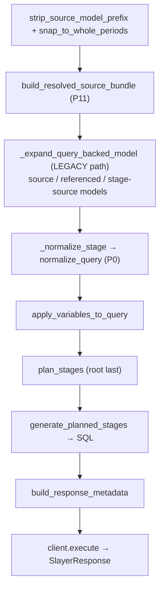

# Engine orchestration

**Modules:** `slayer/engine/query_engine.py` (`_execute_pipeline`,
`save_model`), `slayer/engine/variables.py`

`SlayerQueryEngine` is where the pipeline is wired into a runnable execution. It
also marks the boundary between the new typed pipeline and the legacy stack that
still co-exists.

## `execute` → `_execute_pipeline`

`execute(query, …)` dispatches over the input shape (str run-by-name, dict, list
DAG, `SlayerQuery`), then `_execute_pipeline` runs the linear pipeline:

The new typed pipeline is `build_resolved_source_bundle → _normalize_stage →
apply_variables_to_query → plan_stages → generate_planned_stages →
build_response_metadata`. Storage is consulted once, in
`build_resolved_source_bundle` (P11).

`_normalize_stage` resolves each stage's source model from the bundle so
`MISPLACED_MEASURE` and custom-aggregation-aware `FUNC_STYLE_AGG` see the right
column / aggregation names; a sibling-sourced stage normalizes with `model=None`.
Slack warnings from every stage are collected and surface on
`SlayerResponse.warnings`.

`_touched_models_for_plan` collects the model names a query-time DBAPI error
could be attributed to (bundle referenced models + cross-model targets +
query-backed base names) for schema-drift attribution.

## Variables (`variables.py`)

`merge_query_variables` collapses the four layers — **runtime > stage > outer >
model defaults** — into the effective dict that populates
`ResolvedSourceBundle.query_variables`. `apply_variables_to_query` returns a fresh
`SlayerQuery` with `{var}` substituted in `filters` (the only field legacy
substituted; formula text, `Column.sql`, `Column.filter`, `SlayerModel.filters`
are deliberately not substituted). `dry_run_placeholders=True` fills unresolved
valid placeholders with `"0"` (the legacy save-time dry-run behavior); invalid
names still raise.

## `save_model`

`save_model` runs `normalize_model` (the [slack layer](slack-normalization.md))
so persisted formulas land canonical, then persists. For a **query-backed** model
it rejects user-supplied cache fields and calls `_validate_and_populate_cache`,
which renders the backing query and stores `columns` / `backing_query_sql` /
`data_source`.

## Where the legacy stack still runs (the deviation)

This is the most important orchestration fact, and the largest gap between the
plan and the implementation. The cutover routed **top-level query planning**
through the new pipeline, but **query-backed model expansion** still runs
entirely on the legacy stack — in production, not just tests:

| Path | Renders the backing SQL via |
| --- | --- |
| `_execute_pipeline` → `_expand_query_backed_model` | `_query_as_model` → `enrich_query` → `SQLGenerator.generate` (legacy) |
| `save_model` → `_validate_and_populate_cache` | `_query_as_model` → … → `SQLGenerator.generate` (legacy) |

`_expand_query_backed_model` turns a model's `source_queries` into a virtual
`sql`-mode model whose `.sql` is the rendered backing query — and it does so by
calling `_query_as_model`, which internally runs `_enrich` and the legacy
`SQLGenerator.generate`. The new pipeline then treats that virtual model as a
plain `sql`-mode model and plans/renders the **outer** query through the typed
path.

`_execute_pipeline` invokes `_expand_query_backed_model` for the source model
(line ~581), for query-backed referenced (join/cross-model target) models
(~621), and for non-root stage sources (~640). So:

- `enrichment.py` (~100 KB), `enriched.py` (`EnrichedQuery` / `EnrichedMeasure`),
  `_query_as_model`, the legacy `SQLGenerator.generate`,
  `_rewrite_funcstyle_aggregations`, and the `_forbidden_sibling_refs_var` /
  `_join_target_resolving_var` `ContextVar`s **all still exist and still run**;
- the typed pipeline is the resolution path for the *outer* query and for the
  four acceptance bugs; the legacy stack is load-bearing for query-backed inner
  rendering and (via the synth adapter) dialect SQL emission.

The plan's stage-7b bullet said the cutover would delete all of the above. In
practice every deletion is deferred to **DEV-1452**, which must first migrate
query-backed expansion onto the typed pipeline (it shares machinery with
cross-stage join rendering). Until then, do not read the legacy modules as dead
code — `_query_as_model` is on a hot path.

## Pre-processing before the "single" slack pass

`_execute_pipeline` runs `strip_source_model_prefix()` and (when
`whole_periods_only`) `snap_to_whole_periods()` *before* `_normalize_stage`.
These are query-shape transforms rather than slack-token rewrites, but they mean
the pipeline does not literally "begin with a single slack-normalization pass"
(**P0**). A minor deviation, noted for completeness in
[the deviations list](index.md#deviations-from-the-plan).

## Design rationale

- **Why split the cutover this way?** Bisectability. Flipping the outer query
  while leaving query-backed expansion on legacy let the cutover land with all
  non-integration tests green and integration green, without a single
  thousand-line "delete everything" commit. The cost is the temporary
  two-pipeline coexistence above.
- **Why does query-backed expansion produce a virtual `sql`-mode model rather
  than planning the inner stages directly?** Because the outer typed pipeline
  already knows how to consume a `sql`-mode model. Re-expressing a query-backed
  model as `{sql_table: None, sql: <rendered backing query>}` lets the outer
  planner stay oblivious to query-backedness — at the cost of rendering the inner
  SQL through the legacy generator for now. DEV-1452's job is to make the inner
  rendering go through `plan_stages` / `generate_planned_stages` too.
- **Why consult storage only in the bundle builder (P11)?** So everything after
  it is pure and order-independent. The legacy `ContextVar` re-resolution exists
  *only* on the query-backed/legacy path; the new path has none.
