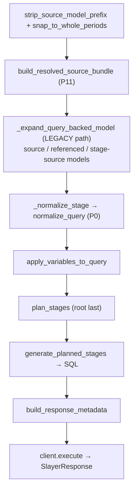

# Engine orchestration

**Modules:** `slayer/engine/query_engine.py` (`_execute_pipeline`,
`save_model`), `slayer/engine/variables.py`

`SlayerQueryEngine` is where the pipeline is wired into a runnable execution. It
also marks the boundary between the new typed pipeline and the legacy stack that
still co-exists.

## `execute` → `_execute_pipeline`

`execute(query, …)` dispatches over the input shape (str run-by-name, dict, list
DAG, `SlayerQuery`), then `_execute_pipeline` runs the linear pipeline:

```mermaid
flowchart TB
    pre["strip_source_model_prefix + snap_to_whole_periods"]
    pre --> bundle["build_resolved_source_bundle (P11)"]
    bundle --> qbexp["_expand_query_backed_model (LEGACY path)<br/>source / referenced / stage-source models"]
    qbexp --> norm["_normalize_stage → normalize_query (P0)"]
    norm --> vars["apply_variables_to_query"]
    vars --> plan["plan_stages (root last)"]
    plan --> gen["generate_planned_stages → SQL"]
    gen --> meta["build_response_metadata"]
    meta --> exec["client.execute → SlayerResponse"]
```

The new typed pipeline is `build_resolved_source_bundle → _normalize_stage →
apply_variables_to_query → plan_stages → generate_planned_stages →
build_response_metadata`. Storage is consulted once, in
`build_resolved_source_bundle` (P11).

`_normalize_stage` resolves each stage's source model from the bundle so
`MISPLACED_MEASURE` sees the right column names; a sibling-sourced stage
normalizes with `model=None`. (`FUNC_STYLE_AGG` is retired — functional
aggregations parse natively since DEV-1826.) Slack warnings from every stage
are collected and surface on `SlayerResponse.warnings`.

`_touched_models_for_plan` collects the model names a query-time DBAPI error
could be attributed to (bundle referenced models + cross-model targets +
query-backed base names) for schema-drift attribution.

## Variables (`variables.py`)

`merge_query_variables` collapses the four layers — **runtime > stage > outer >
model defaults** — into the effective dict that populates
`ResolvedSourceBundle.query_variables`. `apply_variables_to_query` returns a fresh
`SlayerQuery` with `{var}` substituted in `filters` (the only field legacy
substituted; formula text, `Column.sql`, `Column.filter`, `SlayerModel.filters`
are deliberately not substituted). `dry_run_placeholders=True` fills unresolved
valid placeholders with `"0"` (the legacy save-time dry-run behavior); invalid
names still raise.

## `save_model`

`save_model` runs `normalize_model` (the [slack layer](slack-normalization.md))
so persisted formulas land canonical, then persists. For a **query-backed** model
it rejects user-supplied cache fields and calls `_validate_and_populate_cache`,
which renders the backing query and stores `columns` / `backing_query_sql` /
`data_source`.

## Query-backed model expansion

`_expand_query_backed_model` turns a model's `source_queries` into a virtual
`sql`-mode model whose `.sql` is the rendered backing query. It mirrors
`_execute_pipeline`'s mid-section (bundle → expand-nested → normalize →
variables → `plan_stages` → `generate_planned_stages`) and wraps the result in a
flat-rename SELECT so the virtual model exposes downstream-bindable flat
columns. The pipeline then treats that virtual model as a plain `sql`-mode model
and plans/renders the **outer** query the same way.

`_execute_pipeline` invokes it for the source model, for query-backed referenced
(join/cross-model target) models, and for non-root stage sources; `save_model` →
`_validate_and_populate_cache` uses the same path for its save-time dry run. One
renderer, one set of semantics, in every case.

!!! note "Historical: the two-pipeline period"

    Between the DEV-1450 cutover and DEV-1485 there were **two** rendering
    stacks. The cutover routed top-level query planning through the typed
    pipeline, but query-backed expansion kept running on the legacy
    `_query_as_model` → `enrich_query` → `SQLGenerator.generate(enriched=…)`
    path in production. DEV-1452 Stage B migrated expansion onto the typed
    pipeline, and DEV-1485 (Stage D) deleted the legacy stack outright —
    `enrichment.py`, `enriched.py` (`EnrichedQuery` / `EnrichedMeasure`),
    `_query_as_model`, the legacy `SQLGenerator.generate`, and the
    `_forbidden_sibling_refs_var` / `_join_target_resolving_var` `ContextVar`s
    are all gone. Sibling stages resolve through `_follow_sibling_chain` in
    `source_bundle.py`; forward / self / cycle references are caught by
    `topologically_order_stages` up front.

    Documentation, commit messages, and issues written during that period may
    still describe the legacy path as load-bearing. It is not — it no longer
    exists.

## Pre-processing before the "single" slack pass

`_execute_pipeline` runs `strip_source_model_prefix()` and (when
`whole_periods_only`) `snap_to_whole_periods()` *before* `_normalize_stage`.
These are query-shape transforms rather than slack-token rewrites, but they mean
the pipeline does not literally "begin with a single slack-normalization pass"
(**P0**). A minor deviation, noted for completeness in
[the deviations list](index.md#deviations-from-the-plan).

## Design rationale

- **Why split the cutover this way?** Bisectability. Flipping the outer query
  while leaving query-backed expansion on legacy let the cutover land with all
  non-integration tests green and integration green, without a single
  thousand-line "delete everything" commit. The cost is the temporary
  two-pipeline coexistence above.
- **Why does query-backed expansion produce a virtual `sql`-mode model rather
  than planning the inner stages directly?** Because the outer typed pipeline
  already knows how to consume a `sql`-mode model. Re-expressing a query-backed
  model as `{sql_table: None, sql: <rendered backing query>}` lets the outer
  planner stay oblivious to query-backedness — at the cost of rendering the inner
  SQL through the legacy generator for now. DEV-1452's job is to make the inner
  rendering go through `plan_stages` / `generate_planned_stages` too.
- **Why consult storage only in the bundle builder (P11)?** So everything after
  it is pure and order-independent. The legacy `ContextVar` re-resolution exists
  *only* on the query-backed/legacy path; the new path has none.
