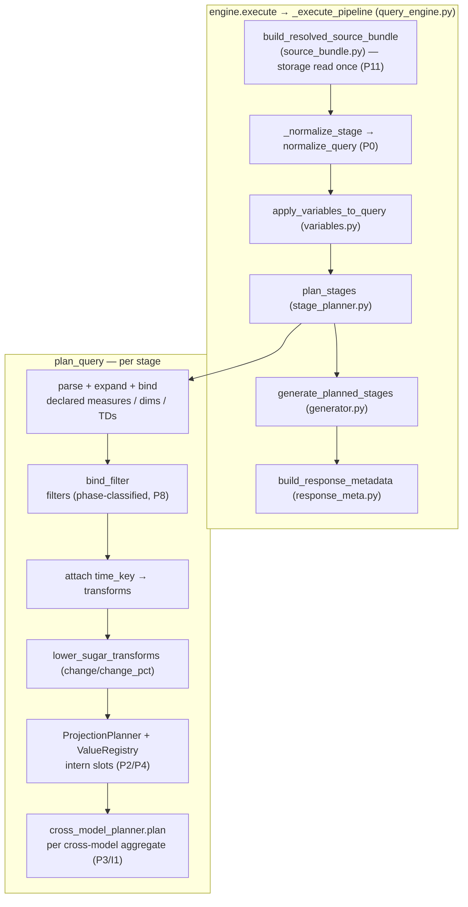

# Architecture: the typed resolution pipeline

This section documents how SLayer turns a `SlayerQuery` into SQL — the typed,
composable pipeline introduced by the DEV-1450 redesign. It describes the code
**as currently implemented**, not the original plan; where the implementation
diverges from the plan, [Deviations from the plan](#deviations-from-the-plan)
calls it out.

The audience is contributors. If you only write queries, read
[Concepts](../concepts/queries.md) instead.

## Why the redesign

The expressive surface syntax (dotted joins, colon aggregation, transforms,
renamed measures, cross-model aggregates) used to be resolved by a single large
enrichment pass (`slayer/engine/enrichment.py`, ~2300 lines) that interleaved
string rewriting, alias remapping, a parallel `cross_model_measures` track,
virtual-model flattening, and implicit passthrough. Every new permutation of
"custom name × join × transform" added another resolution path, and the paths
interacted in ways that produced corner-case bugs (DEV-1445/1446/1448/1449).

The redesign replaces that with a pipeline of small stages, each taking
well-typed input and producing a well-typed intermediate object that carries
everything the next stage needs. **Identity is structural, not textual** — the
single idea that makes the four bugs structurally impossible rather than
individually patched.

## The pipeline at a glance

```mermaid
flowchart LR
    raw["SlayerQuery<br/>(raw, slack-tolerant)"] --> norm["slack normalize<br/>(normalization.py)"]
    norm --> parse["parse_expr<br/>(syntax.py)"]
    parse --> expand["expand measures<br/>(measure_expansion.py)"]
    expand --> bind["bind_expr / bind_filter<br/>(binding.py)"]
    bind --> plan["plan_query / plan_stages<br/>(stage_planner.py)"]
    plan --> planned["PlannedQuery<br/>(planned.py)"]
    planned --> gen["generate_planned_stages<br/>(generator.py)"]
    gen --> sql["SQL string"]
```

Each arrow is the typed-object boundary from principle **P7**
(`raw → NormalizedInput → ParsedExpr → BoundExpr → ValueSlot → PlannedQuery →
SQL`). No stage string-rewrites the output of a previous stage after parsing.

A more detailed view, showing the planner's internal sub-stages and the source
bundle that feeds resolution:

## Principles, and where they live

The redesign was specified as 12 principles (P0–P11). Each maps to a concrete
module:

| Principle | Statement | Where |
| --- | --- | --- |
| **P0** | Pipeline begins with a single slack-normalization pass; rewrites are returned as typed warnings | [`normalization.py`](slack-normalization.md) |
| **P1** | Two surface languages (Mode A SQL / Mode B DSL), never mixed mid-expression; closed `SCALAR_FUNCTIONS` allowlist | [`syntax.py`](parsing.md), `keys.py` |
| **P2** | Identity is structural, not textual — two equal keys intern to one slot | [`keys.py`](typed-keys.md), `planning.py` |
| **P3** | Local and cross-model aggregates share one `AggregateKey` shape (path empty vs non-empty) | [`keys.py`](typed-keys.md), [`cross_model_planner.py`](cross-model-aggregates.md) |
| **P4** | Public names are a separate namespace; a slot has one declared name + many public aliases | [`planning.py`](planning.md) |
| **P5** | Scope determines what dots mean — `ModelScope` vs `StageSchema`, never confused | [`scope.py`](scopes-and-bundle.md), [`binding.py`](binding.md) |
| **P6** | Each stage emits an explicit `StageSchema`; stages compose only through schemas | [`scope.py`](scopes-and-bundle.md), [`stage_planner.py`](stage-planning.md) |
| **P7** | Typed pipeline; no string rewriting after parse | whole pipeline |
| **P8** | Phase (WHERE/HAVING/post) is a property of the slot, not the filter text | [`keys.py`](typed-keys.md) `Phase`, [`binding.py`](binding.md) |
| **P9** | Transforms are operators over slots, not over strings | [`planning.py`](planning.md), [`binding.py`](binding.md) |
| **P10** | Result-key contract preserved exactly | [`generator.py`](sql-generation.md), `response_meta.py` |
| **P11** | Resolution is pure — storage consulted once, no `ContextVar` re-resolution | [`source_bundle.py`](scopes-and-bundle.md) |

## Module map

The new pipeline modules, in dependency order:

| Module | Role | Doc |
| --- | --- | --- |
| `slayer/core/keys.py` | The `ValueKey` family — structural identity primitives | [Typed keys](typed-keys.md) |
| `slayer/core/scope.py` | `ModelScope`, `StageSchema`, `StageColumn` | [Scopes & bundle](scopes-and-bundle.md) |
| `slayer/core/errors.py`, `warnings.py` | Typed errors + slack-warning carriers | [Errors & warnings](errors-and-warnings.md) |
| `slayer/engine/source_bundle.py` | `ResolvedSourceBundle` + eager builder (P11) | [Scopes & bundle](scopes-and-bundle.md) |
| `slayer/engine/normalization.py` | Slack-normalization layer (P0) | [Slack normalization](slack-normalization.md) |
| `slayer/engine/syntax.py` | Mode-B Python-AST parser → `ParsedExpr` | [Parsing](parsing.md) |
| `slayer/sql/sql_expr.py` | Mode-A sqlglot wrapper | [Parsing](parsing.md) |
| `slayer/engine/measure_expansion.py` | Pre-bind named-`ModelMeasure` expansion | [Parsing](parsing.md) |
| `slayer/engine/binding.py` | `ExpressionBinder` / `FilterBinder` → `BoundExpr` | [Binding](binding.md) |
| `slayer/engine/planning.py` | `ValueRegistry`, `ProjectionPlanner`, transform lowering | [Planning](planning.md) |
| `slayer/engine/cross_model_planner.py` | Cross-model aggregate strategy (I1) | [Cross-model aggregates](cross-model-aggregates.md) |
| `slayer/engine/planned.py` | `PlannedQuery` and its parts | [Planning](planning.md) |
| `slayer/engine/stage_planner.py` | `plan_query` / `plan_stages` orchestrators | [Stage planning](stage-planning.md) |
| `slayer/engine/variables.py` | `{var}` substitution + 4-layer merge | [Engine orchestration](engine-orchestration.md) |
| `slayer/sql/generator.py` | `generate_from_planned` / `generate_planned_stages` | [SQL generation](sql-generation.md) |
| `slayer/engine/response_meta.py` | `attributes` / `expected_columns` from the plan | [SQL generation](sql-generation.md) |
| `slayer/engine/query_engine.py` | `_execute_pipeline` orchestration + cutover | [Engine orchestration](engine-orchestration.md) |

## The four bugs, made structurally impossible

The acceptance criterion was that DEV-1445/1446/1448/1449 stop being reachable,
not that each gets a patch. How structural identity achieves that:

- **DEV-1446** (transform-wrapped agg-ref of a renamed measure deduping):
  `change(amount:sum)` and `amount:sum` share the same inner `AggregateKey`
  instance, so the `ValueRegistry` interns one slot — `SUM(amount)` appears once.
  See [Planning](planning.md).
- **DEV-1445** (cross-model renamed-measure filter by alias *or* dotted form):
  `customers.revenue:sum` and the user alias `rev` both bind to one
  `AggregateKey`; the filter's `rev` ref resolves through `alias_map` onto that
  same slot. See [Binding](binding.md), [Stage planning](stage-planning.md).
- **DEV-1448** (user `name` on a join-traversed measure governs the stage column):
  `StageColumn.name` is the declared name, flattened — downstream stages bind
  against it. See [Stage planning](stage-planning.md).
- **DEV-1449** (downstream stages see upstream stages as flat schemas):
  binding against a `StageSchema` rejects dotted refs with
  `IllegalScopeReferenceError`; only flat `__` names resolve. See
  [Scopes & bundle](scopes-and-bundle.md), [Binding](binding.md).

Each has an `engine.execute`-level acceptance test in
`tests/test_dev1445_*.py` / `1446` / `1448` / `1449`.

## Current state: two pipelines coexist

The cutover (DEV-1450 stage 7b.15) routed **top-level query planning** through
the new pipeline. It deliberately did **not** delete the legacy stack —
`enrichment.py`, `enriched.py` (`EnrichedQuery` / `EnrichedMeasure`),
`_query_as_model`, the legacy `SQLGenerator.generate`,
`_rewrite_funcstyle_aggregations`, and the `ContextVar` machinery all still
exist and, in some paths, **still run in production** (not just in tests):

- **Query-backed model expansion** (turning a model's `source_queries` into a
  virtual `sql`-mode model whose `.sql` is the rendered backing query) runs
  entirely on legacy `_query_as_model → enrich_query → SQLGenerator.generate`,
  on **both** the execute path (`_expand_query_backed_model`) and the save path
  (`_validate_and_populate_cache`). The new pipeline then plans/renders the
  *outer* query against the resulting virtual model.
- `generate_from_planned` reuses the legacy dialect helpers via a synthetic
  `EnrichedMeasure` adapter (see [SQL generation](sql-generation.md)).

Deleting the legacy stack — and migrating query-backed expansion onto the typed
pipeline — is tracked as **DEV-1452**. Until then, treat the typed pipeline as
the resolution path for the *outer* query and for the four acceptance bugs, and
the legacy stack as still load-bearing for query-backed inner rendering and
dialect SQL emission. See [Engine orchestration](engine-orchestration.md) for
the exact call sites.

## Deviations from the plan

These are places where the implemented code departs from the DEV-1450 plan.
They are documented here so reviewers don't mistake them for the intended end
state. All are deliberate and tracked, but several reintroduce — temporarily —
the kind of multi-path coupling the redesign set out to remove.

1. **Legacy stack still load-bearing for query-backed models** (above). The
   plan's stage-7b bullet said the cutover would "delete `EnrichedQuery`,
   `EnrichedMeasure`, … `_query_as_model`, … legacy `SQLGenerator.generate`".
   In practice every deletion is deferred to DEV-1452, and the legacy stack is
   not merely "kept reachable for tests" — it renders the backing SQL of every
   query-backed model. This is the largest gap between plan and reality.

2. **A second cross-model rendering path was needed** (re-rooting). The plan's
   cross-model design was a single strategy: `IsolatedCteCrossModelPlanner` plus
   the `inherited_filter_policy` decision table, producing one CTE per
   `(target, grain)`. That proved insufficient: when host dimensions are
   reachable from the target through the *target's own* join graph, the
   forward-path CTE collapses the host grain to a scalar `CROSS JOIN`. The fix
   (`_maybe_reroot_cross_model_plan` in `stage_planner.py`, rendered by
   `_render_rerooted_cross_model_cte` in `generator.py`) builds a full nested
   re-rooted `PlannedQuery` — mirroring legacy `_build_rerooted_enriched`. So
   there are now **two** cross-model render strategies selected heuristically,
   bolted onto `CrossModelAggregatePlan` via `rerooted_plan` /
   `rerooted_grain_pairs` / `rerooted_agg_slot_id`. This is the most significant
   architectural compromise — the "one shape, render strategy chosen downstream"
   abstraction (P3) holds for identity but not for rendering. See
   [Cross-model aggregates](cross-model-aggregates.md).

3. **The new generator adapts back to `EnrichedMeasure`.** The plan said
   "rewrite `generator.py` to consume `PlannedQuery`". The implemented
   `generate_from_planned` consumes `PlannedQuery` at the top but synthesizes
   `EnrichedMeasure` objects (`_synthesize_enriched_measure_from_planned`) to
   reuse the legacy dialect helpers (`_build_agg`, `_build_percentile`,
   `_build_stat_agg`, …). The new path is therefore coupled to a type DEV-1452
   wants to delete. See [SQL generation](sql-generation.md).

4. **Derived-column parity with legacy restored (DEV-1450 follow-ups #4a / #4b).**
   Two cases that legacy handled, and the typed pipeline briefly narrowed to
   `NotImplementedError`, now work again:
   - A `TimeDimension` over a derived (`Column.sql`) temporal column.
     `TimeTruncKey.column` is `Union[ColumnKey, ColumnSqlKey]`; the binder
     (`bind_time_dimension`) and every generator render site apply the
     `DATE_TRUNC` over the EXPANDED derived expression (base SELECT, ORDER BY,
     window/OVER transforms, the time_shift self-join CTE, `date_range`
     BETWEEN, and the cross-model shared-grain CTE). See
     [Typed keys](typed-keys.md) and [SQL generation](sql-generation.md).
   - A `SlayerModel.filters` entry, OR a column-level `Column.filter` on an
     aggregated measure, referencing a non-trivial derived column.
     `_validate_model_filter` no longer rejects the model-filter form; the
     generator inline-expands the predicate (the shared
     `_render_mode_a_predicate`, used by both `_render_model_filter_sql` and the
     `Column.filter` CASE-WHEN path) and pulls any join the expansion crosses
     into the FROM. Inlining covers a bare derived ref (`is_eu` →
     `customers.region`) **and** a dotted ref to a derived column on a joined
     model (`loss_payment.has_flag` → its `sql`), matching the query-level
     filter path so no dangling `<alias>.<derived_col>` (a non-physical column)
     is emitted (DEV-1494). Join discovery for these Mode-A text filters
     (`_filter_join_paths`) unions the paths of the **un-inlined** predicate
     (so the dbt placeholder-join idiom — a constant `has_flag sql="1"` whose
     only purpose is to force the join — keeps its alias) with the paths the
     **inline-expanded** predicate crosses. The cross-model `_cm_*` CTE discovers
     its OWN filter joins too — the target measure's `Column.filter` and the
     target-model filters — and adds them to the CTE's FROM (each `_cm_*` CTE is
     an isolated per-(target, grain) computation, so the join resolves the
     filter's refs without affecting sibling measures). The windowed-`Column.sql`
     and same-model `ModelMeasure`-ref rejects remain.

5. **P10 is intentionally violated for cross-model parametric aggregates.**
   Result keys for `customers.revenue:percentile(p=0.5)` now carry the kwarg
   signature (`…revenue_percentile_p_0_5`) where legacy dropped it
   (`…revenue_percentile`). Legacy's drop was a collision bug (two parametric
   variants on one column produced the same alias); the new path fixes it but
   at the cost of bit-identical parity. Tested structurally, not by parity.

6. **Pre-processing runs before the "single" slack pass (P0).**
   `_execute_pipeline` runs `strip_source_model_prefix()` and
   `snap_to_whole_periods()` on the query *before* `_normalize_stage`. These are
   query-shape transforms rather than slack-token rewrites, but they mean the
   pipeline does not literally "begin with a single slack-normalization pass".

Test-only deviations (parity oracle replacing the planned parity adapter; the
two retained `@pytest.mark.skip`s in `tests/test_filter_renamed_measure.py`;
production extractors using a scope-free `walk_parsed_refs` instead of binding)
are noted in the relevant component docs and are not architectural concerns.
