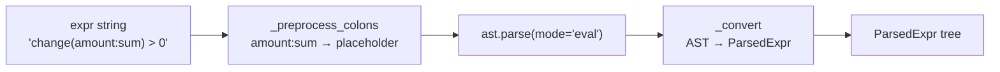
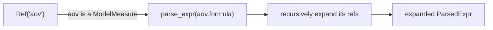

# Parsing

**Modules:** `slayer/engine/syntax.py` (Mode B), `slayer/sql/sql_expr.py`
(Mode A), `slayer/engine/measure_expansion.py` (pre-bind expansion)

Parsing turns expression strings into typed `ParsedExpr` trees. It is **pure
syntax** — no scope resolution, no named-measure expansion, no function-style
rewriting. Those are separate stages (the [slack layer](slack-normalization.md)
does function-style → colon; the [binder](binding.md) does scope; expansion is
its own step). This separation is what keeps each stage small.

## The `ParsedExpr` family

Eleven frozen Pydantic node types with value-based equality (so tests assert via
`==`):

| Node | Shape |
| --- | --- |
| `Ref` | `name` — a bare identifier |
| `DottedRef` | `parts` — a dotted path |
| `StarSource` | `*` |
| `Literal` | `value` (`Decimal` / `str` / `bool` / `None`) |
| `AggCall` | `source, agg, args, kwargs` — colon aggregation |
| `TransformCall` | `op, input, args, kwargs` |
| `ScalarCall` | `name, args` |
| `Arith` | `op, left, right` |
| `UnaryOp` | `op, operand` |
| `Cmp` | `op, left, right` |
| `BoolOp` | `op, operands` |

## How `parse_expr` works

Mode B is a *Python-AST* DSL — the grammar is a deliberate subset of Python
expression syntax, so the parser leans on `ast.parse(..., mode="eval")` rather
than a hand-rolled grammar. Two pre/post steps make the colon and `__` rules
work:

1. **`_preprocess_colons`** replaces `<source>:<agg>` with a placeholder
   identifier (`__slayer_agg_N__`) before handing the text to Python's parser,
   capturing the source kind (`*` / `Ref` / `DottedRef`) and agg name in a side
   map. Any trailing `(args)` is left in place so Python parses it as a `Call`
   naturally. String-literal spans are skipped so quoted contents aren't touched.
2. **`_reject_dunder_in_ast`** walks the parsed AST and rejects any user
   identifier containing `__` (on `Name`, `Attribute.attr`, and `keyword.arg`),
   unless `allow_dunder=True`. `__` is reserved for internal join-path aliases on
   the SQL side; users write single-dot DSL paths.

`_convert` then maps AST nodes to `ParsedExpr` nodes. A `Call` dispatches in a
fixed order: aggregation placeholder → transform (in `ALL_TRANSFORMS`, requires
≥1 positional) → scalar (in `SCALAR_FUNCTIONS`, rejects kwargs) → otherwise
`UnknownFunctionError`. List/tuple kwarg values (e.g. `partition_by=[a, b]`)
convert to a tuple of converted elements.

### Rejections (P1)

The parser is where the Mode-B contract is enforced:

- a function call not in `SCALAR_FUNCTIONS` / `ALL_TRANSFORMS` / aggregations →
  `UnknownFunctionError`;
- a raw `OVER(...)` clause anywhere in the text → `IllegalWindowInFilterError`
  (checked by regex before AST parsing);
- `__` in a user identifier → `ValueError` (unless `allow_dunder`);
- chained comparisons (`1 < x < 10`) → `ValueError` (split into `1 < x and x <
  10`); the binder can't give a chained comparison a single phase.

### `allow_dunder` — the StageSchema escape hatch (DEV-1449)

`parse_expr(text, *, allow_dunder=False)` defaults to rejecting `__`. The
[stage planner](stage-planning.md) sets `allow_dunder=True` *only* when binding a
downstream stage against a flat `StageSchema`, whose columns **are** the
`__`-flattened multi-hop aliases of the upstream stage (`customers__region`).
Legality there is the binder's concern (the column must exist in the upstream
schema). This is the one place `__` is legal in a Mode-B ref, and it is exactly
what makes a downstream stage able to name an upstream joined dimension.

### `parse_filter_expr` — SQL-operator leniency

Filters historically accepted SQL operator spellings (`=`, `<>`, `NULL`, keyword
`AND`/`OR`/`NOT`/`IS`/`IN`) alongside Python ones. `parse_filter_expr` normalizes
those to Python equivalents (string-literal-aware) via
`_normalize_sql_filter_operators`, then delegates to `parse_expr`. Measures and
order parse with `parse_expr` directly; only filters get the leniency — matching
the legacy `parse_filter` contract.

### `walk_parsed_refs` — scope-free reference extraction

`walk_parsed_refs(parsed)` yields the reference-bearing leaves (`Ref`,
`DottedRef`, `AggCall`) of a tree without binding it. It is the scope-free
counterpart to the binder's `walk_value_keys`: production extractors that only
need the *names* a formula touches — schema-drift cascade attribution and memory
entity tagging — walk the parse tree directly instead of binding against a scope.
Its descent rules match the legacy `parse_formula` walk exactly (an `AggCall` is
yielded as a unit and its args/kwargs are *not* descended, so
`weighted_avg(weight=quantity)` surfaces `price`, never `quantity`).

> **Deviation note.** The plan specified walking the typed-key `BoundExpr` via
> `walk_value_keys` for these extractors. That is infeasible: binding raises on
> bare named-measure refs (which need planner-side expansion) and resolves the
> very refs drift detection must find *pre*-resolution. `parse_expr` +
> `walk_parsed_refs` was the user-approved alternative.

## Mode A — `sql_expr.py`

Mode A (`Column.sql`, `Column.filter`, `SlayerModel.filters`) is sqlglot-native.
`parse_sql_expr` wraps the fragment as `SELECT (<text>) AS _` before sqlglot
parses it — necessary because sqlglot's SQLite/MySQL parser otherwise falls back
to a `Command` node for a top-level `replace(...)`. `has_window_function` is the
predicate the binder uses to reject filters that touch a windowed `Column.sql`
(DEV-1369). Mode A keeps full SQL expressiveness; the typed pipeline only needs
to detect windows and (in the slack layer) rewrite multi-dot paths.

## Pre-bind measure expansion — `measure_expansion.py`

The binder raises `UnknownReferenceError` for a bare *measure* name (measures
aren't columns). `expand_model_measures` runs *before* binding: it is an
AST → AST rewrite that replaces every `Ref(name=X)` whose `X` is a saved
`ModelMeasure` with the recursively-expanded `parse_expr(measure.formula)` tree,
turning measure refs into binder-resolvable column/aggregation nodes.

Eligibility is principled: expansion fires at the root and in `Arith` / `UnaryOp`
/ `Cmp` / `BoolOp` operands, `ScalarCall.args`, and `TransformCall.input` / args
/ kwarg values. It does **not** fire on `DottedRef` segments (those resolve
through joins), `AggCall` in any position (sources/args/kwargs are column-level
by contract), or function-name slots. Recursion is bounded: depth limit 32
(configurable via `SLAYER_MEASURE_EXPANSION_DEPTH`) raising
`MeasureRecursionLimitError`, plus per-chain cycle detection raising
`MeasureCycleError` with the offending chain. A `parse_cache` memoizes each
measure's parse. The node-type tuple is derived from the `ParsedExpr` union via
`get_args`, so a new node type added to `syntax.py` is automatically walked.

## Design rationale

- **Why reuse Python's AST for Mode B?** The DSL was always a Python-expression
  subset; `ast.parse` gives precedence, grouping, and operator handling for free,
  and the conversion layer stays small. The colon preprocessor is the only piece
  that bridges the one construct Python doesn't have.
- **Why is parsing pure (no scope)?** So the same parser serves the binder, the
  measure expander, and the scope-free extractors. Mixing in resolution would
  re-couple parsing to the model graph — the coupling the redesign removes.
- **Why a separate expansion pass instead of expanding in the binder?** Expansion
  is an AST → AST rewrite with its own recursion/cycle concerns; keeping it
  before binding means the binder only ever sees column/aggregation refs and can
  stay a straight scope lookup.
