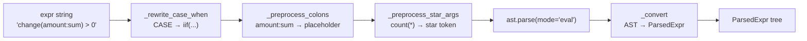

# Parsing

**Modules:** `slayer/engine/syntax.py` (Mode B), `slayer/sql/sql_expr.py`
(Mode A)

Parsing turns expression strings into typed `ParsedExpr` trees. It is **pure
syntax** — no scope resolution and no saved-measure resolution. Those are
separate stages (the [binder](binding.md) does scope *and* saved-measure
resolution). This separation is what keeps each stage small. Both aggregation
spellings — colon (`amount:sum`) and functional (`sum(amount)`) — are native
grammar and collapse to the SAME `AggCall` node (DEV-1826), so everything
downstream is spelling-insensitive by construction.

```mermaid
flowchart LR
    text["expr string<br/>'change(amount:sum) > 0'"] --> cw["_rewrite_case_when<br/>CASE → iif(...)"]
    cw --> pp["_preprocess_colons<br/>amount:sum → placeholder"]
    pp --> star["_preprocess_star_args<br/>count(*) → star token"]
    star --> ast["ast.parse(mode='eval')"]
    ast --> conv["_convert<br/>AST → ParsedExpr"]
    conv --> tree["ParsedExpr tree"]
```

## The `ParsedExpr` family

Eleven frozen Pydantic node types with value-based equality (so tests assert via
`==`):

| Node | Shape |
| --- | --- |
| `Ref` | `name` — a bare identifier |
| `DottedRef` | `parts` — a dotted path |
| `StarSource` | `*` |
| `Literal` | `value` (`Decimal` / `str` / `bool` / `None`) |
| `AggCall` | `source, agg, args, kwargs` — an aggregation, either spelling; `source` is a column / star / aggregation-free scalar expression |
| `TransformCall` | `op, input, args, kwargs` |
| `ScalarCall` | `name, args` |
| `Arith` | `op, left, right` |
| `UnaryOp` | `op, operand` |
| `Cmp` | `op, left, right` |
| `BoolOp` | `op, operands` |

## How `parse_expr` works

Mode B is a *Python-AST* DSL — the grammar is a deliberate subset of Python
expression syntax, so the parser leans on `ast.parse(..., mode="eval")` rather
than a hand-rolled grammar. Two pre/post steps make the colon and `__` rules
work:

1. **`_preprocess_colons`** replaces `<source>:<agg>` with a placeholder
   identifier (`__slayer_agg_N__`) before handing the text to Python's parser,
   capturing the source kind (`*` / `Ref` / `DottedRef`) and agg name in a side
   map. Any trailing `(args)` is left in place so Python parses it as a `Call`
   naturally. String-literal spans are skipped so quoted contents aren't touched.
1b. **`_preprocess_star_args`** (DEV-1826) runs AFTER the colon pass: a
   token-aware, string-literal-safe scan replaces a call's first-argument `*`
   / trailing `path.*` (`count(*)`, `count(customers.*)`) with the reserved
   `__slayer_star__` token — Python's AST cannot parse a bare `*` expression —
   which `_convert` maps back to `StarSource` / a `*`-tailed `DottedRef`.
   Multiplication is untouched (a multiplying `*` never directly follows a
   call's `(` or a `.`).
2. **`_reject_reserved_expr_token`** (DEV-1743) scans the raw text — with
   string-literal spans blanked, and *before* `_preprocess_colons` runs — for the
   reserved `__slayer_` prefix, raising `ValueError` if a user token uses it. The
   scan runs before colon preprocessing precisely because that step mints
   internal `__slayer_agg_N__` placeholders, which must not trip the guard. A
   plain `__` in a user identifier is otherwise legal now (the DEV-1743 flip lifts
   the `__` ban); only the `__slayer_` namespace is reserved.

`_convert` then maps AST nodes to `ParsedExpr` nodes. A `Call` dispatches in a
fixed order (DEV-1826):

1. **colon-aggregation placeholder** → `AggCall`;
2. **functional builtin aggregation** — the callee heals through
   `normalize_aggregation_name` (case + alias: `SUM`, `countD`), and the raw
   token is stored as `agg` so both spellings produce the identical node.
   `first` / `last` are also transform names and dispatch by first-arg shape:
   an aggregated input falls through to the transform branch, anything else is
   the aggregation. The first argument becomes the `AggCall.source` — a
   column, a star, or an aggregation-free scalar expression
   (`sum(amount - cost)`); nested aggregations/transforms inside it are
   rejected here;
3. **transform** (in `ALL_TRANSFORMS`, requires ≥1 positional);
4. **scalar** (in `SCALAR_FUNCTIONS`, rejects kwargs);
5. **unknown name with an aggregatable first argument** → an `AggCall`
   candidate deferred to the binder, exactly like `x:whatever` — custom
   aggregations resolve at binding with no parser plumbing, and genuinely
   unknown names get the standard unknown-aggregation error there;
6. otherwise `UnknownFunctionError`.

List/tuple kwarg values (e.g. `partition_by=[a, b]`) convert to a tuple of
converted elements.

### Rejections (P1)

The parser is where the Mode-B contract is enforced:

- a function call that is neither scalar / transform / aggregation NOR an
  aggregation candidate (no aggregatable first argument — e.g. kwargs-only
  `bogus(p=1)`) → `UnknownFunctionError`;
- SQL's `DISTINCT` keyword inside a call (`count(distinct x)`) → syntax error
  (write `count_distinct(x)` / `x:count_distinct`);
- a raw `OVER(...)` clause anywhere in the text → `IllegalWindowInFilterError`
  (checked by regex before AST parsing);
- the reserved `__slayer_` prefix in a user token → `ValueError` (DEV-1743);
- chained comparisons (`1 < x < 10`) → `ValueError` (split into `1 < x and x <
  10`); the binder can't give a chained comparison a single phase.

### `__` in Mode-B refs (DEV-1743)

`parse_expr` no longer takes an `allow_dunder` flag — a plain `__` in a user
identifier is legal everywhere. A downstream stage bound against a flat
`StageSchema` names the upstream stage's `__`-flattened multi-hop aliases
(`customers__region`) directly, with no escape hatch; legality is the binder's
concern (the column must exist in the upstream schema). Only the `__slayer_`
prefix is reserved (see `_reject_reserved_expr_token` above).

### `parse_filter_expr` — SQL-operator leniency

Filters historically accepted SQL operator spellings (`=`, `<>`, `NULL`, keyword
`AND`/`OR`/`NOT`/`IS`/`IN`) alongside Python ones. `parse_filter_expr` normalizes
those to Python equivalents (string-literal-aware) via
`_normalize_sql_filter_operators`, then delegates to `parse_expr`. Measures and
order parse with `parse_expr` directly; only filters get the leniency.

### `walk_parsed_refs` — scope-free reference extraction

`walk_parsed_refs(parsed)` yields the reference-bearing leaves (`Ref`,
`DottedRef`, `AggCall`) of a tree without binding it. It is the scope-free
counterpart to the binder's `walk_value_keys`: production extractors that only
need the *names* a formula touches — schema-drift cascade attribution and memory
entity tagging — walk the parse tree directly instead of binding against a scope.
Its descent rules match the legacy `parse_formula` walk exactly (an `AggCall` is
yielded as a unit and its args/kwargs are *not* descended, so
`weighted_avg(weight=quantity)` surfaces `price`, never `quantity`).

> **Deviation note.** The plan specified walking the typed-key `BoundExpr` via
> `walk_value_keys` for these extractors. That is infeasible: binding raises on
> bare named-measure refs (which need planner-side expansion) and resolves the
> very refs drift detection must find *pre*-resolution. `parse_expr` +
> `walk_parsed_refs` was the user-approved alternative.

## Mode A — `sql_expr.py`

Mode A (`Column.sql`, `Column.filter`, `SlayerModel.filters`) is sqlglot-native.
`parse_sql_expr` wraps the fragment as `SELECT (<text>) AS _` before sqlglot
parses it — necessary because sqlglot's SQLite/MySQL parser otherwise falls back
to a `Command` node for a top-level `replace(...)`. `has_window_function` is the
predicate the binder uses to reject filters that touch a windowed `Column.sql`
(DEV-1369). Mode A keeps full SQL expressiveness; the typed pipeline only needs
to detect windows — a Mode-A `SUM(amount)` stays raw SQL, untouched by the
Mode-B aggregation grammar.

## Saved-measure resolution — in the binder

There is no pre-bind expansion pass; the binder (`binding.py`) is the single
saved-measure resolution authority. A bare name resolves in `_resolve_ref`
(`alias_map` → column → saved measure); a saved measure inlines as
`parse_expr(measure.formula)` re-bound at the same scope, and recursion resolves
nesting. A dotted name resolves in `_resolve_dotted` (`alias_map` on the full
dotted text → join walk to the terminal model → leaf column → saved measure): a
dotted measure is bound against `ModelScope(source_model=terminal)` then
prepend-rerooted into host coordinates (`keys.py`), so `customers.aov` from an
`orders` query is bound-tree-identical to the hand-expanded `customers.`-prefixed
formula and inherits DEV-1836 cross-model semantics for free.

Eligibility is an explicit bind context (`MeasureResolutionCtx`), threaded like
`in_filter` and enabled only at the two eligible call sites (measure formulas and
computed-dimension expressions). It is dropped on aggregation-level edges —
`_bind_agg` source/args/kwargs, `partition_by`, transform scalar args — each
pinned by a test, so a measure never resolves inside an aggregation position.
Recursion is bounded: a depth cap (default 32, `SLAYER_MEASURE_EXPANSION_DEPTH`)
raising `MeasureRecursionLimitError`, plus per-chain cycle detection raising
`MeasureCycleError` naming the offending (model, measure) chain.

## Design rationale

- **Why reuse Python's AST for Mode B?** The DSL was always a Python-expression
  subset; `ast.parse` gives precedence, grouping, and operator handling for free,
  and the conversion layer stays small. The colon and star preprocessors are the
  only pieces that bridge the two constructs Python doesn't have.
- **Why parse the functional spelling natively instead of normalizing it to
  colon first?** The old `FUNC_STYLE_AGG` rewrite had to be replicated per text
  surface, and every missed surface (ModelExtension measures, hand-authored
  YAML) was a parity bug. One dispatch branch covers every position by
  construction, and collapsing both spellings to one node makes identity,
  naming, and cross-spelling measure/filter matching free. See
  [slack normalization](slack-normalization.md) for the retirement.
- **Why is parsing pure (no scope)?** So the same parser serves the binder and
  the scope-free extractors. Mixing in resolution would re-couple parsing to the
  model graph — the coupling the redesign removes.
- **Why resolve saved measures in the binder, not a separate pass?** Resolution
  is inherently scope-bound (it needs the model graph the binder already holds),
  so a pre-bind pass would duplicate that scope machinery; inlining
  `parse_expr(measure.formula)` at the same scope keeps recursion, cycle, and
  depth handling in one place.
