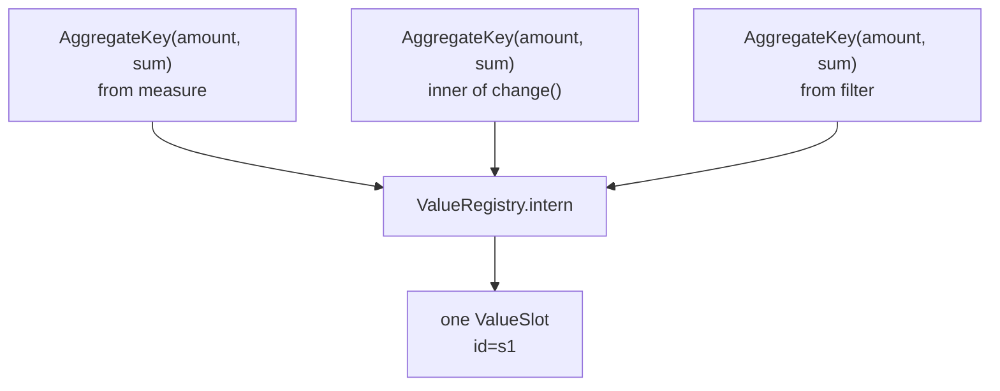

# Planning: interning, projection, and the plan shape

**Modules:** `slayer/engine/planning.py` (ValueRegistry, ProjectionPlanner,
transform lowering), `slayer/engine/planned.py` (the `PlannedQuery` types)

Planning turns bound expressions into a `PlannedQuery` — the fully resolved,
render-ready target. Three composable concerns live in `planning.py`; the typed
result types live in `planned.py`. The [stage planner](stage-planning.md)
composes them.

## `ValueRegistry` — interning by structural identity (P2 / P4)

The registry maps `ValueKey → ValueSlot`. `intern(...)` either returns the
existing slot for a structurally-equal key or allocates a fresh one. This is the
mechanism behind **P2**: `change(amount:sum)` and a filter `amount:sum` build the
same inner `AggregateKey`, so they intern to one slot and `SUM(amount)` is
emitted once (DEV-1446).

### Public names are a separate namespace (P4 / C13)

A slot has at most one *declared name* but can accumulate **multiple**
`public_aliases` — if the same structural key is declared with two different
user `name`s, both aliases appear in the projection pointing at one slot
(`_merge_into_existing`). A filter/order expression may reference a declared name
as an alias for the slot, but cannot *synthesize* a new slot from a
canonical-looking bare name when no corresponding measure was declared.

### Alias-collision validations (DEV-1443)

`intern` enforces three validations against the host model's column names:

- a declared `public_name` colliding with a source column →
  `MeasureNameCollidesWithColumnError`;
- a `canonical_alias` (e.g. `amount_sum`) shadowing a source column →
  `CanonicalAliasShadowsColumnError`;
- two different keys declaring the same `public_name` →
  `DuplicateMeasureNameError`.

With carefully chosen exemptions: a *self-named dimension* (a `ColumnKey` /
`ColumnSqlKey` / `TimeTruncKey` whose public name **is** its own column name) is
the column, not a rename, so the collision check is skipped; and an unnamed
`*:<agg>` re-aggregation (whose canonical `_count` is a structural marker, not a
column ref) is exempt.

## Transform lowering (P9 / C6)

`change` and `change_pct` are sugar. `desugar_change` rewrites
`change(x)` → `x - time_shift(x, periods=-1)` and `desugar_change_pct`
→ `(x - time_shift(x, -1)) / time_shift(x, -1)`. The inner `x` is the **same
`ValueKey` instance** across the arithmetic and the time_shift, so a downstream
registry interns it once — this is the identity-preservation that makes DEV-1446
hold even through desugaring. `partition_by` and `time_key` thread through to the
underlying `time_shift` (**C6**).

`lower_sugar_transforms(key)` is the recursive walker that applies the desugar
functions anywhere in a `ValueKey` tree (`TransformKey` / `ArithmeticKey` /
`ScalarCallKey` / `BetweenKey`), rebuilding only the path that contains a
change/change_pct so identity is preserved elsewhere. The stage planner runs it
*after* `time_key` patching so the desugared `time_shift` inherits the patched
key.

## `ProjectionPlanner` — declared + hidden slots

`ProjectionPlanner.plan(...)` interns each declared measure (in dim → time-dim →
measure order) into the registry, builds the public projection, and then
materializes **hidden** slots for any value referenced only in filters / order
or as an auxiliary dependency of a declared measure.

The dependency-selection rule is `_iter_slot_deps`, and it encodes which keys
need a materialised slot versus which the generator inlines:

| Key | Slotted? |
| --- | --- |
| `ColumnKey` / `ColumnSqlKey` / `TimeTruncKey` | yes (row slot) |
| `AggregateKey` | yes (stops — its inner source materializes inside the aggregate) |
| `TransformKey` | yes, **and** recurse into `input`, `partition_keys`, `time_key` |
| `ArithmeticKey` / `ScalarCallKey` | no — recurse into operands/args; the op/call is inlined |
| `BetweenKey` | no — inlined into WHERE; recurse into column/low/high |
| `LiteralKey` / `StarKey` | never slottable alone |

So `ORDER BY revenue:sum DESC LIMIT 10` with no declared `revenue:sum` measure
interns the aggregate as a `hidden=True` slot: the base CTE materializes it, the
outer SELECT trims it from the public projection, and `StageSchema.columns`
excludes it (downstream stages see no extra column). The same rule covers
filter-only refs. The no-transform "plain" path follows the same pattern via a
conditional outer-trim wrapper (DEV-1501): the wrap fires only when the base
materialises a hidden slot, so simple flat queries stay flat. Hidden parametric
aggregates (`revenue:last(created_at)` vs `revenue:last(updated_at)`,
`revenue:percentile(p=0.5)` vs `…(p=0.95)`) route their declared name through
`canonical_agg_name` so the args/kwargs surface in the materialised alias —
two distinct hidden parametric aggregates get distinct base-CTE aliases instead
of colliding on `revenue_last` / `revenue_percentile`.

`filter_referenced_slot_ids(bound_filter, registry)` walks the predicate via
`_iter_slot_deps` and looks each dep up in the registry, returning `set[SlotId]`
— the input the [cross-model planner](cross-model-aggregates.md) needs for filter
routing (it gets slot ids, not pre-interning `ValueKey`s, and it sees
composite-predicate leaves rather than just the top-level key).

## The `PlannedQuery` shape (planned.py)

`PlannedQuery` is the typed target the [SQL generator](sql-generation.md)
consumes. It carries everything needed to emit SQL without re-walking the model
graph (**P7**):

| Field | Role |
| --- | --- |
| `source_relation` | the FROM relation name (model name or stage CTE) |
| `join_plan` | `JoinRequirement` hops |
| `row_slots` / `aggregate_slots` / `combined_expression_slots` | slots bucketed by phase |
| `cross_model_aggregate_plans` | one `CrossModelAggregatePlan` per cross-model aggregate |
| `transform_layers` | one `TransformLayer` per transform slot, in dependency order |
| `filters_by_phase` | `FilterPhase` entries (WHERE / HAVING / post) |
| `projection` / `order` / `limit` / `offset` | output shape |
| `stage_schema` | the projection downstream stages bind against (P6) |
| `active_time_dimension_slot_id` | the TD slot used for OVER `ORDER BY` |
| `render_source_model` | the concrete `SlayerModel` this stage renders against |

A `ValueSlot` carries `id`, `key`, `declared_name`, `public_name`,
`public_aliases`, `hidden`, `phase`, `label`, `type`, and `expression`
(a `BoundExpr`). A model-validator enforces the hidden invariant: a hidden slot
must have `public_name=None` and `public_aliases=[]`, so the generator can never
accidentally emit it in the public projection.

`FilterPhase` has two mutually-exclusive carrier modes: a typed `expression`
(`BoundExpr`, for Mode-B DSL filters and the planner-emitted `BetweenKey`
date_range) or `text` + `text_columns` (a Mode-A SQL fragment, for
`SlayerModel.filters` — the renderer qualifies the named columns and emits the
text verbatim).

### `BoundExpr` unification

`planned.py` re-exports `binding.BoundExpr` as the canonical class. Earlier the
planned side had a separate `BoundExpr` with an optional `sql_text` cache; that
was folded into the binder's `BoundExpr(value_key=ValueKey)` so
`ValueSlot.expression` and `FilterPhase.expression` store binder output directly.
There is no cached SQL string — the generator renders from the typed `value_key`
against the slot registry.

### `CrossModelAggregatePlan` — the re-rooting fields

The struct carries the route-explicit filter ids
(`where_filter_ids` / `having_filter_ids` / `target_model_filters`) plus, for the
re-rooting case, `rerooted_plan` (a nested `PlannedQuery`), `rerooted_grain_pairs`,
and `rerooted_agg_slot_id`. See [Cross-model aggregates](cross-model-aggregates.md)
— the re-rooting fields are the largest deviation from the plan's single-strategy
design.

## Design rationale

- **Why intern at all?** Because the four bugs are all "the same value got two
  slots" or "two values shared one". Structural interning is the single mechanism
  that resolves both directions, instead of per-permutation alias bookkeeping.
- **Why hidden slots rather than special-casing order/filter refs?** A hidden
  slot is materialised in the base CTE like any other, then trimmed from the
  public projection — so the generator has one uniform notion of "a value to
  compute" and the projection logic decides visibility. Order-only and
  filter-only aggregates fall out of this for free.
- **Why does `_iter_slot_deps` inline `ArithmeticKey` / `ScalarCallKey`?**
  Because they have no independent column to materialise — they're operators over
  their operands. Slotting them would create spurious hidden columns; the
  generator inlines the operator into the SELECT/WHERE and slots only the leaves.
