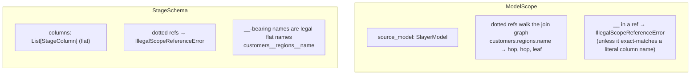

# Scopes and the source bundle

**Modules:** `slayer/core/scope.py`, `slayer/engine/source_bundle.py`

Binding needs two things the keys don't carry: *what a name resolves against*
(the scope) and *the resolved models it resolves through* (the bundle). These
two modules supply them, and together they implement principles **P5**, **P6**,
and **P11**.

## Two scope kinds (P5)

A reference like `customers.regions.name` means different things depending on
where it is being resolved. The redesign makes that explicit with two scope
types that are never confused:

- **`ModelScope`** — joins exist. Dotted refs walk the join graph rooted at
  `source_model`. A `__` in a Mode-B ref is illegal *unless* it exact-matches a
  column literally named that way (the C11 carve-out for legacy persisted
  query-backed columns).
- **`StageSchema`** — a flat namespace. Dots are *not* join syntax (a dotted ref
  raises); `__`-bearing identifiers are ordinary flat names. This is what a
  downstream stage binds against — and exactly why DEV-1449 is impossible: a
  downstream ref to an upstream multi-hop dimension must use the flat form
  (`robot_details__modelseriesval`), and the dotted form raises.

`ModelScope.source_model` is `Optional` from day one (the **I2** extension
point). The binder asserts `source_model is not None` at use sites today; a
future anchor-less mode would set it `None` and take a different binder branch.
Keeping the type optional avoids a breaking change later.

## `StageSchema` and `StageColumn` (P6)

`StageSchema` is the typed projection a stage emits. Downstream stages bind only
against it — they never re-walk the upstream join graph. The fields that make
DEV-1448/1449 work are on `StageColumn`:

| Field | Meaning |
| --- | --- |
| `name` | the downstream **bind** name — flat (`customers__revenue_sum`, or a user `rev`) |
| `sql_alias` | the identifier emitted in the stage's SELECT projection |
| `public_alias` | the result-key piece returned to the user (dotted form, or the user name) |
| `type, label, format, hidden, description, meta, sampled, provenance` | per-column metadata carried downstream |

The split between `name`, `sql_alias`, and `public_alias` is what lets the
planner reserve a hidden or alias-bearing form without coupling the downstream
bind name to the public result key. `StageSchema` supports `__getitem__`, `get`,
and `__contains__` for name lookup; `relation_name` is the CTE name / subquery
alias used when a downstream stage references it.

## `ResolvedSourceBundle` and "storage consulted once" (P11)

`ResolvedSourceBundle` is the eagerly-resolved set of everything the binder
might need, built **once** at the top of execution by
`build_resolved_source_bundle`. After that, the binder is provably scope-only —
no `ContextVar`, no callback that re-enters storage. This is **P11**, the
principle that most directly kills the old tangle: the legacy enrichment path
re-resolved models lazily through `ContextVar`-threaded callbacks, which is why
concurrent and nested resolution was so hard to reason about.

The bundle carries:

| Field | Contents |
| --- | --- |
| `source_model` | the host of the query (the real base the root chain bottoms out at) |
| `referenced_models` | transitive join-graph walk + each sibling stage's base; host first |
| `inline_extensions` | a root `ModelExtension` overlay over a non-sibling base, re-applied after query-backed expansion |
| `named_queries` | the raw sibling `SlayerQuery`s of a multi-stage DAG |
| `stage_source_models` | per-named-stage resolved source model (for heterogeneous DAGs) |
| `query_variables` | merged variables (runtime > stage > outer > model defaults) |
| `datasource_hint` | the `data_source=` kwarg that wins over the priority list |

### How the builder resolves the source

`build_resolved_source_bundle` (`source_bundle.py:189`) handles every input
shape the public API accepts — stored-model name, inline `SlayerModel`,
`ModelExtension` overlay, and the dict forms of both — via `_resolve_source_spec`.

Two subtleties worth knowing:

- **Sibling-chain following.** A root whose `source_model` points at a named
  sibling is followed down (`_follow_sibling_chain`) to the real base it
  ultimately reads from, so the bundle's `source_model` is always a concrete
  base, not a sibling name. A cycle raises (mirrors the legacy circular-reference
  guard).
- **Root overlay preservation.** When the root source is a `ModelExtension` over
  a non-sibling base, the overlay is recorded in `inline_extensions` so the
  engine can re-apply it *after* a query-backed base expands (expansion derives
  columns from the backing query and would otherwise drop the overlay's extra
  columns).

The join-graph walk (`_collect_referenced_models`) is a best-effort BFS scoped
to the source model's own `data_source` — joins never cross datasource
boundaries. Absent join targets are skipped silently (matching the legacy
`_expand_join_graph`). The source model is returned first so
`get_referenced_model` finds the host before any same-named join target.

### Synthetic models for sibling stages

When a downstream stage joins to — or cross-model-references — a *sibling* stage
(materialised elsewhere as a CTE), the planner needs a `SlayerModel` to resolve
against. `synthetic_model_from_stage_schema` builds a stand-in whose
`sql_table` is the stage's CTE name and whose columns are the stage's flat
output columns. `stage_bundle_with_siblings` threads these synthetic models into
a per-stage bundle so a join/cross-model ref to a sibling resolves to its CTE
relation. These two helpers are what let the [stage planner](stage-planning.md)
treat sibling stages uniformly with stored models.

## Design rationale

- **Why a bundle at all, rather than passing `storage` to the binder?** Purity.
  If the binder can reach storage, it can re-resolve, and re-resolution is where
  the old order-dependence and `ContextVar` machinery came from. Resolving
  everything up front makes the binder a pure function of `(parsed, scope,
  bundle)`.
- **Why optional `source_model` everywhere (I2)?** So a future
  "resolve against a whole datasource, no anchor model" mode is a type-additive
  change, not a breaking one. The cost today is a handful of
  `assert source_model is not None` lines.
- **Why two scope classes instead of a flag?** A flag (`is_stage: bool`) would
  re-merge the two resolution rules into one function with internal branching —
  precisely the shape the redesign is removing. Distinct types force the binder
  to dispatch, and force callers to be explicit about which world they're in.
