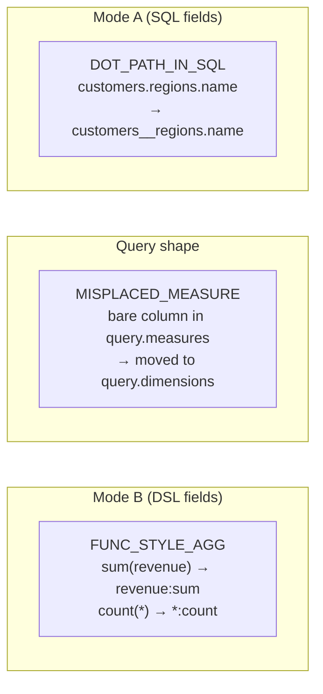

# Slack normalization

**Module:** `slayer/engine/normalization.py` (warning types in
`slayer/core/warnings.py`)

The pipeline begins (principle **P0**) with a single pass that rewrites
*slack-but-unambiguous* agent input into canonical form, so every downstream
stage sees only the canonical shape. Each rewrite is returned as a typed
`NormalizationWarning` and surfaced two ways at once.

This is how SLayer stays tolerant of the natural things agents type
(`sum(revenue)`, a bare column listed under `measures`) without letting that
tolerance leak into the resolution logic — the parser, binder, and planner never
have to know that `sum(revenue)` is even a thing.

## The three rules



| Rule | Mode | Detects | Rewrites to |
| --- | --- | --- | --- |
| `FUNC_STYLE_AGG` | Mode B | `sum(col)`, `count(*)`, `percentile(amount, p=0.5)` | colon form (`col:sum`, `*:count`, `amount:percentile(p=0.5)`) |
| `MISPLACED_MEASURE` | query shape | a bare (no colon, no call) entry in `query.measures` that names a column | moved to `query.dimensions` |
| `DOT_PATH_IN_SQL` | Mode A | a root-scope dotted ref whose leading segment is a known join target | the `__` alias form |

### `FUNC_STYLE_AGG`

Applies to Mode-B fields (`ModelMeasure.formula`, `SlayerQuery.measures[].formula`,
`SlayerQuery.filters`). It scans for `<agg>(` where `<agg>` is a builtin or
custom aggregation name (and not already preceded by `:`), finds the balanced
close paren (string-literal-aware), and rewrites the first argument into colon
form, keeping any remaining args as the parametric tail. `first` / `last` are
also transform names, so the rewrite skips them when the inner is already a
colon-form aggregate (`_AMBIGUOUS_AGG_TRANSFORMS`). Custom aggregation names are
threaded in via `custom_agg_names` so model-defined aggregations are recognized.

`func_style_agg_to_colon` is the **quiet** variant for read-only consumers
(schema-drift attribution, memory entity tagging) that need the rewrite but must
not re-surface slack advice to the user — it suppresses the warning.

### `MISPLACED_MEASURE`

Mirrors the legacy `_auto_move_fields_to_dimensions` heuristic but emits a
structured warning. A bare token in `measures` that names a known `ModelMeasure`
stays a measure; one that names a column moves to `dimensions`; an unknown token
is left for the downstream resolver to error on. It is a no-op when the stage has
no resolved model (a sibling-sourced stage), because column classification needs
the model's column names.

### `DOT_PATH_IN_SQL`

The subtle one. It rewrites `customers.regions.name` → `customers__regions.name`
in Mode-A SQL (`Column.sql`, `Column.filter`, `SlayerModel.filters`), but only
when the leading segment is a real join target on the host model — and it is
**AST-based and scope-aware**, not a regex:

- It parses with sqlglot and identifies the **root-scope** `Column` nodes by
  walking lexical ancestors (`_dot_path_root_scope_analysis`), *not* by trusting
  `Scope.columns` (which would pull in correlated subquery refs). Refs inside
  subqueries, CTE bodies, and set-op branches are left alone.
- It collects shadow names — CTE definitions, explicit `AS` aliases,
  Subquery/CTE sources, and schema/catalog qualifiers on FROM tables — and a ref
  whose leading segment matches both a join target and a shadow is flagged
  *ambiguous*: no rewrite, a warning carrying
  `normalized="(ambiguous: …)"`.

The scope-guard reuses the `column_expansion.py` precedent from DEV-1410. Why
AST and not the old construction-time regex: the rewrite needs the model's join
graph to know whether the first segment is a join target (vs. a
catalog/schema-qualified name like `mydb.customers.x`), which a `Column.sql`
field validator has no access to. So multi-dot normalization is **boundary-only,
by design** — it runs in the slack pass at `engine.execute` / `engine.save_model`,
not at Pydantic construction. A consequence to state honestly: a `SlayerModel`
built in memory and read back without crossing execute/save shows the raw
multi-dot form; `save_model` canonicalizes before persisting.

## Warning shape and dual surfacing

```python
class NormalizationWarning(BaseModel):       # slayer/core/warnings.py
    rule_id: str                 # "FUNC_STYLE_AGG"
    original: str                # "sum(revenue)"
    normalized: str              # "revenue:sum"
    location: str                # "measures[2].formula"
    rule_doc_url: Optional[str]  # "docs/agent_input_slack.md#func-style-agg"

class SlayerNormalizationWarning(UserWarning):
    """Carrier UserWarning around a NormalizationWarning payload."""
```

Every rewrite is surfaced **both** as a Python warning
(`warnings.warn(SlayerNormalizationWarning(payload))`, so
`warnings.catch_warnings()` callers see it) **and** appended to
`SlayerResponse.warnings: List[NormalizationWarning]` (so REST/MCP/CLI consumers
get the structured payload alongside the result). One source of truth, two
surfaces. The payload Pydantic type lives in `slayer.core.warnings` rather than
in the engine module so storage/REST schemas can reference it without importing
engine code.

## Entry points and boundaries

- `normalize_query(query, *, model, custom_agg_names)` — runs `FUNC_STYLE_AGG`
  over Mode-B fields and `MISPLACED_MEASURE` over the query shape, returning a
  `NormalizationResult(query, warnings)`. (The query-side `DOT_PATH_IN_SQL`
  wiring is present but a no-op — Mode-A on a query is rare; most Mode-A lives on
  the model.)
- `normalize_model(model)` — runs `FUNC_STYLE_AGG` over `ModelMeasure.formula`
  and `DOT_PATH_IN_SQL` over `Column.sql` / `Column.filter` /
  `SlayerModel.filters`, returning `NormalizationResult(model, warnings)`.

These are invoked at the engine boundaries: `engine.execute` (per stage, via
`_normalize_stage`) and `engine.save_model`. CLI / REST / MCP go through those
entry points automatically. See [Engine orchestration](engine-orchestration.md)
for the call sites.

## Design rationale

- **Why normalize before parsing rather than teaching the parser to accept slack
  forms?** Keeping the slack rules in one pass means the rest of the pipeline has
  exactly one shape to reason about. If `parse_expr` accepted `sum(revenue)`, the
  binder and planner would each have to handle both spellings.
- **Why typed warnings rather than logging?** Agents (and the REST/MCP consumers
  driving them) need to *see* that their input was rewritten, structurally, so
  they can learn the canonical form. A log line is invisible to them; the
  `rule_doc_url` points at the canonical-form documentation.
- **Why AST for `DOT_PATH_IN_SQL`?** The old construction-time regex blindly
  rewrote any `a.b.c`, including `mydb.customers.x` — a latent bug. Being
  scope-aware and join-graph-aware is only possible at a boundary that has the
  model in hand.

The reference page for the rules (with the `#func-style-agg` /
`#dot-path-in-sql` / `#misplaced-measure` anchors that `rule_doc_url` points at)
is `docs/agent_input_slack.md`, authored as part of the user-facing docs update.
