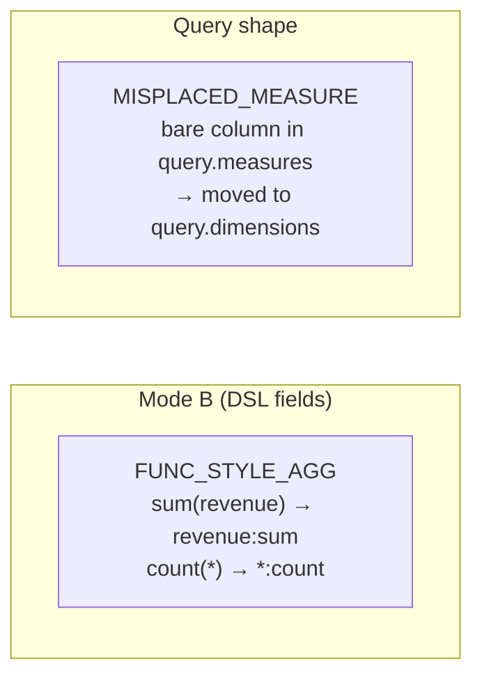

# Slack normalization

**Module:** `slayer/engine/normalization.py` (warning types in
`slayer/core/warnings.py`)

The pipeline begins (principle **P0**) with a single pass that rewrites
*slack-but-unambiguous* agent input into canonical form, so every downstream
stage sees only the canonical shape. Each rewrite is returned as a typed
`NormalizationWarning` and surfaced two ways at once.

This is how SLayer stays tolerant of the natural things agents type
(`sum(revenue)`, a bare column listed under `measures`) without letting that
tolerance leak into the resolution logic — the parser, binder, and planner never
have to know that `sum(revenue)` is even a thing.

## The two rules


```mermaid
flowchart LR
    subgraph "Mode B (DSL fields)"
        f["FUNC_STYLE_AGG<br/>sum(revenue) → revenue:sum<br/>count(*) → *:count"]
    end
    subgraph "Query shape"
        m["MISPLACED_MEASURE<br/>bare column in query.measures<br/>→ moved to query.dimensions"]
    end
```

| Rule | Mode | Detects | Rewrites to |
| --- | --- | --- | --- |
| `FUNC_STYLE_AGG` | Mode B | `sum(col)`, `count(*)`, `percentile(amount, p=0.5)` | colon form (`col:sum`, `*:count`, `amount:percentile(p=0.5)`) |
| `MISPLACED_MEASURE` | query shape | a bare (no colon, no call) entry in `query.measures` that names a column | moved to `query.dimensions` |

> **DEV-1743 — the `DOT_PATH_IN_SQL` rule is RETIRED.** Mode-A free SQL is now
> dotted-canonical: a dotted join path (`customers.regions.name`) is the
> canonical form and is left untouched by normalization; the legacy `__`
> split-alias input form (`customers__regions.name`) is no longer produced by a
> rewrite — it is a hard error (`LegacyDunderAliasError`) raised by the shared
> resolver in `column_expansion.py` at generation time and by the save-time door
> in `query_engine.py`. See below.

### `FUNC_STYLE_AGG`

Applies to Mode-B fields (`ModelMeasure.formula`, `SlayerQuery.measures[].formula`,
`SlayerQuery.filters`). It scans for `<agg>(` where `<agg>` is a builtin or
custom aggregation name (and not already preceded by `:`), finds the balanced
close paren (string-literal-aware), and rewrites the first argument into colon
form, keeping any remaining args as the parametric tail. `first` / `last` are
also transform names, so the rewrite skips them when the inner is already a
colon-form aggregate (`_AMBIGUOUS_AGG_TRANSFORMS`). Custom aggregation names are
threaded in via `custom_agg_names` so model-defined aggregations are recognized.

`func_style_agg_to_colon` is the **quiet** variant for read-only consumers
(schema-drift attribution, memory entity tagging) that need the rewrite but must
not re-surface slack advice to the user — it suppresses the warning.

### `MISPLACED_MEASURE`

Mirrors the legacy `_auto_move_fields_to_dimensions` heuristic but emits a
structured warning. A bare token in `measures` that names a known `ModelMeasure`
stays a measure; one that names a column moves to `dimensions`; an unknown token
is left for the downstream resolver to error on. It is a no-op when the stage has
no resolved model (a sibling-sourced stage), because column classification needs
the model's column names.

### `DOT_PATH_IN_SQL` (retired — DEV-1743)

Historically this rule rewrote a dotted Mode-A join path
(`customers.regions.name`) into the `__` split-alias form
(`customers__regions.name`) at the `engine.execute` / `engine.save_model`
boundary. DEV-1743 makes dots the **canonical** Mode-A separator, so there is
nothing to rewrite: a dotted path stays dotted, and resolution to the internal
`__` JOIN alias happens structurally in the shared resolver
(`column_expansion.expand_derived_refs_sync`), not by a textual normalization.

The inverse is now a **hard error** rather than a rewrite target. A legacy `__`
split-alias qualifier that does not name a real (exact) join target but whose
naive split would walk the graph raises `LegacyDunderAliasError` at two doors:
generation time (the resolver runs during SQL generation) and save time
(`SlayerQueryEngine._validate_mode_a_join_paths` in `save_model`). A `__` token
that IS an exact directly-joined model name resolves normally — `__` is a legal
identifier character now, matched exactly, never split. Stored pre-v9 models
carrying the old split-alias form are migrated to dotted on load by the v9
storage migration.

## Warning shape and dual surfacing

```python
class NormalizationWarning(BaseModel):       # slayer/core/warnings.py
    rule_id: str                 # "FUNC_STYLE_AGG"
    original: str                # "sum(revenue)"
    normalized: str              # "revenue:sum"
    location: str                # "measures[2].formula"
    rule_doc_url: Optional[str]  # "docs/agent_input_slack.md#func-style-agg"

class SlayerNormalizationWarning(UserWarning):
    """Carrier UserWarning around a NormalizationWarning payload."""
```

Every rewrite is surfaced **both** as a Python warning
(`warnings.warn(SlayerNormalizationWarning(payload))`, so
`warnings.catch_warnings()` callers see it) **and** appended to
`SlayerResponse.warnings: List[NormalizationWarning]` (so REST/MCP/CLI consumers
get the structured payload alongside the result). One source of truth, two
surfaces. The payload Pydantic type lives in `slayer.core.warnings` rather than
in the engine module so storage/REST schemas can reference it without importing
engine code.

## Entry points and boundaries

- `normalize_query(query, *, model, custom_agg_names)` — runs `FUNC_STYLE_AGG`
  over Mode-B fields and `MISPLACED_MEASURE` over the query shape, returning a
  `NormalizationResult(query, warnings)`.
- `normalize_model(model)` — runs `FUNC_STYLE_AGG` over `ModelMeasure.formula`,
  returning `NormalizationResult(model, warnings)`. (Since DEV-1743 it no longer
  rewrites Mode-A `Column.sql` / `Column.filter` / `SlayerModel.filters` — those
  are dotted-canonical and pass through untouched.)

These are invoked at the engine boundaries: `engine.execute` (per stage, via
`_normalize_stage`) and `engine.save_model`. CLI / REST / MCP go through those
entry points automatically. See [Engine orchestration](engine-orchestration.md)
for the call sites.

## Design rationale

- **Why normalize before parsing rather than teaching the parser to accept slack
  forms?** Keeping the slack rules in one pass means the rest of the pipeline has
  exactly one shape to reason about. If `parse_expr` accepted `sum(revenue)`, the
  binder and planner would each have to handle both spellings.
- **Why typed warnings rather than logging?** Agents (and the REST/MCP consumers
  driving them) need to *see* that their input was rewritten, structurally, so
  they can learn the canonical form. A log line is invisible to them; the
  `rule_doc_url` points at the canonical-form documentation.
The reference page for the rules (with the `#func-style-agg` /
`#misplaced-measure` anchors that `rule_doc_url` points at) is
`docs/agent_input_slack.md`, authored as part of the user-facing docs update.
