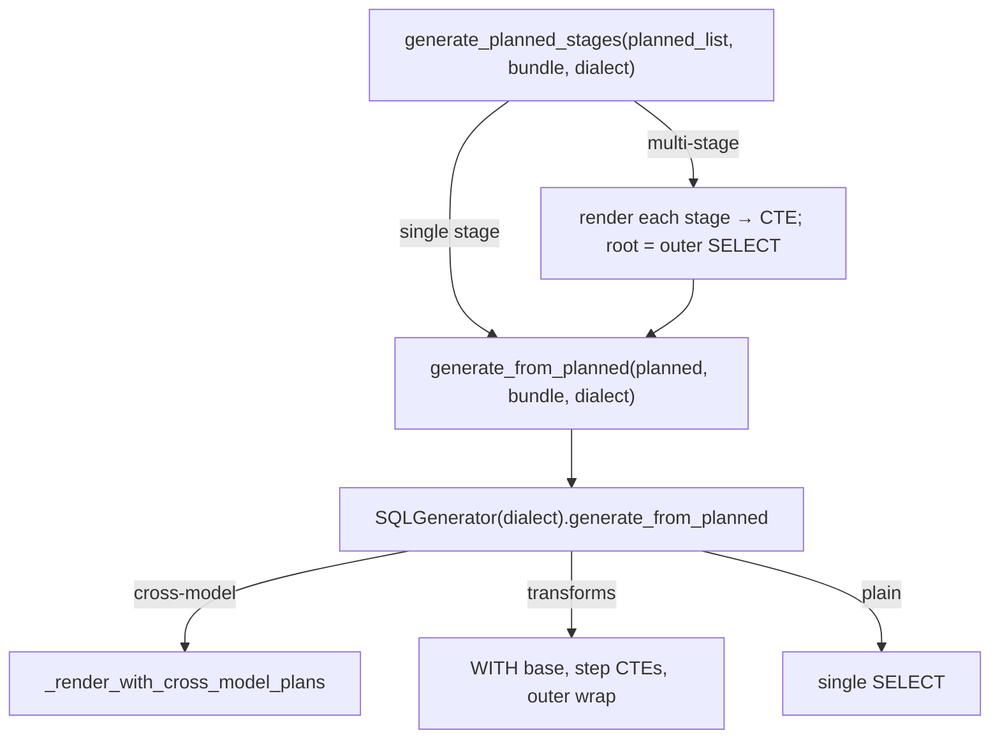

# SQL generation

**Modules:** `slayer/sql/generator.py` (the planned-consuming path),
`slayer/engine/response_meta.py` (response metadata)

The generator renders a `PlannedQuery` (or a list of them) to a SQL string. It
preserves the result-key contract exactly (**P10**) and emits SQL via sqlglot
AST building, not string concatenation.

## Entry points

- `generate_from_planned(planned_query, *, bundle, dialect)` — module-level
  entry that constructs an `SQLGenerator` and delegates to the instance method.
  Renders **one** stage.
- `generate_planned_stages(planned_queries, *, bundle, dialect)` — renders a
  multi-stage DAG to one SQL string. Each non-root stage becomes a CTE; the root
  is the outer SELECT.

## `generate_from_planned` (instance method)

Reads from typed `PlannedQuery` fields (`row_slots` / `aggregate_slots` /
`filters_by_phase` / `order` / `transform_layers`) and dispatches:

- `cross_model_aggregate_plans` non-empty → `_render_with_cross_model_plans`;
- `transform_layers` present → `WITH base AS (...)`, Kahn-batched step CTEs
  carrying the window functions, an outer wrap projecting in user-spec order;
  POST-phase filters that reference transform slots wrap as `SELECT * FROM (...)
  AS _filtered WHERE …`; `time_shift` / `consecutive_periods` emit dedicated
  self-join CTE pairs;
- otherwise → a single base SELECT with WHERE/HAVING, GROUP BY, ORDER BY, LIMIT.

It builds its own `slot_id_by_key` map (the `PlannedQuery` doesn't carry the
registry), materializes hidden aux slots referenced as transform inputs /
partition keys / time keys / POST-filter operands, and renders.

### The synthetic-`EnrichedMeasure` adapter (deviation)

To render aggregations identically to legacy across all dialects, the new path
**reuses the legacy dialect helpers** (`_build_agg`, `_build_percentile`,
`_build_stat_agg`, `_wrap_cast_for_type`, `_resolve_sql`, `_build_date_trunc`).
It does so by synthesizing `EnrichedMeasure` objects from planned slots
(`_synthesize_enriched_measure_from_planned`) and feeding them to those helpers.

This is a real coupling: `generate_from_planned` consumes `PlannedQuery` at the
top but adapts back to `EnrichedMeasure` — a type DEV-1452 wants to delete — to
emit aggregate SQL. The plan said "rewrite `generator.py` to consume
`PlannedQuery`"; the implemented path is a hybrid. It is flagged in
[the deviations list](index.md#deviations-from-the-plan). The upside is that
dialect-specific behavior (SQLite UDFs, ClickHouse `quantile`, the MySQL
`median` `NotImplementedError`, etc.) is rendered by exactly one code path,
shared with legacy — so the two pipelines can't drift on dialect SQL while both
exist.

## Multi-stage chaining (`generate_planned_stages`)

Each non-root stage renders independently (against a per-stage bundle from
`_bundle_for_stage`) and is wrapped by `_stage_rename_wrapper` so its output
columns become the flat names downstream stages bound against
(`orders.customers.region` → `customers__region`). The wrapper derives those from
the *actual* rendered `named_selects` (robust to the cross-model renderer
emitting columns out of `public_projection` order) and asserts they match the
stage's `StageSchema` — a planner/generator divergence fails here rather than as
a confusing downstream bind miss. Stage CTEs are prepended before any CTEs the
root already emits (the root reads `FROM <stage>`).

`_bundle_for_stage` picks the host model the stage renders against from the
planner's `render_source_model` (the stage's own source / overlay /
synthetic-over-sibling), falling back to a synthetic model over the upstream CTE
for a `StageSchema` chain stage — so the generator's FROM/joins bind against
exactly what the binder used.

## Cross-model rendering

`_render_with_cross_model_plans` emits one `_cm_*` CTE per
`CrossModelAggregatePlan` joined back to the host base. When `plan.rerooted_plan`
is set, `_render_rerooted_cross_model_cte` renders the nested re-rooted plan
(FROM target + the target's joins) preserving host grain; otherwise the
forward-path CTE renders (FROM bare target, grouped at the forward dims).
`Column.filter` on the aggregated column renders as
`SUM(CASE WHEN <filter> THEN <col> END)`. See
[Cross-model aggregates](cross-model-aggregates.md).

## Result-key contract (P10)

The generator preserves the result keys byte-for-byte: `orders.revenue_sum`,
`orders._count` (the `*` dropped, the leading `_` kept), joined dimensions as the
full dotted path `orders.customers.regions.name`, and renamed measures as
`orders.<user_name>`. `_full_alias_for_slot` derives these from the slot's key /
public aliases. The one documented exception is cross-model parametric
aggregates, which carry the kwarg suffix legacy dropped (see the cross-model
limitations).

## Response metadata (`response_meta.py`)

The legacy engine derived `SlayerResponse.attributes` and `expected_columns` from
an `EnrichedQuery`. The typed pipeline has none, so `build_response_metadata`
rebuilds both from the root `PlannedQuery` plus the rendered SQL:

- **`expected_columns`** comes from the final SQL's `named_selects` — the literal
  result-key columns rows come back under. Reading them from the SQL (rather than
  re-deriving from slots) is bulletproof: it is exactly the outer SELECT the
  generator emitted.
- **`attributes`** (`ResponseAttributes.dimensions` / `.measures`) come from the
  root plan's public `ValueSlot`s, classified dimension (ROW phase) vs measure
  (everything else), with each public result key mapped to its
  `FieldMetadata(label, format)`. `_slot_result_keys` mirrors
  `_full_alias_for_slot` so the keys line up with the rendered projection; only
  keys actually present in the rendered SQL are surfaced (a guard against
  divergence). Aggregate formats come from `_infer_aggregated_format` (INTEGER
  for count/star, FLOAT for avg-family, source-column format for sum/min/max).

`FieldMetadata` / `ResponseAttributes` / `_infer_aggregated_format` live here (not
in `query_engine`) so the module imports nothing from the engine;
`query_engine` re-exports them, keeping the public import path unchanged.

## Design rationale

- **Why reuse legacy dialect helpers instead of reimplementing aggregation SQL?**
  Dialect coverage (SQLite UDFs, ClickHouse parametric quantiles, MySQL's
  unsupported-function `NotImplementedError`, the `log10`/`log2` literal
  preservation, JSON-extract rewriting) is large and well-tested. Sharing one
  emitter keeps the two pipelines from drifting on dialect SQL while both exist —
  at the cost of the `EnrichedMeasure` coupling, which DEV-1452 removes.
- **Why derive `expected_columns` from the SQL?** Because the SQL is the ground
  truth for what rows come back keyed by. Re-deriving from slots risks a subtle
  mismatch; reading `named_selects` cannot.
- **Why assert in `_stage_rename_wrapper`?** A leaked hidden column or a C13
  over-projection would otherwise surface as a downstream "column not found"
  deep in the next stage's binding. Asserting at the boundary turns a confusing
  failure into a precise one.
