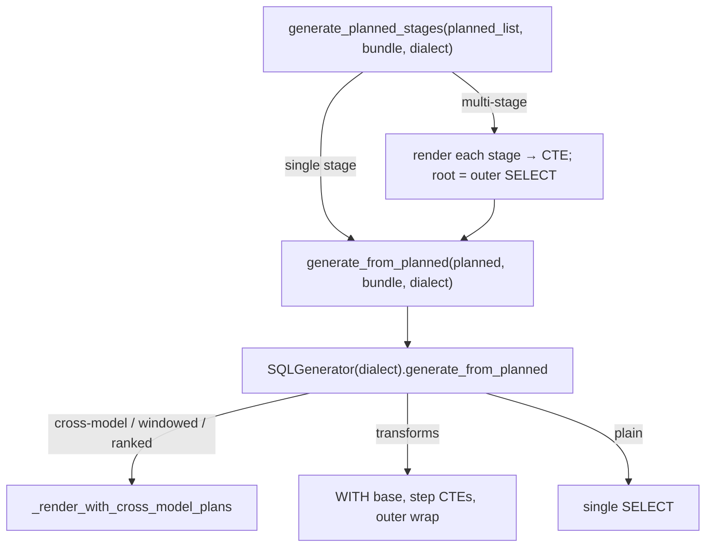

# SQL generation

**Modules:** `slayer/sql/generator.py` (renders a `PlannedQuery` to SQL),
`slayer/sql/render/` (the shared renderers — value keys, aggregates, order
terms, joins), `slayer/sql/scope.py` (`ScopeFrame`), `slayer/sql/naming.py`
(the allocator), `slayer/engine/response_meta.py` (response metadata).

The generator renders a `PlannedQuery` (or a list of them) to a SQL string via
sqlglot AST building, never string concatenation. It is organised around ten
principles (P-A – P-J); the invariant, the code that enforces it, and the key
mechanism are described together under each. The consolidation that arrived at
these is logged in `DECISIONS.md` (DEV-1742).

## Entry points

```mermaid
flowchart TB
    gps["generate_planned_stages(planned_list, bundle, dialect)"]
    gps -->|single stage| gfp["generate_from_planned(planned, bundle, dialect)"]
    gps -->|multi-stage| loop["render each stage → CTE; root = outer SELECT"]
    loop --> gfp
    gfp --> inst["SQLGenerator(dialect).generate_from_planned"]
    inst -->|cross-model / windowed / ranked| cm["_render_with_cross_model_plans"]
    inst -->|transforms| tl["WITH base, step CTEs, outer wrap"]
    inst -->|plain| base["single SELECT"]
```

- `generate_from_planned(planned_query, *, bundle, dialect)` — module-level
  entry that constructs an `SQLGenerator` and delegates to the instance method.
  Renders **one** stage.
- `generate_planned_stages(planned_queries, *, bundle, dialect)` — renders a
  multi-stage DAG to one SQL string. Each non-root stage becomes a CTE; the root
  is the outer SELECT.

`generate_from_planned` reads typed `PlannedQuery` fields (`row_slots` /
`aggregate_slots` / `filters_by_phase` / `order` / `transform_layers`) and
dispatches: any `cross_model_aggregate_plans` / `WindowedAggregatePlan` /
`RankedAggregatePlan` present → `_render_with_cross_model_plans`;
`transform_layers` present → `WITH base AS (...)`, Kahn-batched step CTEs, an
outer wrap projecting in user-spec order; otherwise → a single base SELECT with
WHERE/HAVING, GROUP BY, ORDER BY, LIMIT (plus a conditional outer-trim wrap when
the base materialises a hidden aggregate, so the hidden alias never leaks into
the result columns).

## P-A — One door into a scope

Every SQL fragment enters a SELECT scope through that scope's resolver, and
join discovery is a **side effect of rendering**, never a separate pass. There
is no string concatenation between scopes — inter-scope assembly is sqlglot AST.

A `ScopeFrame` (`slayer/sql/scope.py`) is the door. Rendering a `ValueKey` or a
Mode-A text predicate through the frame both resolves the reference (qualifying
bare identifiers against the scope root, joined refs to their `__`-path alias,
reserved-word relations quoted) **and** registers the join paths the reference
crosses onto the frame's `join_paths`, which the FROM is then built from
(`_build_from_and_joins`). Discovery is root-scope-only, so a correlated ref
inside an `EXISTS (...)` subquery does not pull an outer join.

Mode-A surfaces — a column-level `Column.filter` (`SUM(CASE WHEN <filter> THEN
<col> END)`) and a `SlayerModel.filters` WHERE term — enter through the scope's
Mode-A door (`_mode_a_scope` / `ScopeFrame.enter_predicate`). The door
inline-expands references to derived columns (bare `is_eu` → its `CASE WHEN
customers.region …`; dotted `loss_payment.has_flag` → its `sql`) so the emitted
predicate is runnable and never names a non-physical `<alias>.<derived_col>`,
and it discovers the crossed joins as it renders. The dbt placeholder-join idiom
— a constant derived column such as `has_flag sql="1"` whose only purpose is to
force the inner join — keeps its join because discovery unions the paths of the
un-inlined and the inline-expanded predicate.

## P-B — Scopes exchange data only through projected columns

Cross-scope data flow uses exactly one materialisation mechanism —
`ScopeFrame.resolve(consumer=...)` + `apply_materializations` — with one dedup
key: producing-scope identity + anchored AST + dialect. A value a producing
scope computes once (a crossing grain expression, a first/last value that
crosses a join) is projected under a minted `_val_<n>` alias and the consuming
scope references the alias; the dedup key means the same value is never
projected twice.

At the stage level, each non-root stage renders independently (against a
per-stage bundle from `_bundle_for_stage`) and is wrapped by
`_stage_rename_wrapper`, which renames its output columns to the flat names
downstream stages bound against (`orders.customers.region` →
`customers__region`). The wrapper derives those from the *actual* rendered
`named_selects` and asserts they match the stage's `StageSchema` — a
planner/generator divergence fails at the boundary rather than as a confusing
downstream bind miss.

## P-C — One isolation doctrine

Any aggregate that needs its own rows — crossing inputs, its own row ordering
(first/last), or its own frame (windowed) — is a **plan-shaped CTE** rooted
where its rows live, joined back on the query grain. The host base SELECT
contains only purely-local aggregates, and host cardinality never changes.

`_render_with_cross_model_plans` emits three CTE kinds, all joined back to the
host base on the query grain:

- **`_cm_*`** per `CrossModelAggregatePlan` — a measure over a joined model. A
  re-rooted plan (`plan.rerooted_plan`) renders FROM the target + the target's
  joins preserving host grain; a forward plan renders FROM the bare target
  grouped at the forward dims. See [Cross-model aggregates](cross-model-aggregates.md).
- **`_wm_*`** per `WindowedAggregatePlan` — a duration-windowed measure
  (`revenue:sum(window='90d')`). Host-rooted: an inner `_src` subquery
  self-selects the host rows and `FROM _base LEFT JOIN _src` pairs the grain
  equalities with a trailing `INTERVAL` range predicate. `sum`/`avg` local
  measures only; other shapes raise at plan time (`_guard_windowed_measures`).
- **`_rk_*`** per `RankedAggregatePlan` — a `first`/`last` measure. Rooted at the
  host or the join target, it ranks its own rows (ROW_NUMBER), picks rank 1 per
  grain, and joins back on that grain. See [Ranked aggregates](ranked-aggregates.md).

Since the Law-3 trigger widened (DEV-1709), a LOCAL aggregate with **any**
crossing input — source `Column.sql`, `Column.filter`, positional args, kwargs —
never renders in the top-level host base: it isolates into a host-rooted `_cm_*`
CTE, and its join discovery runs inside that CTE's sub-render. The host base
FROM therefore pulls `LEFT JOIN`s only for purely-local sources — derived
dimension / time-dimension `Column.sql`, local aggregated-measure `Column.filter`,
and local aggregate-source `Column.sql` — each discovered through the scope door
(P-A) and fed to the shared `needed_join_paths` list, deduped by
`_build_from_and_joins`'s `emitted_aliases` guard.

### Frame bounds vs population filters (DEV-1732)

A `_src` (windowed) or shifted (`time_shift`) CTE inherits the host's ROW-phase
filters **minus their frame bounds** — a relational comparison between a
non-hidden time dimension's raw column and a temporal literal. Without that, the
trailing window cannot reach rows before the earliest visible bucket and that
bucket under-counts. `slayer/core/time_bounds.py` owns the analysis
(dependency-free, so planner and generator share it); `plan_query` partitions
the filters into `WindowedAggregatePlan.where_filter_ids` plus
`src_filter_rewrites` (a top-level `and` is split so only its frame-bound
conjuncts drop; `or`/`not` are never descended into), and the generator's
`_effective_src_filters` materialises that view once for both join discovery and
rendering. Hidden `TimeTruncKey` slots are excluded on purpose; Mode-A
`SlayerModel.filters` are exempt entirely — they define which rows exist, not
which frame the query looks at.

## P-D — Plan decides, render emits

All classification happens at plan time; the generator consumes the plan
verbatim. It never re-classifies a slot, re-parses user text, or re-walks
filters to decide policy. The isolation decision (does this aggregate cross a
join?), the ranking-time column, the frame-bound partition, and the order-term
scope all arrive as typed fields on `PlannedQuery` / its plans. The generator
builds only the environment those decisions read — for example, the render-time
crossing probe that used to build a throwaway `ScopeFrame` purely to *detect* a
crossing is gone; the crossing is decided at plan time and carried on the order
entry's `OrderScope`.

When a filter is routed into a cross-model CTE, its column leaves re-root to the
CTE-local scope through `_reroot_routed_leaf`, which validates the host-rooted
path **symmetrically** for both `ColumnKey` and `ColumnSqlKey` (DEV-1769): an
intermediate-hop path — one not ending at the target relation — is rejected for
either kind rather than silently stripped. The `ColumnSqlKey` guard is
unreachable for binder-produced keys (the binder builds `model == path[-1]`, and
every call site passes `target_relation == target_model.name`), so it fails
closed on inconsistent hand-built / deserialized keys.

## P-E — Identity is structural end-to-end

Rerooting and isolation operate on typed keys, never by round-tripping through
formula text. A cross-model aggregate re-anchored from the host's coordinate
system into the target's is `reroot_aggregate_key` / `reroot_value_key`
(`slayer/core/keys.py`) producing typed keys directly — there is no
serialize-to-`revenue:sum`-and-re-bind step. Sub-plan filters are classified
structurally against the CTE's own root rather than re-derived from
`routing.text`.

## P-F — One naming authority

Every alias and CTE name is minted by the allocator (`slayer/sql/naming.py`);
result keys come from `result_key` / `flat_name`. The allocator reserves the
deterministic CTE families (`_cm_` / `_wm_` / `_rk_` / user CTEs) up front, then
allocates the transform families (`shifted_` / `sjoin_`) around them, so a
transform CTE whose preferred name collides with a reserved one renames rather
than shadows.

Two ratified carve-outs, recorded rather than silently omitted. The T-SQL
ORDER-BY-detach rewrite and the stage-schema wrapper take `_outer` /
`_stage_inner` as shared CONSTANTS, not allocator-minted names — the former is a
post-generation AST pass with no allocator in reach, and each scopes a derived
table its own pass creates, so a collision could only arise inside that one
subquery. The structural names `base` / `_base` / `_combined` keep their literal
spellings but are reserved into the allocator up front, so a user CTE that folds
onto one of them renames instead.

### Result-key contract (P10)

Result keys are preserved byte-for-byte: `orders.revenue_sum`, `orders._count`
(the `*` dropped, the leading `_` kept), joined dimensions as the full dotted
path `orders.customers.regions.name`, renamed measures as `orders.<user_name>`.
`_full_alias_for_slot` derives these from the slot's key / public aliases. Two
documented exceptions, both through `canonical_agg_name`: cross-model parametric
aggregates carry the kwarg suffix, and hidden parametric `first`/`last` carry the
explicit time-arg suffix so distinct time-column specs get distinct materialised
aliases.

## P-G — Same construct, same SQL

A given `ValueKey` renders identically wherever it appears — one
`ValueKey`→AST renderer parameterised by scope context, not four copies.

Every `ValueKey` tree — WHERE/HAVING predicates, AGGREGATE-phase composites,
POST-phase filters, the DEV-1503 outer combined WHERE, and cross-model CTE
routed filters — renders through `slayer.sql.render.value_expr.render_value_key(key,
ctx)`, parameterised by a `RenderContext`. This is what keeps the same
`ScalarCallKey` from emitting `IFNULL(...)` on one path (invalid on Postgres)
and `COALESCE(...)` on another. The context carries per-concern facilities:

- **`FilterFacilities`** — the WHERE/HAVING `agg_builder` seam (renders a local
  aggregate as its *expression*, not its SELECT alias, so HAVING works on
  backends that reject aliases there), the filter-side CAST policy
  (`cast_column_sql`), and the comparison grouping (`paren_comparison_operands`).
- **`CompositeFacilities`** — the AGGREGATE-composite `agg_builder`; the
  composite *structure* renders through `render_value_key` while the aggregate
  *leaf* delegates to `_build_agg`.
- **`AliasFacilities`** — POST-phase / outer-wrapper *alias-exclusive*
  resolution: the slotted kinds come back as their materialised alias
  (table-qualified via `table_by_slot_id`), never rebuilt from source.

A missing facility or an unmaterialised slot raises
`RenderContextMissingFacilityError` — the renderer fails closed rather than
degrading quietly, which is how the predecessor copies drifted apart. Arithmetic
and scalar calls likewise route through single functions (`render_arithmetic`,
`render_scalar_call`); the generator no longer carries per-path composer shims.

### The aggregation registry

Aggregation classification is a single table, `AGG_REGISTRY`
(`slayer/sql/render/aggregates.py`): each built-in is one `AggEntry` naming the
`dispatch` mechanism (`simple` / `ranked` / `stat` / `dialect_hook` / `distinct`
/ `formula`) and, for the simple path, its sqlglot `node_class`. `_build_agg`
reads the table — `is_builtin_agg` / `resolve_agg_entry` — rather than the four
former mechanisms (a name→function-string map, a second inline class map, a
stat-name frozenset, and per-name equality intercepts). A name absent from the
table is a model-level custom aggregation and takes the formula-template path.
`window_agg_class` reads the same table's `window_class`, replacing a silent
`else AVG` catch-all.

## P-H — Dialect differences live only in the dialect strategy

To render identically across dialects, the shared helpers (`_build_agg`,
`_build_percentile`, `_build_stat_agg`, `_wrap_cast_for_type`, `_resolve_sql`,
`_build_date_trunc`) consume one typed input, `AggRenderSpec`, built from planned
slots by `_build_agg_render_spec_from_planned`. Dialect-specific behaviour
(SQLite UDFs, ClickHouse parametric quantiles, MySQL's unsupported-function
`NotImplementedError`, `log10`/`log2` literal preservation, JSON-extract
rewriting) is emitted by exactly one code path. The outer wrap is likewise a
dialect hook: `_emit_planned_outer_wrap` delegates to `SqlDialect.emit_outer_wrap`
(pagination arrives as detached AST from the plan), and order terms resolve
through the single `resolve_order_term`, which reads null-ordering and direction
from the dialect strategy rather than per-render-path.

## P-I — Grain join-backs are null-safe everywhere

Every plan-shaped CTE joins back to the host base on the query grain through the
one null-safe join builder (`slayer/sql/render/joins.py`), which pairs each grain
column with a null-safe equality so a NULL grain value on either side still
matches. A scalar CMA has an empty grain — no join predicate exists, so the shape
stays a CROSS JOIN.

## P-J — No parity ballast

Every superseded mechanism passes through three states: (1) production-
unreferenced, (2) deleted, (3) test-unpinned. States 2 and 3 happen only after
the desired behaviour is completely pinned by tests on the new code; byte-parity
with already-deleted legacy code is not a requirement. This PR (DEV-1749)
executed states 2 and 3 for the legacy value-key renderers and arithmetic
composers, the first/last host-base ranked machinery (`FirstLastRenderState` and
its helpers), the Mode-A model-filter qualify chain, the four legacy ORDER BY
resolvers, the `_null_safe_join_pair_sql` string round-trip, the formula-text
cross-model re-rooting island, and the double-indirection aggregation dispatch —
each with its pinning tests removed only after the live path's behaviour was
confirmed pinned.

## Response metadata (`response_meta.py`)

`build_response_metadata` builds `SlayerResponse.attributes` and
`expected_columns` from the root `PlannedQuery` plus the rendered SQL:

- **`expected_columns`** comes from the final SQL's `named_selects` — the literal
  result-key columns rows come back under. Reading them from the SQL (rather than
  re-deriving from slots) is exactly the outer SELECT the generator emitted.
- **`attributes`** (`ResponseAttributes.dimensions` / `.measures`) come from the
  root plan's public `ValueSlot`s, classified dimension (ROW phase) vs measure,
  each public result key mapped to its `FieldMetadata(label, format)`.
  `_slot_result_keys` mirrors `_full_alias_for_slot`; only keys actually present
  in the rendered SQL are surfaced. Aggregate formats come from
  `_infer_aggregated_format` (INTEGER for count/star, FLOAT for avg-family,
  source-column format for sum/min/max).

`FieldMetadata` / `ResponseAttributes` / `_infer_aggregated_format` live here (not
in `query_engine`) so the module imports nothing from the engine; `query_engine`
re-exports them, keeping the public import path unchanged.

## Design rationale

- **Why one shared dialect emitter (P-H)?** Dialect coverage is large and
  well-tested; routing every caller through one emitter keeps that behaviour in a
  single place and makes "same construct, same SQL" (P-G) hold across backends.
- **Why derive `expected_columns` from the SQL?** The SQL is the ground truth for
  what rows come back keyed by. Re-deriving from slots risks a subtle mismatch;
  reading `named_selects` cannot.
- **Why assert in `_stage_rename_wrapper` (P-B)?** A leaked hidden column or a C13
  over-projection would otherwise surface as a downstream "column not found" deep
  in the next stage's binding. Asserting at the boundary turns a confusing failure
  into a precise one.
- **Why typed keys end-to-end (P-E)?** A formula-text round-trip could silently
  drift on quoting, path residuals, or operand order; typed re-rooting cannot
  produce a key the binder would read differently.
