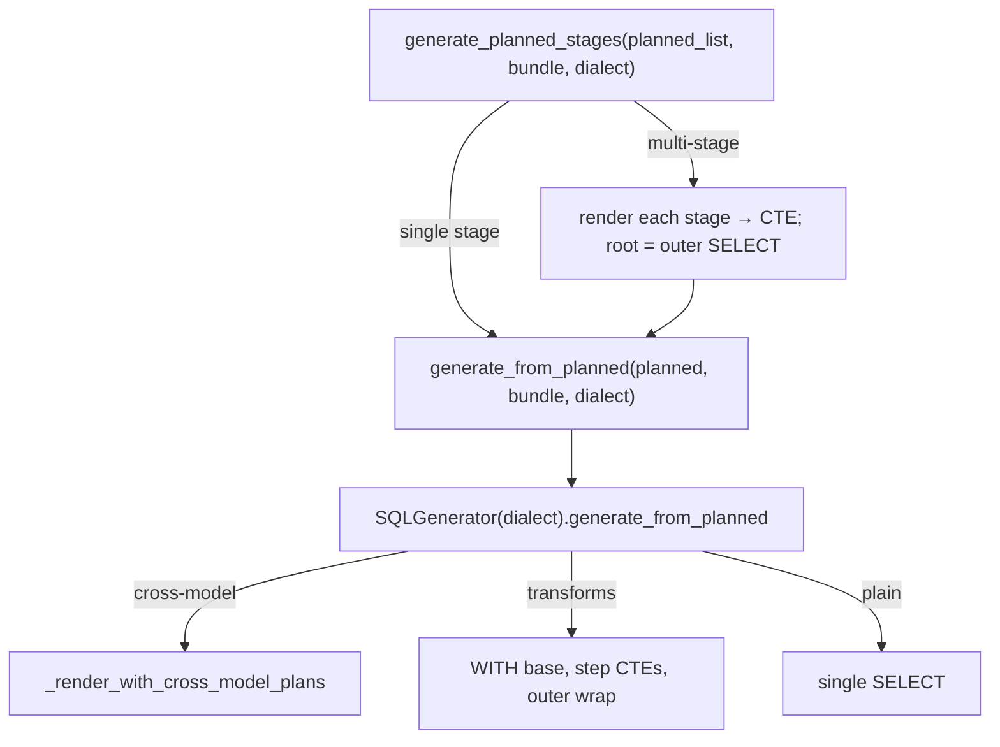

# SQL generation

**Modules:** `slayer/sql/generator.py` (the planned-consuming path),
`slayer/engine/response_meta.py` (response metadata)

The generator renders a `PlannedQuery` (or a list of them) to a SQL string. It
preserves the result-key contract exactly (**P10**) and emits SQL via sqlglot
AST building, not string concatenation.

## Entry points

```mermaid
flowchart TB
    gps["generate_planned_stages(planned_list, bundle, dialect)"]
    gps -->|single stage| gfp["generate_from_planned(planned, bundle, dialect)"]
    gps -->|multi-stage| loop["render each stage → CTE; root = outer SELECT"]
    loop --> gfp
    gfp --> inst["SQLGenerator(dialect).generate_from_planned"]
    inst -->|cross-model| cm["_render_with_cross_model_plans"]
    inst -->|transforms| tl["WITH base, step CTEs, outer wrap"]
    inst -->|plain| base["single SELECT"]
```

- `generate_from_planned(planned_query, *, bundle, dialect)` — module-level
  entry that constructs an `SQLGenerator` and delegates to the instance method.
  Renders **one** stage.
- `generate_planned_stages(planned_queries, *, bundle, dialect)` — renders a
  multi-stage DAG to one SQL string. Each non-root stage becomes a CTE; the root
  is the outer SELECT.

## `generate_from_planned` (instance method)

Reads from typed `PlannedQuery` fields (`row_slots` / `aggregate_slots` /
`filters_by_phase` / `order` / `transform_layers`) and dispatches:

- `cross_model_aggregate_plans` non-empty → `_render_with_cross_model_plans`;
- `transform_layers` present → `WITH base AS (...)`, Kahn-batched step CTEs
  carrying the window functions, an outer wrap projecting in user-spec order;
  POST-phase filters that reference transform slots wrap as `SELECT * FROM (...)
  AS _filtered WHERE …`; `time_shift` / `consecutive_periods` emit dedicated
  self-join CTE pairs;
- otherwise → a single base SELECT with WHERE/HAVING, GROUP BY, ORDER BY, LIMIT.
  When the base CTE materialises any hidden aggregate (an aggregate referenced
  ONLY by ORDER BY or a filter, never declared as a measure), a conditional
  outer-trim wrapper projects exactly the public projection — same shape as the
  transform path's outer wrap, minus the step CTEs — so the hidden alias does
  not leak into the result columns (DEV-1501).

It builds its own `slot_id_by_key` map (the `PlannedQuery` doesn't carry the
registry), materializes hidden aux slots referenced as transform inputs /
partition keys / time keys / POST-filter operands, and renders.

### `AggRenderSpec` — the dialect-helper interface

To render aggregations identically across all dialects, the shared dialect
helpers (`_build_agg`, `_build_percentile`, `_build_stat_agg`,
`_wrap_cast_for_type`, `_resolve_sql`, `_build_date_trunc`) consume a single
typed input: `AggRenderSpec`, built directly from planned slots by
`_build_agg_render_spec_from_planned`.

Dialect-specific behavior (SQLite UDFs, ClickHouse `quantile`, the MySQL
`median` `NotImplementedError`, and so on) is therefore emitted by exactly one
code path.

!!! note "Historical: the synthetic-`EnrichedMeasure` adapter"

    `generate_from_planned` originally consumed `PlannedQuery` at the top but
    adapted *back* to `EnrichedMeasure` (`_synthesize_enriched_measure_from_planned`)
    to reach the dialect helpers — a hybrid that coupled the new path to a
    legacy type, kept deliberately so the two coexisting pipelines could not
    drift on dialect SQL. DEV-1452 Stage A retyped the helpers onto
    `AggRenderSpec`; DEV-1485 deleted the last adapter
    (`_agg_render_spec_from_enriched`) and `_build_agg`'s `measure=` compat
    surface with the rest of the legacy stack.

## Multi-stage chaining (`generate_planned_stages`)

Each non-root stage renders independently (against a per-stage bundle from
`_bundle_for_stage`) and is wrapped by `_stage_rename_wrapper` so its output
columns become the flat names downstream stages bound against
(`orders.customers.region` → `customers__region`). The wrapper derives those from
the *actual* rendered `named_selects` (robust to the cross-model renderer
emitting columns out of `public_projection` order) and asserts they match the
stage's `StageSchema` — a planner/generator divergence fails here rather than as
a confusing downstream bind miss. Stage CTEs are prepended before any CTEs the
root already emits (the root reads `FROM <stage>`).

`_bundle_for_stage` picks the host model the stage renders against from the
planner's `render_source_model` (the stage's own source / overlay /
synthetic-over-sibling), falling back to a synthetic model over the upstream CTE
for a `StageSchema` chain stage — so the generator's FROM/joins bind against
exactly what the binder used.

## Cross-model rendering

`_render_with_cross_model_plans` emits one `_cm_*` CTE per
`CrossModelAggregatePlan` joined back to the host base. When `plan.rerooted_plan`
is set, `_render_rerooted_cross_model_cte` renders the nested re-rooted plan
(FROM target + the target's joins) preserving host grain; otherwise the
forward-path CTE renders (FROM bare target, grouped at the forward dims).
`Column.filter` on the aggregated column renders as
`SUM(CASE WHEN <filter> THEN <col> END)`. See
[Cross-model aggregates](cross-model-aggregates.md).

The same renderer also emits one `_wm_*` CTE per `WindowedAggregatePlan` — a
duration-windowed measure (`revenue:sum(window='90d')`). Unlike `_cm_*` (rooted
at the join target), a `_wm_*` CTE is **host-rooted**: an inner `_src` subquery
self-selects the host rows (dimensions → `_w_dim_<n>`, other time dims →
`_w_td_<n>`, the raw window time column → `_w_time`, the value → `_w_value`)
with its joins discovered through a host `ScopeFrame`, and
`FROM _base LEFT JOIN _src`
pairs the grain equalities with a trailing `INTERVAL` range predicate
(`_src._w_time >= bucket_end − window` / `< bucket_end`). The result groups at
the query grain and joins back to `_base` null-safe, exactly like a `_cm_*` CTE,
so windowed and cross-model measures coexist in one query. Windowed-measure
filters route to the combined-SELECT outer `WHERE` (`Phase.POST`). `sum`/`avg`
local measures only; other shapes raise at plan time (`_guard_windowed_measures`
in `stage_planner.py`).

And one `_rk_*` CTE per `RankedAggregatePlan` — a `first`/`last` measure. Rooted
at the host or at the join target, it ranks its own rows and picks rank 1 per
grain, then joins back on that grain like the other two. See
[Ranked aggregates](ranked-aggregates.md). Any of the three plan kinds routes
the whole query through this renderer.

### Frame bounds vs population filters (DEV-1732)

`_src` inherits the host's ROW-phase filters **minus their frame bounds** — a
relational comparison (`<`, `<=`, `>`, `>=`) between a non-hidden time
dimension's raw column and a temporal literal. Without that, the trailing window
cannot reach rows before the earliest visible bucket and that bucket
under-counts; with it, `date_range` and the explicit spelling of the same intent
produce identical numbers.

`slayer/core/time_bounds.py` owns the analysis (dependency-free, so planner and
generator share it). `stage_planner.plan_query` computes the strippable column
set once into `PlannedQuery.frame_bound_columns` and partitions the filters into
`WindowedAggregatePlan.where_filter_ids` (applied) plus `src_filter_rewrites`
(applied as a residual — a top-level `and` is split so only its frame-bound
conjuncts drop; `or`/`not` are never descended into). The generator's
`_effective_src_filters` materialises that view **once** and feeds the same list
to both join discovery and rendering, so the two cannot disagree about what the
CTE contains.

Hidden `TimeTruncKey` slots are excluded from `frame_bound_columns` on purpose:
`_build_windowed_plans` skips hidden row slots, so a hidden time axis is never
equality-joined into `_src` and stripping its bound would leave it
unconstrained. Mode-A `SlayerModel.filters` are exempt entirely — they define
which rows exist, not which frame the query looks at.

The `time_shift` shifted CTE (`_shifted_where_part`) applies the same rule,
reading the same `frame_bound_columns`; its former
`isinstance(..., BetweenKey)` special case is subsumed, since a `date_range`'s
`BetweenKey` column is always a query time dimension's raw column.

## Mode-A filter inlining and join discovery (DEV-1494)

A column-level `Column.filter` on an aggregated measure becomes a CASE-WHEN
wrapper (`SUM(CASE WHEN <filter> THEN <col> END)`), and a `SlayerModel.filters`
entry becomes a WHERE term. Both are Mode-A SQL and share one renderer,
`_render_mode_a_predicate`, which inline-expands references to derived columns —
bare (`is_eu` → its `CASE WHEN customers.region …`) or dotted to a derived
column on a joined model (`loss_payment.has_flag` → its `sql`) — so the emitted
predicate is runnable and never references a non-physical `<alias>.<derived_col>`.
A predicate with only base refs takes the cheap qualify path
(`_qualify_mode_a_sql_filter` regex for model filters, `_qualify_column_filter_sql`
AST for column filters), byte-identical to before. On sqlglot parse failure the
predicate falls through to the qualify path unchanged.

Join discovery for these text filters (`_filter_join_paths`) is the **union** of
the join paths in the **un-inlined** predicate and those in the **inline-expanded**
predicate. Both are needed: the dbt placeholder-join idiom — a constant derived
column such as `has_flag sql="1"` whose only purpose is to force the (inner)
join — keeps its alias only in the un-inlined form (it inlines to the constant
`(1)`), while a derived ref's *crossed* joins (`is_eu` → `customers`;
`loss_payment.deep_flag` → `loss_payment__claim`) appear only after expansion.
Discovery for column filters in the base SELECT is restricted to **local**
aggregate sources (empty `AggregateKey.path`); a cross-model aggregate's filter
joins are discovered inside its `_cm_*` CTE instead — `_render_cross_model_cte`
collects the join paths of the target measure's `Column.filter` and the
target-model filters and adds them to the CTE's own FROM. Because each `_cm_*`
CTE is an isolated per-(target, grain) computation, adding the join resolves the
filter's refs without affecting sibling measures. Discovery is root-scope-only,
so a correlated ref inside an `EXISTS (...)` subquery does not pull an outer join.

## Host-base join discovery (the three symmetric sources)

The host base FROM at `_build_base_select_for_planned` pulls in `LEFT JOIN`s from
three symmetric sources, each handled by a dedicated collector wired in the same
call chain just before `_build_from_and_joins`:

1. **Dimension / time-dimension `Column.sql`** (DEV-1484): `_expand_derived_row_dims`
   pre-expands derived ROW slots (`ColumnSqlKey` dims and `TimeTruncKey` columns
   that are themselves derived) and scans the expansion through
   `_joined_paths_in_sql`, appending crossed paths to `needed_join_paths`.
2. **Aggregated-measure `Column.filter`** (DEV-1494): `_collect_column_filter_join_paths`
   recurses through AGGREGATE-phase composite keys (`ArithmeticKey` /
   `ScalarCallKey`) and, for each `AggregateKey` with a `column_filter_key`,
   collects the paths the predicate touches via `_filter_join_paths` (the union
   of un-inlined and inline-expanded predicate paths, per the section above).
3. **Aggregate-source `Column.sql`** (DEV-1502): `_collect_aggregate_source_join_paths`
   mirrors the filter helper — recurses through the same composite keys, and for
   each `AggregateKey` whose `source` is a `ColumnSqlKey` with `path == ()`,
   expands the column via `_expand_derived_column_sql` and scans the result
   through `_joined_paths_in_sql`. The render-time expansion in
   `_build_agg_render_spec_from_planned` already produces `SUM(<expanded>)` SQL;
   this collector closes the join-discovery loop so a measure source like
   `customers__regions.population` emits both `LEFT JOIN`s.

All three collectors restrict to **local** aggregate sources (empty
`AggregateKey.source.path`); cross-model aggregates own their own join
discovery inside the per-plan `_cm_*` CTE — for the `Column.filter` side
(DEV-1494 / DEV-1503) and, since Stage 4 (DEV-1708 closed DEV-1526), for a
target column's `Column.sql` that crosses a further join. All three
host-side collectors feed the shared `needed_join_paths` list, so repeated
paths surfaced by different sources dedupe naturally via
`_build_from_and_joins`'s `emitted_aliases` guard.

Since Stage 5 (DEV-1709, widened Law-3 trigger), a LOCAL aggregate with
any crossing input — source `Column.sql`, `Column.filter`, positional
args, kwargs — never renders in the top-level host base at all: it
isolates into a host-rooted `_cm_*` CTE, and the discovery above runs
inside that CTE's sub-render (see
[cross-model-aggregates.md](cross-model-aggregates.md#strategy-3-host-rooted-isolation--any-crossing-input-dev-1503-widened-by-dev-1709)).
The host base only ever contains purely-local aggregates.

## Result-key contract (P10)

The generator preserves the result keys byte-for-byte: `orders.revenue_sum`,
`orders._count` (the `*` dropped, the leading `_` kept), joined dimensions as the
full dotted path `orders.customers.regions.name`, and renamed measures as
`orders.<user_name>`. `_full_alias_for_slot` derives these from the slot's key /
public aliases. Two documented exceptions, both routed through the same
`canonical_agg_name` helper: cross-model parametric aggregates carry the kwarg
suffix legacy dropped, and hidden parametric `first`/`last` (DEV-1501) carry the
explicit time-arg suffix so distinct time-column specs get distinct
materialised aliases (`orders.revenue_last_created_at`,
`orders.revenue_last_updated_at`).

## Response metadata (`response_meta.py`)

`build_response_metadata` builds `SlayerResponse.attributes` and
`expected_columns` from the root `PlannedQuery` plus the rendered SQL (the
retired legacy engine derived both from an `EnrichedQuery`):

- **`expected_columns`** comes from the final SQL's `named_selects` — the literal
  result-key columns rows come back under. Reading them from the SQL (rather than
  re-deriving from slots) is bulletproof: it is exactly the outer SELECT the
  generator emitted.
- **`attributes`** (`ResponseAttributes.dimensions` / `.measures`) come from the
  root plan's public `ValueSlot`s, classified dimension (ROW phase) vs measure
  (everything else), with each public result key mapped to its
  `FieldMetadata(label, format)`. `_slot_result_keys` mirrors
  `_full_alias_for_slot` so the keys line up with the rendered projection; only
  keys actually present in the rendered SQL are surfaced (a guard against
  divergence). Aggregate formats come from `_infer_aggregated_format` (INTEGER
  for count/star, FLOAT for avg-family, source-column format for sum/min/max).

`FieldMetadata` / `ResponseAttributes` / `_infer_aggregated_format` live here (not
in `query_engine`) so the module imports nothing from the engine;
`query_engine` re-exports them, keeping the public import path unchanged.

## Design rationale

- **Why one shared dialect emitter?** Dialect coverage (SQLite UDFs, ClickHouse
  parametric quantiles, MySQL's unsupported-function `NotImplementedError`, the
  `log10`/`log2` literal preservation, JSON-extract rewriting) is large and
  well-tested. Routing every caller through one emitter keeps that behaviour in
  a single place. This originally also kept the two coexisting pipelines from
  drifting on dialect SQL, at the cost of an `EnrichedMeasure` coupling that
  DEV-1452 / DEV-1485 removed.
- **Why derive `expected_columns` from the SQL?** Because the SQL is the ground
  truth for what rows come back keyed by. Re-deriving from slots risks a subtle
  mismatch; reading `named_selects` cannot.
- **Why assert in `_stage_rename_wrapper`?** A leaked hidden column or a C13
  over-projection would otherwise surface as a downstream "column not found"
  deep in the next stage's binding. Asserting at the boundary turns a confusing
  failure into a precise one.
