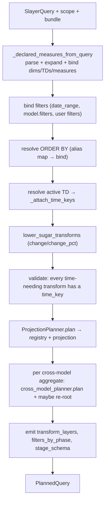
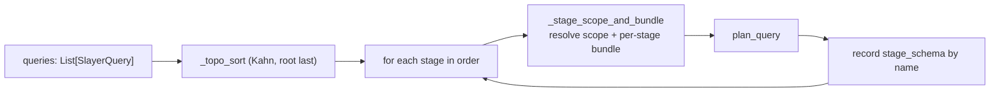

# Stage planning

**Module:** `slayer/engine/stage_planner.py`

The stage planner is the orchestrator that turns `SlayerQuery` stages into
`PlannedQuery`s. `plan_query` compiles one stage; `plan_stages` compiles a
multi-stage DAG. It composes the [binder](binding.md), the
[planning](planning.md) primitives, and the
[cross-model planner](cross-model-aggregates.md), and emits each stage's
`StageSchema` (**P6**).

## `plan_query` — one stage end to end

### Declared measures, in projection order

`_declared_measures_from_query` builds the `DeclaredMeasure` list in **dim →
time-dim → measure** order (matching the legacy `user_projection` order). Each
dimension/time-dimension binds and is declared under its flattened `__` name
(`stores.opened_at` → `stores__opened_at`) — that flat name is the
`StageColumn.name` a downstream stage binds against (DEV-1448/1449). Measures
run through `expand_model_measures` first (against a `ModelScope` only —
downstream `StageSchema` stages don't expose saved measures), then bind, then get
a canonical alias via `_canonical_alias_for_formula`.

`_canonical_alias_for_formula` routes any aggregate-rooted formula (including
parametric `revenue:percentile(p=0.5)`) through `canonical_agg_name` so kwargs are
sanitized consistently (`p=0.5` → `_p_0_5`); a cross-model star keeps its
`customers.` prefix. (This is also where cross-model parametric aliases keep the
kwarg suffix legacy dropped — the documented P10 divergence.)

### Filters, in legacy WHERE order

The planner constructs filters in the exact order the legacy generator emitted
them, so SQL stays parity-stable:

1. `date_range` filters — one per time dimension with a 2-element range, built by
   `_build_date_range_filter` as a `BetweenKey` over the **bare** underlying
   column (a `ColumnKey`, or a `ColumnSqlKey` for a derived temporal column —
   DEV-1450 #4a — which the generator renders as `<expanded sql> BETWEEN …`),
   not the `TimeTruncKey`, so the self-join CTE path can read raw data while the
   filter applies to the outer projection.
2. `SlayerModel.filters` — Mode-A SQL, validated by `_validate_model_filter`
   (rejects DSL constructs, raw windows, measure refs, and windowed columns).
   A reference to a non-trivial derived column is accepted (DEV-1450 #4b): the
   generator's `_render_model_filter_sql` inline-expands the predicate at render
   time. These are text-only `FilterPhase` entries with no typed value-key.
3. user query filters — Mode-B DSL, bound with the `filter_alias_map` so renamed
   measures resolve by alias (DEV-1445). Two filter strings that bind to the same
   structural key are deduped (P2) so a HAVING isn't duplicated.

The `filter_alias_map` is built from **measure** aliases only (the tail of
`declared_measures` past the dim/time-dim prefix) — never dimension/time-dimension
names, because a time dimension's declared name is its raw column and a
`created_at <= '…'` filter must resolve to the raw column.

### ORDER BY resolution

A user order column may name a declared measure by user `name`, declared name,
canonical alias, the flattened dotted form (a joined dimension), or the `_count`
form of `*:count`. `plan_query` checks `declared_alias_to_bound` in that order
before falling back to `bind_expr` on the preserved `raw_formula` — so an
aggregate alias like `amount_sum` (not a column on the model) interns onto the
projection slot rather than raising.

### Time-key attachment

`_attach_time_keys` walks every measure/filter/order value-key and, for each
time-needing `TransformKey` (`cumsum` / `change` / `time_shift` / `first` /
`last` / `lag` / `lead` / `consecutive_periods`) whose `time_key` is `None`,
patches in the active TD's key. The active TD is resolved by
`_resolve_main_time_dimension` (0 TDs → none; 1 TD → that one;
2+ → `main_time_dimension` by full-name then leaf, else
`model.default_time_dimension` host-local). After patching,
`_find_unresolved_time_needing_op` validates that no time-needing transform was
left without a TD, raising the legacy error phrase. Sugar lowering runs *after*
this so the desugared `time_shift` inherits the patched `time_key`.

### Emitting the plan

`ProjectionPlanner.plan` builds the registry; `_bucket_slots` splits slots into
row / aggregate / combined by phase; the cross-model loop runs the strategy once
per cross-model aggregate — passing `host_query` / `public_projection` / a
`subplan_builder` callback so the strategy itself decides forward-vs-re-rooted
(DEV-1450 #2; the re-root logic moved into `cross_model_planner.py`);
`_emit_transform_layers`
emits one `TransformLayer` per transform slot in Kahn-topological dependency
order (so `cumsum(change(...))` renders inner before outer); and
`_emit_stage_schema` builds the `StageSchema` from public slots.

## `_emit_stage_schema` — the downstream contract (P6)

Only public (non-hidden) slots appear, one column per `public_projection`
occurrence (so a C13 multi-alias slot emits one column per alias). Each column's
downstream `name` and `sql_alias` are the `__`-flattened alias
(`customers.revenue_sum` → `customers__revenue_sum`), while `public_alias` keeps
the dotted result-key form. Two distinct public columns that flatten to the same
downstream name raise a collision error rather than silently binding the first
match. This flat-name schema is precisely what a downstream stage binds against —
the reason DEV-1449's dotted-ref-downstream raises.

## `plan_stages` — the multi-stage DAG

`_topo_sort` orders stages so each appears after the siblings it references via
`source_model` (Kahn's algorithm; rejects duplicate names and cycles; unnamed
stages — typically the root — go last). For each stage,
`_stage_scope_and_bundle` resolves the right `(scope, bundle)`:

- a `ModelExtension`/dict **over a sibling** → overlay the extra columns onto a
  synthetic model of the sibling CTE and bind `ModelScope`-style;
- a **bare-string sibling** source (a chain) → bind against the upstream flat
  `StageSchema` (P6 / DEV-1449), with the synthetic upstream model as the host
  for cross-model/generation consistency;
- otherwise **model-scoped** → the stage's own resolved source (the root uses the
  bundle's `source_model`; a named sibling uses its pre-resolved
  `stage_source_models` entry).

Each per-stage bundle threads in synthetic models for the *other* already-planned
siblings (`stage_bundle_with_siblings`), so a join/cross-model ref to a sibling
resolves to its CTE. After planning a named stage, its `StageSchema` is recorded
so later stages can bind against it.

## Design rationale

- **Why build declared measures in dim/time-dim/measure order?** So the public
  projection order matches legacy exactly (P10), and so the `filter_alias_map`
  can slice off the measure tail without tracking indices separately.
- **Why attach `time_key` in the planner rather than the binder?** Only the
  planner has the query (the set of TDs, `main_time_dimension`,
  `default_time_dimension`). The binder is expression-local. See
  [Binding](binding.md).
- **Why emit `StageSchema` per stage rather than let downstream re-walk joins?**
  Because re-walking is the legacy tangle. A stage composes with the next *only*
  through its schema (P6); the downstream binder sees a flat namespace and
  literally cannot reach the upstream join graph — which is what makes DEV-1449
  a structural impossibility rather than a guarded special case.
- **Why topo-sort here when the engine also sorts the runtime list?** The engine
  sorts the user-submitted list (and validates root-as-sink) before planning;
  `_topo_sort` re-establishes the planning order from `source_model` references so
  `plan_stages` is correct regardless of how it's called (it shares the algorithm
  but is the planner's own guarantee).
