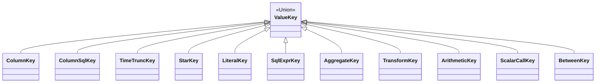

# Typed keys — structural identity

**Module:** `slayer/core/keys.py`

The `ValueKey` family is the foundation of the whole pipeline. A key answers
exactly one question — *"are these two expression occurrences the same value?"*
— and carries nothing else. Rendering state (SQL text, alias, projection
position, hidden-ness) lives on `ValueSlot` (in `planned.py`), never on the key.

This separation is principle **P2**: identity is structural, not textual.
`revenue:sum`, the inner `revenue:sum` in `change(revenue:sum)`, and a filter
occurrence of `revenue:sum` all build the same `AggregateKey`, so the
`ValueRegistry` interns them to one slot. That is what makes the dedup bugs
(DEV-1446) structurally impossible rather than patched.

## The family



| Key | Phase | Identifies |
| --- | --- | --- |
| `ColumnKey(path, leaf)` | ROW | a base column; `path` empty for local, non-empty for joined |
| `ColumnSqlKey(path, model, column_name)` | ROW | a derived column (`Column.sql` set) |
| `TimeTruncKey(column, granularity)` | ROW | a time-truncated column at one grain |
| `StarKey(path)` | ROW | the `*` source for `*:count` (local or cross-model) |
| `LiteralKey(value)` | ROW | a literal operand inside an expression tree |
| `SqlExprKey(canonical_sql)` | ROW | a Mode-A SQL fragment (a `Column.filter`) |
| `AggregateKey(source, agg, args, kwargs, column_filter_key)` | AGGREGATE | one aggregation slot |
| `TransformKey(op, input, args, kwargs, partition_keys, time_key)` | POST | a window/temporal transform over a value |
| `ArithmeticKey(op, operands)` | max(operands) | arithmetic / comparison / boolean |
| `ScalarCallKey(name, args)` | max(args) | a closed-allowlist scalar function call |
| `BetweenKey(column, low, high)` | ROW | a `BETWEEN` predicate (today only `date_range`) |

All are frozen Pydantic models (`_FrozenKey` sets `frozen=True`), so they are
hashable and immutable — usable directly as `dict` keys in the `ValueRegistry`.

## Phase

`Phase` is an `IntEnum` (`ROW=0 < AGGREGATE=1 < POST=2`). It is the engine of
filter routing (**P8**): a composite key's phase is the **max** of its operands'
phases, and a filter routes to `WHERE` / `HAVING` / post-filter by the highest
phase it reaches. Phase is computed, not stored — `ArithmeticKey.phase` is
`max(o.phase for o in operands)`, `ScalarCallKey.phase` is the max over args
that carry a phase, and the leaf keys hard-code their level. Keeping phase a
*property of the key* means no separate "is this a HAVING filter?" text analysis
exists anywhere.

## Design choices

### Local and cross-model share one shape (P3)

`ColumnKey`, `ColumnSqlKey`, and `StarKey` all carry a `path: Tuple[str, ...]`.
Empty path = local; non-empty = a join walk from the query's source model
(`("customers",)`, `("customers", "regions")`). `AggregateKey` inherits this via
its `source`. There is **no separate `cross_model_measures` track** in the
intermediate representation — `path == ()` is the only thing distinguishing a
local aggregate from a cross-model one, and "base CTE vs cross-model CTE" is a
*render* decision made downstream by the planner, not a semantic split baked
into the key.

### Structural identity has to survive Python's scalar coercion

Python collapses `True == 1 == Decimal("1")` (and `False == 0`). A naive
tuple-of-bare-values hash would intern `args=(True,)` with `args=(Decimal("1"),)`
— wrong. `AggregateKey`, `TransformKey`, `ScalarCallKey`, and `LiteralKey`
therefore override `__hash__` / `__eq__` to wrap each scalar leaf in a
`(type_tag, value)` pair via `_typed_leaf` (`"__bool__"` / `"__num__"` /
`"__str__"` / `"__none__"`). This restores the type distinction at hash/eq time
without changing the stored representation users see via `key.args[0]`. This was
a review fix (the original keys interned distinct values together).

### Kwargs are canonicalized to sorted order

`AggregateKey.kwargs` and `TransformKey.kwargs` run through a `before`-validator
(`_sort_kwargs_tuple`) that sorts by key name, so `weighted_avg(weight=qty)`
interns regardless of input order. Numeric scalars are expected to already be
normalized to `Decimal` (via `normalize_scalar`) so `percentile(p=0.5)` and
`percentile(p=0.50)` are the same key; identifier kwargs arrive as `ColumnKey`
so `weight=quantity` and `weight=quantity_v2` differ.

### `normalize_scalar` is the one place ints/floats become `Decimal`

`int → Decimal(value)`; `float → Decimal(str(value))` (via `str`, so floats land
on their displayed decimal form, not their binary approximation); `bool` / `str`
/ `None` / `Decimal` pass through. Booleans are checked *before* int (because
`bool` is-a `int` in Python). Anything else raises `TypeError`.

### `column_filter_key` folds `Column.filter` into aggregate identity

A column's `Column.filter` (a Mode-A CASE-WHEN applied at aggregation time)
becomes part of the `AggregateKey` via `column_filter_key: Optional[SqlExprKey]`.
Two aggregates over the same column with different attached filters are therefore
different slots; same-filter ones intern. `*:count` (a `StarKey` source) has no
column, so `column_filter_key` stays `None`.

### `TimeTruncKey` is a distinct key, not a slot flag

A time dimension is identified by `(column, granularity)`. Month, day, and
raw uses of the same column are distinct slots automatically, with no
special-casing in the registry. The granularity is stored as a plain `str`
(the `TimeGranularity` member's value) so the key stays a pure-data frozen model
without an enum import. The underlying column is recoverable, so a
`date_range` filter can bind against the raw column independently of the
truncation. (Codex weighed three encodings — a new key, slot metadata, or
`TransformKey(op="date_trunc")` — and the new key won for keeping the registry
uniform.) `TimeTruncKey.column` is `Union[ColumnKey, ColumnSqlKey]` (DEV-1450
follow-up #4a): a derived (`Column.sql`) temporal column is a first-class time
dimension — the generator applies the `DATE_TRUNC` over the expanded
expression. The kind-agnostic helpers `column_leaf` / `column_path` (in
`keys.py`) unwrap either form. See [Binding](binding.md).

### `BetweenKey` exists only for legacy SQL parity

A `col BETWEEN low AND high` and the Mode-B compound `col >= low and col <= high`
render to different SQL text. The legacy generator emits `BETWEEN` for
`date_range`, so `BetweenKey` marks exactly that spot. The Mode-B parser never
produces it — a user-written `col >= a and col <= b` stays an `ArithmeticKey`,
preserving its parity with legacy (which keeps the AND form verbatim). This is a
deliberately narrow key whose only job is "don't drift from legacy on this one
construct".

## The closed scalar allowlist (P1 / C12)

`SCALAR_FUNCTIONS` is a `frozenset` living here (not in `formula.py`) so the keys
module is the single source of truth for what counts as a structurally-keyed
scalar call:

```python
SCALAR_FUNCTIONS = frozenset({
    # null handling
    "nullif", "coalesce", "ifnull",
    # math
    "ln", "log10", "log2", "log", "exp", "sqrt", "pow", "power",
    "abs", "floor", "ceil", "round",
    # string hygiene (was DEV-1378's STRING_HYGIENE_OPS)
    "lower", "upper", "trim", "replace", "substr", "instr", "length", "concat",
})
```

Anything outside this set (plus the transform and aggregation registries) raises
`UnknownFunctionError` in Mode B. This replaces the deleted
`MixedArithmeticField` implicit passthrough: arbitrary dialect-specific
functions (`regexp_match`, `date_part`, JSON ops) belong in Mode A — the user
moves them into a derived `Column.sql`. The `keys.py` constant is imported by
both the parser (`syntax.py`) and the binder (`binding.py`); the binder
re-checks membership as defence-in-depth against direct `ParsedExpr`
construction that bypasses the parser.
